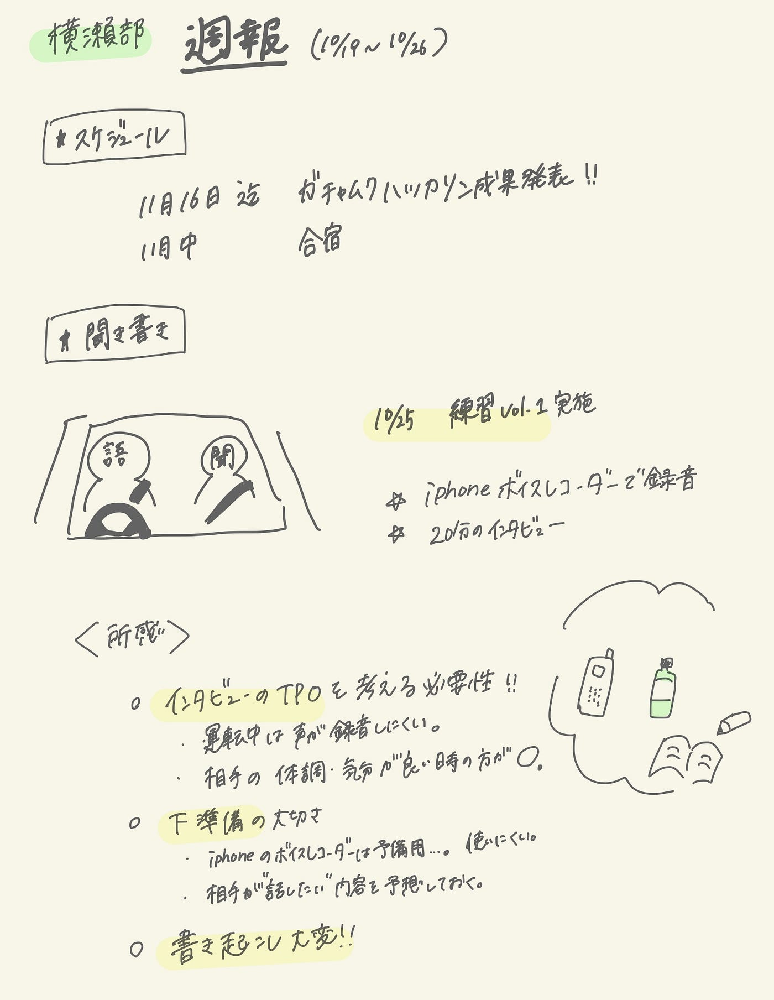

### 聞き書きやってみた

こんにちは！横瀬部３年佐藤です。
今週は実際に聞き書きをやってみたので、その感想などを書いていきます！

1. スケジュール

11月16日迄 ガチャムクハッカソン成果発表
11月中旬 合宿

2. 聞き書き

語り手とスケジュールが合わず運転中にインタビューしました😂
書き起こし、諸々の記録はG[oogleドキュメントに](https://docs.google.com/document/d/1hyRg_f763ap9JP2ASaYLOxB7YXyYwSSgp6wCtD33efQ/edit?usp=sharing)まとめました。

> 日時：１０月２５日日曜日（20分）
場所：国道６号線
状況：運転中
語り手：友人①
方法：iPhoneボイスメモで録音、documentに記録

所感：
**インタビューのTPOを考える必要性**
語り手が長時間運転で疲れている時にインタビュー。すぐに話すことに疲れてしまった。→しっかりと語り手の精神面・体調面もかんがえべき。ゆっくりと話しやすい環境で行うことが重要。

**下準備の大切さ
 **インタビューが初めてで緊張した。語り手が知人であることからくる恥ずかしさがあった。質問事項や、相手が話したい内容を予測してインタビューしたほうがいい。何かの専門家でもないためテーマを決めにくく、話し手が沢山話したいと思っている内容を探るのが難しい。
今回は相手がよく話してくてる人だったため、スムーズに進行した。しかし、ワンフレーズではなく話してもらう難しさ。「〇〇ということですか？」と誘導してしまうことが何度か、、、。
→聞き書きの趣旨が伝えきれていない。

**面白み
**やはり知らない話を聞ける面白さはある。知人だからこそ、幼少期や、自身の性格などの話を聞くと改めてその人の良さや特徴が見えてきた。

次回は茶道を長年やってきた祖母にインタビューをする。

