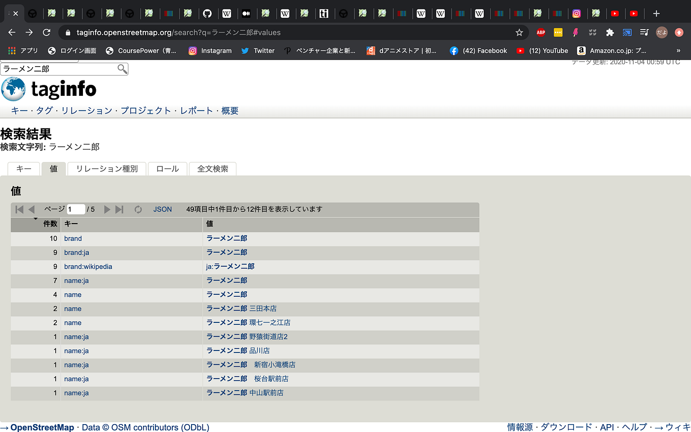
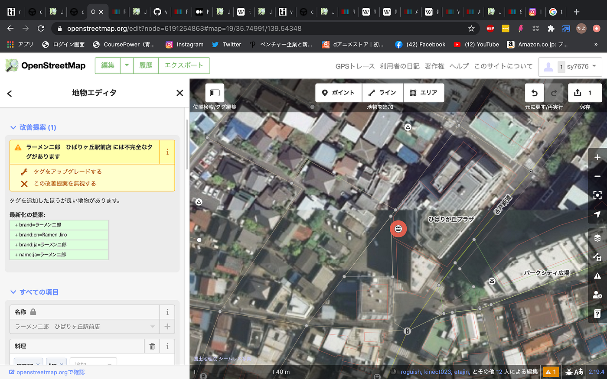
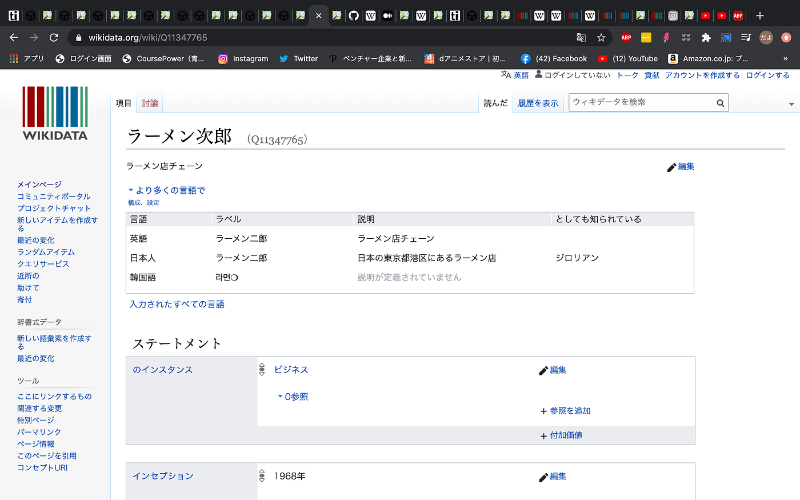

### 中間発表〜（浜田風）

### ラーメン二郎OSM

### Introduction

本研究では、OSMのオープンな地理空間情報プラットフォームを用いて、日本全国のラーメン二郎店舗データ、およびそのメタデータを整理、網羅することによって、誰もが自由にラーメン二郎店舗データにアクセスし、再利用することが可能な状況を構築することを試みた。

### Methods

「taginfo」でワード「ラーメン二郎」の検索で「値」が等しいものに対してタグ「wikidata」と「wikipedia」の情報を追記。また同じく「taginfo」でワード「ラーメン二郎」の検索で「値」が等しいもので旧式のタグが使われているものに対しては最新のタグにアップデートを行なった。

### Results

試験的ではあるが、変更は無事に終了した。しかし、今回は個人的に時間の管理が出来ておらずOSMのコミュニティーに事前の確認が行えなかったため、今後変更したことを事後報告になってしまうが報告しレビューを仰ぎたいと思う。返答次第ではもう一度内容を書き換える予定である。

### Discussion

そもそもの「wikidata」の情報量が少ないということが今課題の最大の改善点であると感じたので、今後の課題としては「wikidata」の追記を行なっていくべきなのか検討していきたい。

