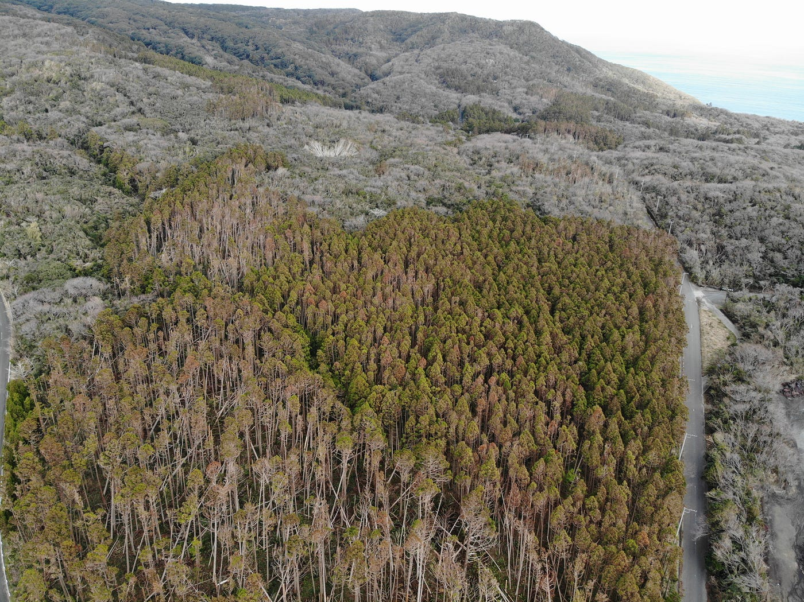
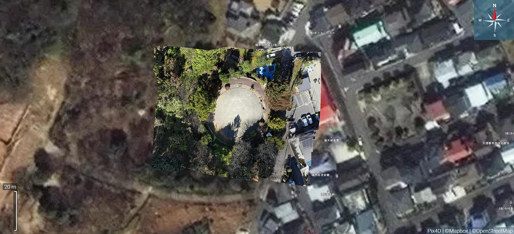
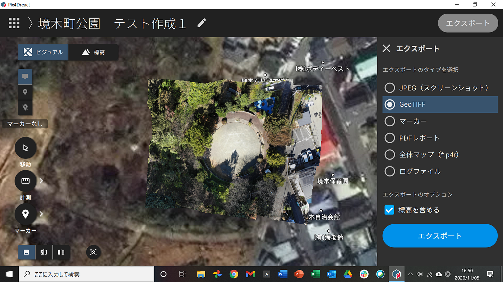
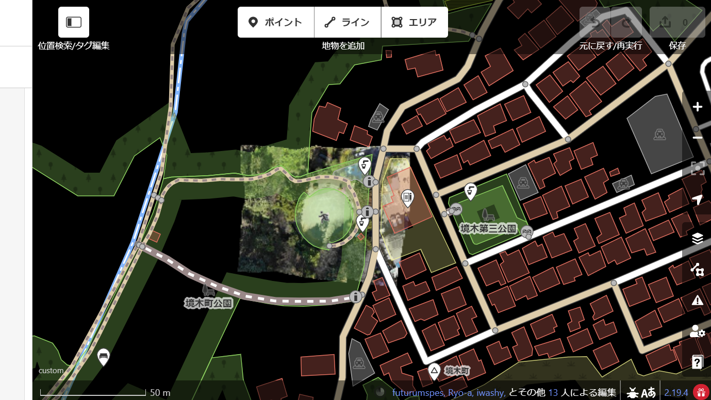
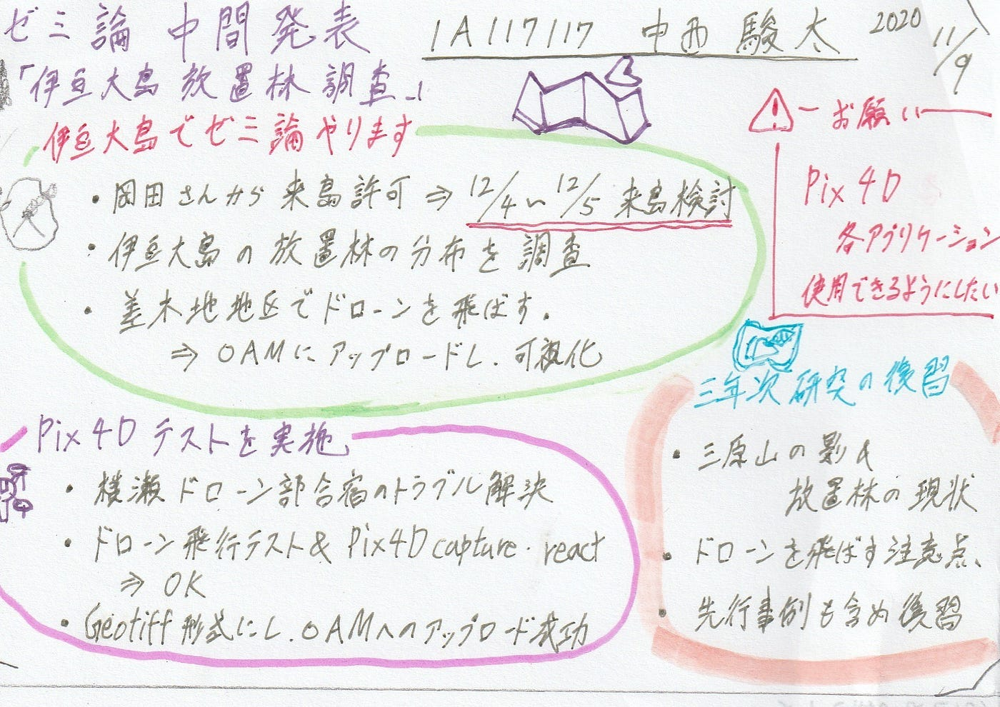

### ゼミ論中間発表～伊豆大島放置林調査～

地球社会共生学部 4年 1A117117 中西駿太

> _**はじめに_**

当初、新型コロナウイルスの影響で医療体制が整っていない島嶼部への移動を控えなければならず、3年次より行ってきた伊豆大島での活動を断念し、オフライン登山アプリ「Yamap」を使ったゼミ論にする予定でした。しかし、伊豆大島より来島自粛措置が解除されたことや、伊豆大島観光協会の岡田雅司さんから感染対策をした上で来島してもよいとの旨を受け、方針を変換し3年次より行ってきた伊豆大島をフィールドとした活動を再開することとします。

> _**概要_**

**「ドローンを使った伊豆大島放置林調査」**

本研究は伊豆諸島最大の島「伊豆大島」をフィールドに、過去の度重なる自然災害、現地の独特な気候や文化を観光目線で把握し、伊豆大島の”今”（現状）を確認し報告をするものである。

今年度は、三年次に行ったゼミ論の続きとして、伊豆大島でドローンを飛ばし、台風や土砂崩れにより倒木が懸念される放置林の生殖範囲を上空から撮影し、OpenAerialMapにアップロードしOpenStreetMap等を通し可視化する作業を行う。

[Open Aerial Map](https://map.openaerialmap.org/#/0/user/5f1ef30157ddda00054a036e?_k=vz8h1j) (OAM)

三年次では、かつて本研究室が伊豆大島合宿を行いドローンによる空撮をしたり、地域資源発掘型実証プログラムとして「ドローンフェスIN伊豆大島」（古橋教授講演）が開催されたりしたことも踏まえ、ドローンを活用し4年次も引き続き伊豆大島をフィールドに研究を進めていくべく現地でドローンを実際に飛ばし、飛ばす上での注意点等を調べた。

4年次は、3年次で得た結果や知識を踏まえ、放置林の植生分布をドローンを使いOAMとOSMで可視化するという新規性のある研究を行う。

> _**Introduction_**

三年次の研究を進める中で注目したのが、大島の「放置林問題」であった。

2013年10月の台風26号「ウィパー」による大雨で発生した大規模土砂災害（死者・行方不明者３９人）では、土砂と共に流された流木によって家屋を破壊し、甚大な被害をもたらした。木は管理（間伐）を行わなければ根が奥まで張られない。そのため、大雨が降った最は大木を支えられずに崩落し土砂災害を引き起こす。

島の若者の人口流出により森林の管理が行われなくなり杉の放置林が増加している。放置林は土砂災害の被害の拡大の要因となり再び甚大な被害が発生する恐れがある。

三年次の研究では2019年の台風15号「ファクサイ」で破壊された杉林上空を撮影し、規模を実際に確認した。調査を進める中で「放置林問題」が今後大きな課題となることが浮き彫りになった。

今年度では、破壊された放置林が植生する差木地地区を中心に、上空から撮影し、OAMにアップロードし可視化する作業を行う予定である。

> _**Methods(中間発表時点)_**

・ドローン撮影から可視化までの流れ（予定）
_[横瀬でのドローン部合宿の手法を取り入れる予定_](https://medium.com/furuhashilab/dronebird%E3%81%AF%E7%81%BD%E5%AE%B3%E6%99%82%E3%81%AB%E4%BD%95%E3%82%92%E8%A1%8C%E3%81%86%E3%81%AE%E3%81%8B-f0e4a153bcb3)

_**中間発表までにドローン合宿時のトラブル解決及び一連の流れを必ずテストする！_**

＃使用ツール

・Dji Mavic Air
・Pix4D capture
・Pix4D react
・[OpenAerialMap](https://map.openaerialmap.org/#/0/user/5f1ef30157ddda00054a036e?_k=vz8h1j)
・OpenStreetMap

> _**Result (中間発表時点)_**

**・撮影テスト（ひとり合宿）
**→Dji Mavic Airを使用し、上空40mからではあるが、Pix4D captureを使い撮影に成功。

**・ドローン合宿時のトラブル解決
**→Pix4D capture & react の不具合は解消。
→最終的にはGeotiff形式にしてOAMへのアップロードまでを自身のデバイスのみで完了させた。

**・三年次の研究
**→伊豆大島の現状を把握している。
→”三原山の影”問題等、ドローンを飛ばす上での注意点を確認済み。
→撮影に成功している。

[2019年度伊豆大島ドローン調査空撮映像](https://drive.google.com/file/d/1ulf94V2i-NCVKKYpK-4FfEzAZuMMvSZr/view)

以上のことを踏まえ
１２月４日～１２月５日 第三回伊豆大島調査
伊豆大島を訪問し、早速本番の作業及び調査を行う

> _**Discussion（中間発表時点）_**

#### **Pix4Dの各アプリケーションの無料トライアル期間が終了！**

今後も使用していくため、古橋教授とアカウント共有等Pix4Dの今後の使用方法について話し合う必要がある。

> _**Conclution (中間発表時点)_**

中間発表時点の結果と、三年次の研究を踏まえ、

#### １２月４日～１２月５日 第三回伊豆大島調査
伊豆大島を訪問し、早速本番の作業及び調査を行う

岡田雅司さんと古橋先生のFacebookチャットを再開し、確認を取る。

> _**Github レポジトリ＆プロジェクト_**

・ [2020年度ゼミ論 Github レポジトリ](https://github.com/furuhashilab/2020gsc_ShuntaNakanishi)
・ [2020年度ゼミ論 Github プロジェクト](https://github.com/furuhashilab/sotsuron2020/projects/7)

> _**グラレコ_**

> _**参考文献・資料_**

・[2019年度ゼミ論最終発表](https://docs.google.com/document/d/1nYEfIbsow8ICGCpd4HIupMZR9cOiKXeT2lJIo3gMMFE/edit)

・線香林問題 
[なぜ山に木が多すぎると土砂崩れが起きるのか — 痩せるコーラ](https://www.yaserucola.com/entry/dosyasaigai)

・[気象の話 大島の風](http://www13.plala.or.jp/oosimakisyou/1kaze.htm)

・[Open Aerial Map](https://map.openaerialmap.org/#/139.55915451049805,35.43381992014202,12/square/13300213001113?_k=9uorne)

・[Open Drone Map](https://www.opendronemap.org/)

・[CrisisMappers Japan](http://crisismappers.jp/index.html)

・[地図から被災地支援を。クライシスマッピングを支える地図技術](https://www.cariot.jp/blog/2017/08/16/crisismap/)

■[ドローンフェス ― 伊豆大島観光協会](http://www.izu-oshima.or.jp/pdf/drone%20event.pdf)

■[古橋研究室 伊豆大島合宿 Medium Ayame Otsuki](https://medium.com/furuhashilab/%E3%82%BC%E3%83%9F%E5%90%88%E5%AE%BF-%E4%BC%8A%E8%B1%86%E5%A4%A7%E5%B3%B6-88ed09b33fa7)

■[古橋研究室 ドローン撮影動画](https://encrypted-vtbn3.gstatic.com/video?q=tbn:ANd9GcSGeHiOb-zGq9TABImlW9N4MIhE5n_bojAka5xJ60Sttxx1njmh)（1）

■[古橋研究室 ドローン撮影動画](https://encrypted-vtbn0.gstatic.com/video?q=tbn:ANd9GcRnWRPNZ5LUgVSAD3ch5BTd27lZvqRES52Ps6gE8L48j_EWGxNI)（2）

・[DRONEBIRDは災害時に何を行うのか！？](https://medium.com/furuhashilab/dronebird%E3%81%AF%E7%81%BD%E5%AE%B3%E6%99%82%E3%81%AB%E4%BD%95%E3%82%92%E8%A1%8C%E3%81%86%E3%81%AE%E3%81%8B-f0e4a153bcb3) （森田メンバー著）
