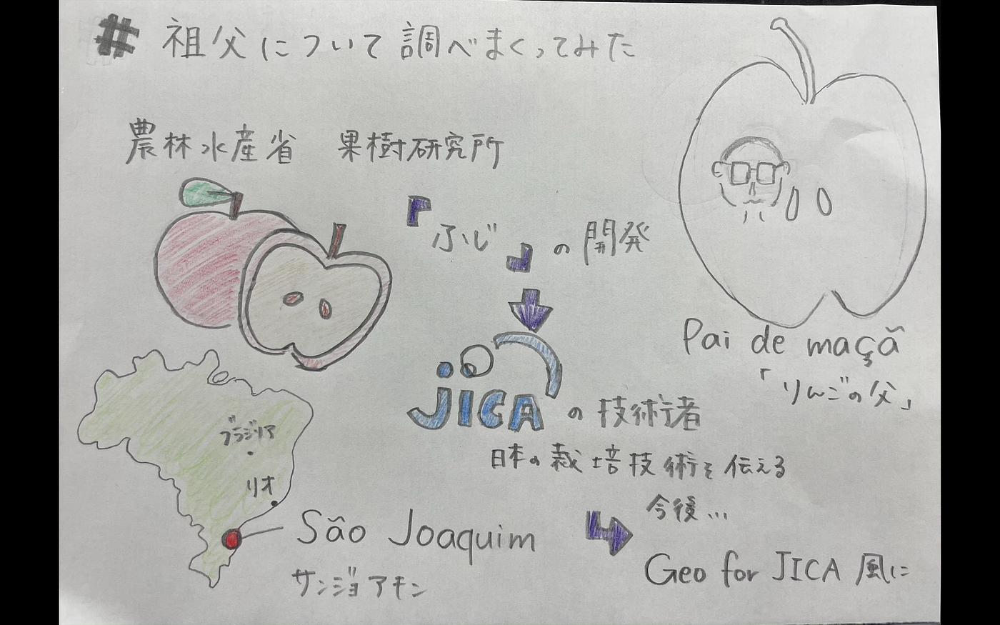

### #祖父について調べまくってみた

> Introduction

会ったことないけどAO入試の志望理由書に登場しまくった祖父について改めて調べてみました。

私は1999年10月生まれ。そのちょうど1年まえに現地で肺炎で亡くなりました。だから私は会ったことがありません。肺炎になったときに日本にいれば助かっていたのでは、、、と思いますが、、、会ってみたかったなあと、、、

会ったこともないのに数々のAO入試の志望理由書に登場させました。青学もしっかり書かせていただきました。小論文でも面接でもちゃんと語らせていただきました。

そんな祖父を父から聞いただけでしかなかったため、きちんと調べようと思いました、、、

> Methods

昔すぎて見つけられない！！！祖父の名前見つからない、、、！

しかし、今回古橋先生に相談したところ桑島先生に繋いでいただき、調べかたを教えていただきました。すぐ見つかるじゃん、、、ごめんなさい。

祖父の名前が出てくると嬉しいものですね。

> Results

調べると、祖父は農林水産省の果樹研究所を経てJICAの技術者としてブラジルのサンジョアキンという場所にりんごの栽培技術を伝えに行った人でした。

長野県に生まれた祖父は

農林水産省時代では当時のりんご品種改良チームで「ふじ」というブランドを作り上げた。

祖父はブラジルにりんご台木選定の専門家として派遣されていた。

りんご台木（だいぎ）選定：りんごは種子で増やすことができない。挿し木や取り木もできない。接ぎ木だけで数を増やしてきた植物。その台木を選ぶスペシャリストだったそう、、、

このプロジェクトの実施予定期間は1996年12月から5年間の予定。祖父が亡くなったのは1998年9月。波に乗ってきた真っ只中なはずなのに、

> Discussion

これからはこの調べた内容をもっと丁寧に掘り下げ、なぜりんごだったのか、なぜブラジルのサンジョアキンだったのかについて調べます。

PDFが古すぎてcommand+Fが使えない、、、

そして最終目標は、ちょっと大変だった（汗）、Geo for JICA 見える化サイト風に作りたいと思っています。

[furuhashilab/sotsuron2020
You can't perform that action at this time. You signed in with another tab or window. You signed out in another tab or…github.com](https://github.com/furuhashilab/sotsuron2020/projects/18)
