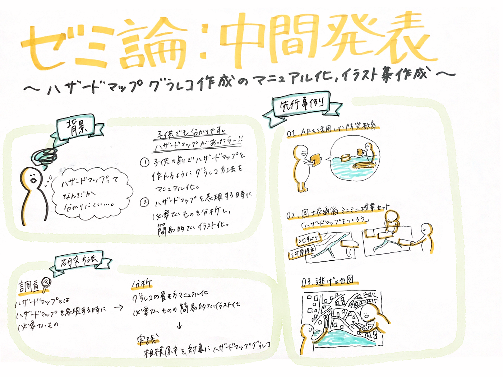

### ゼミ論中間発表：ハザードマップとグラレコ

### Introduction

ハザードマップを実際に自分で調べて見たことがある人って少ないのではないでしょうか？また、見たことがあっても見方がわからない…と感じた人も多いと思います。私自身も最近までハザードマップを見たこともなく、見たら見たで全くもって見方がわからないと困惑しました…。

そこで、より身近なわかりやすいハザードマップがあったらいいのではないかと考え、**「ハザードマップグラレコ作成のマニュアル化、イラスト集作成」**を私のゼミ論のテーマにしてみました。

ハザードマップとは：

> 「ハザードマップ」とは、一般的に「自然災害による被害の軽減や防災対策に使用する目的で、被災想定区域や避難場所・避難経路などの防災関係施設の位置などを表示した地図」とされています。防災マップ、被害予測図、被害想定図、アボイド（回避）マップ、リスクマップなどと呼ばれているものもあります。
ハザードマップを作成するためには、その地域の土地の成り立ちや災害の素因となる地形・地盤の特徴、過去の災害履歴、避難場所・避難経路などの防災地理情報が必要となります。国土地理院では、これらの防災地理情報が表示されている主題図（土地条件図、火山土地条件図、都市圏活断層図、沿岸海域土地条件図など）を作成し、一般に提供しています。

[防災に関する各種マップ
各種マップの利用にあたっては、以下の事項にご留意ください。 土砂災害警戒区域・土砂災害特別警戒区域について …www.city.sagamihara.kanagawa.jp](https://www.city.sagamihara.kanagawa.jp/kurashi/bousai/1008688/index.html)

### Methods

当初、ハザードマップを簡易にイラスト化し子供でもわかりやすいものを作成しようと考えていたのですが、グラレコ＝タイムリーに話や会議の内容をイラストやキーワードでまとめて「見える化」するといったグラレコ要素がないのでは！？と思い断念。

そこで、子供と一緒に楽しくハザードマップを学べるように、

> _①子供の目の前でハザードマップを作れるようなグラレコ方法のマニュアル化_

> _②ハザードマップを表現するときに必要なものを分析し、その要素を簡易的にイラスト化（例：洪水や避難所をどう表現するか）_

をゼミ論の目標とします。

### Results

そこで、今回はハザードマップ防災教育のワークショップについて先行事例を調査しました。

#### **ハザードマップを使った防災教育**

**①ARを活用した防災教育**

もし自分がいる教室が水浸しになったら…を実際に体験し「我がこと」として実感できるのです！自分がいる場所の想定最大浸水深も表示しすることができ洪水リスクをより身近に感じることができます。

**②国土交通省ミニミニ授業セット「ハザードマップをつくろう」**

実際に地図をみて地形を読み取り、危険箇所や避難場所を提案するという非常に実践的な授業ができるようになっています。

**③逃げ地図**

ハザードマップを活用し、避難場所や危険な場所を書き込み、避難所までの時間を色をぬりみんなで発表、話し合うという実践的に防災を学べるものです。

> 「逃げ地図」とは、目標避難地点までの時間を色鉛筆で塗り分ける手づ くりの地図です。道路が色ぬりされることで、直感的に危険な場所と逃げ る方向を理解することができます。ですから、逃げ地図を見ながら、また は作りながらより安全な避難を考えたり、課題を考えたりすることもできます。

[逃げ地図ウェブ
「逃げ地図」とは、目標避難地点までの時間を色鉛筆で塗り分ける手づ くりの地図です。道路が色ぬりされることで、直感的に危険な場所と逃げ る方向を理解することができます。ですから、逃げ地図を見ながら、また…nigechizu.com](http://nigechizu.com/)

#### **イラストについて**

**①国土交通省「洪水ハザードマップイラスト集」**

国土交通省からハザードマップを作成する際に自由に使用できるイラスト集が公開されていました。避難時の心得などハザードマップに書き込むイラストとはまた違うイラストなっていました。

[洪水ハザードマップ イラスト集
ホーム >> 水管理・国土保全トップ >> 防災 >> 浸水想定区域図・洪水ハザードマップ >> 洪水ハザードマップ作成の手引き >> 洪水ハザードマップ イラスト集www.mlit.go.jp](https://www.mlit.go.jp/river/basic_info/jigyo_keikaku/saigai/tisiki/hazardmap/illust.html)

### **Discussion**

３つのに共通して、自分ごととして実感するには実際に自分たちで動いてみる、あるいは描いてみることが重要だと感じました。ハザードマップを使った防災教育という観点から先行事例を調べましたが

> _①ハザードマップを活用しリアルに学ぶもの_

> _②地形や地図からハザードマップを実際に作成するもの_

> _③ハザードマップを使い、新たなマップを作り出すもの_

と特徴が異なりました。そこで、私のゼミ論では③の「ハザードマップを使い、新たなマップを作り出すもの」を主な軸としていきたいと考えます。

#### ##発表用スライド

#### ##グラレコ

#### ##GitHub

[furuhashilab/2020gsc_AyakaKawashima
You can't perform that action at this time. You signed in with another tab or window. You signed out in another tab or…github.com](https://github.com/furuhashilab/2020gsc_AyakaKawashima)
