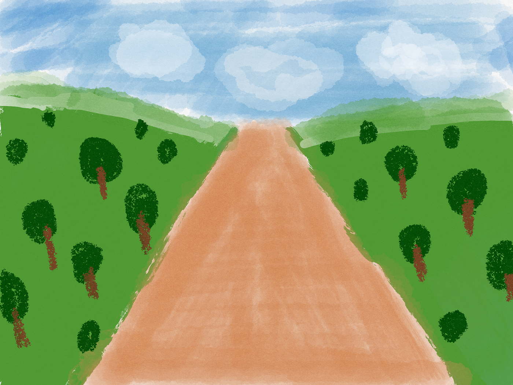
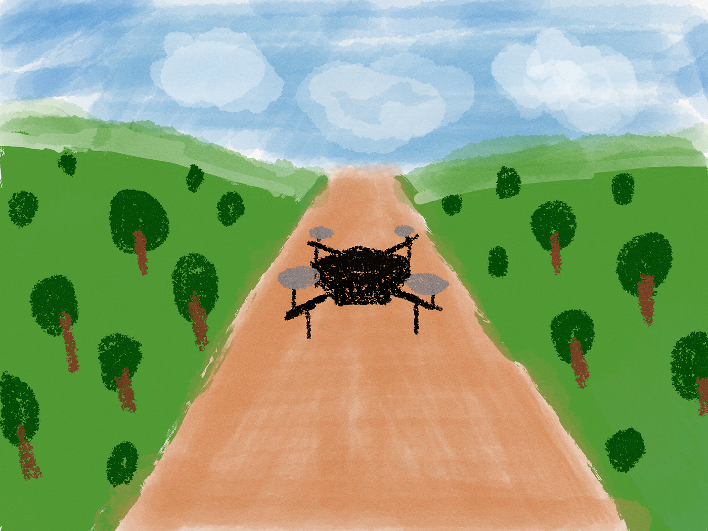
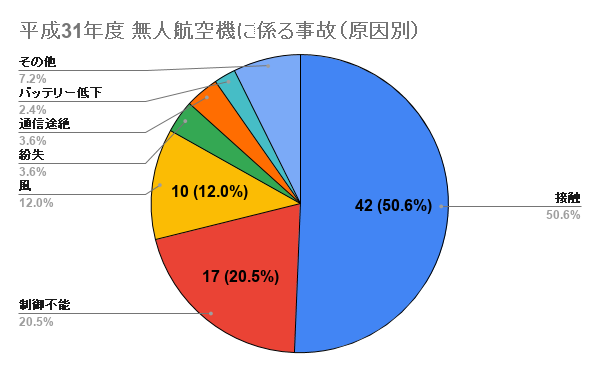
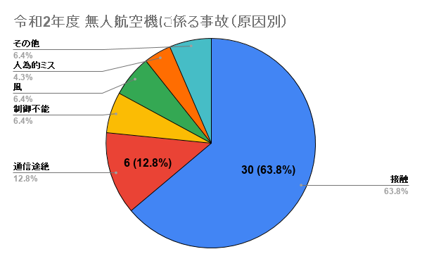
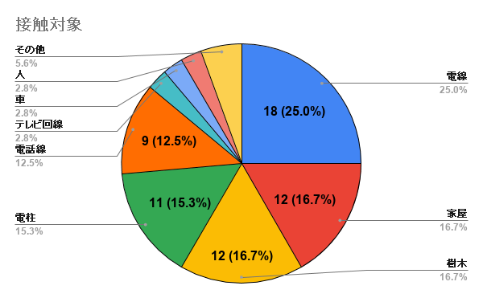
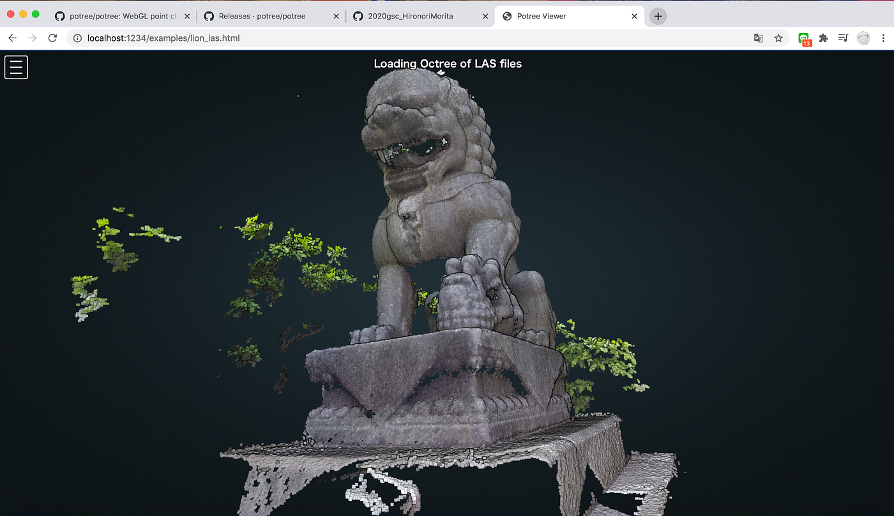
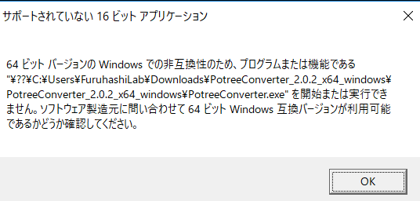
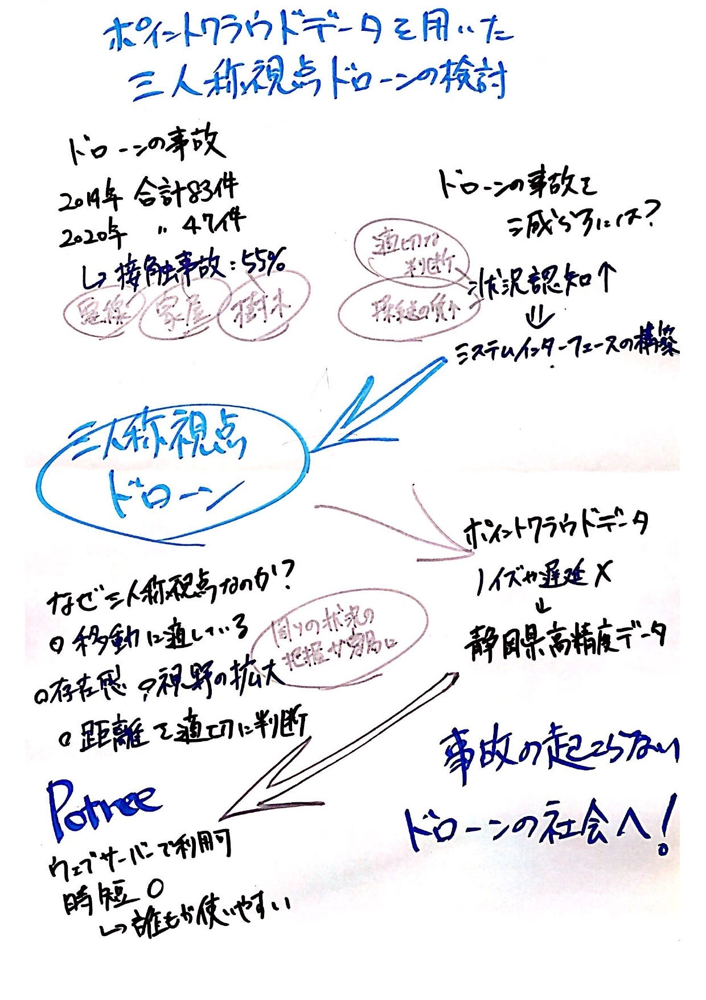

### ポイントクラウドデータを用いた三人称視点ドローンの検討

#### ゼミ論中間発表 森田浩徳

### # 背景

ドローン部に所属してから、少しずつではありますがドローンのニュースに注目するようになりました。近年では農業や災害対応、観測だけでなく、輸送や医療にまで進出されつつあります。技術革新が甚だしいドローン業界では、今後も需要が大きくなり、私たちの生活に密接な時代が到来するのもそんな遠くはないはずです。[Radiant Insights(2017)](https://www.radiantinsights.com/research/commercial-drones-highways-in-the-sky-commercial-unmanned-aerial-systems-uas-market)によると、2021年におけるドローン業界の市場価値は48億ドルにも及ぶと予測されています。しかしそんな朗報の裏では、ドローンによる墜落事故のニュースがちらほら報道されます。

なぜドローンの事故が発生するのか調べた所によると、**接触による事故**が多いことがわかりました。この点は、後の先行研究で記載します。そこで、ドローンの接触事故を防ぐ方法はないのかと考えました。

またコロナの時期で、なかなかドローンを飛ばすことができない時期、荒野行動のドローンで練習を試みました。少しおふざけ感覚程度ではあったのですが、実際に飛ばしてみると、非常に操縦がしやすいことに気がつきました。それは、荒野行動でのドローンは**三人称視点**（Third Person View, 以下TPVと呼ぶ）で操縦できるからです。

現在では、**一人称視点**で操縦されるFPV(First Person View)ドローンは存在しております。しかし、ドローンそのものの映像が画面越しに見える三人称視点のTPVドローンは未だに販売はされていません。

では、FPVとTPVではどれだけ見え方が異なるのでしょうか？





これはFPVとTPVドローンの視点の違いを表したものなのですが、同じ背景でもドローンがあるかないかで、見え方が異なると思います。FPVはドローンから見える映像であるため、より近くダイナミックに見えるかと思います。対しTPVは少し視野が広がり、その名の通り客観視していることが見て取れます。

#### ## FPVの利点

- 近距離が見やすい

- 臨場感やリアリティを感じやすい

- 撮影に適している

#### ## TPVの利点

- 視野が広い

- 周囲の状況を把握しやすい

```
過去の記事
```

[荒野行動から学ぶドローンの安全飛行
都心には様々な高層ビルがありますよね。その中でも際立っているビルmedium.com](https://medium.com/furuhashilab/%E8%8D%92%E9%87%8E%E8%A1%8C%E5%8B%95%E3%81%8B%E3%82%89%E5%AD%A6%E3%81%B6%E3%83%89%E3%83%AD%E3%83%BC%E3%83%B3%E3%81%AE%E5%AE%89%E5%85%A8%E9%A3%9B%E8%A1%8C-d649e3d00bfa)

そこで、**この視点の差を利用することによって、ドローンの接触事故を減らすことができるのではないか**と考えました。思いついたTPVドローンの見せ方として、

1. ドローンにカメラのついた棒を取り付ける

1. ドローンを2台使用する

があげられました。

実際に、[Saakes(2013)](https://ieeexplore.ieee.org/abstract/document/6728900)や、[天間(2020)ら](http://www.interaction-ipsj.org/proceedings/2019/data/pdf/INT19012.pdf)が研究を行なっています。

また[Thomason(2017)ら](https://dl.acm.org/doi/pdf/10.1145/3025171.3025179)は、リアルタイム適応視点システムを導入することにより、ロボットの位置、向き、および3Dポイントクラウドデータを可視化させることにより、ユーザーの視点を変更して可視性を最大化させる研究をしました。その結果、ドローンのカメラのみに依存する遠隔操作において、安全性とスムーズなユーザー操作を改善することが可能になったとされています。しかしポイントクラウドデータを再構築する際に、ノイズや遅延などの現実世界の要因が結果に影響を与える可能性があるため、操縦に悪影響を及ぼす可能性があると懸念しています。

そこで、リアルタイムではなく、既存のポイントクラウドデータを先に可視化することにより、ノイズや遅延の発生を防ぐことができないのではと考えました。今回は[静岡県交通基盤部建設支援局建設技術企画課](http://www.pref.shizuoka.jp/kensetsu/ke-130/index.html)が[高精度点群データ](https://pointcloud.pref.shizuoka.jp/)をCC BY 4.0で公開しているので、その点群データを用いて**静岡県の街を可視化**し、それを**ドローンの操縦に組み込む**ことはできないかという仮説が立ちました。

したがって、ポイントクラウドデータを可視化、さらにドローン操縦のインターフェースに組み込むことで三人称視点ドローンを構成することを提案します。ドローンのより安全な操縦の構築に繋げることを目標に、本研究を進めて参りたいと思います。

### # 先行研究

ドローンの墜落事故には様々な要因がありますが、強風、人為的ミス、接触、通信途絶などの理由が挙げられます。その中でも接触による事故が一番多く、[国土交通省](https://www.mlit.go.jp/index.html)による_無人航空機に係る事故トラブル等の一覧_によると、[平成31年度](https://www.mlit.go.jp/common/001292055.pdf)には83件中42件、[令和2年度](https://www.mlit.go.jp/common/001342842.pdf)（令和2年11月3日現在）には47件中30件にも及んでいます。

約1年9ヶ月の間に最低130件ものドローンの事故や問題が発生していますが、その中でも接触による事故は全体の55%にも及びます。接触の対象として一番多いのが、電線であり、家屋、樹木、電柱、電話線と続きます。この結果から空中にぶら下がっているものや、高いものへの衝突が多く見られることがわかります。







[Clarke(2014)](https://www.sciencedirect.com/science/article/abs/pii/S0267364914000545?casa_token=XOBtllWVlCUAAAAA:odOAkM4P2NiyGQh59jtoKDkFbCYQ3jDiFJYi2DOxsB1TPFbhObHqkEwANGNq8vUSZ3Kj9vb6g_jj)の分析では、ドローンにおける最も重要な2つの価値として、**公共の安全**と**プライバシーへの影響の管理**する適切性について慎重に検討する必要があると結論付けています。また[Yao(2017)](https://dl.acm.org/doi/abs/10.1145/3025453.3026049)によると、ドローン操縦において、**安全の確保は最優先事項**であると述べています。安全飛行の重要性が高いことは言わずとも認識されていると思いますが、未だに事故が防げていないからこそ、この問題が取り上げられていることがわかります。

ドローンによる事故の要因の中に、障害物の有無を確認できなかったり、操縦中に突如接触したという供述がありました。実際ドローンを操縦すると、カメラによって映し出される範囲が限定的であることがわかります。そこでゲームのように周り全体を表示できるようにしたら、接触事故を防ぐことができるかもしれません。

[天間(2019)ら](http://www.interaction-ipsj.org/proceedings/2019/data/pdf/INT19012.pdf)によると、目視外飛行が困難である要因として、**操縦者によるドローン周囲の状況認知（Situational Awareness）が欠かれる**からと述べている。さらに状況認識ができないまま操縦をすると、操縦者は身体的ストレスが発生し、**操縦の質が低下する可能性**があるとも述べている。

[Endsley(1995)](https://journals.sagepub.com/doi/10.1518/001872095779049543)によると、状況認知のステップとして、知覚（Perception）、理解（comprehension）、予測（projection）があり、**周囲認知を高めること により、動的環境における適切な判断やより良いパフォーマンスが期待**されると結論づけている。

[Stanton(2001)](https://www.sciencedirect.com/science/article/pii/S0925753501000108)では、状況認識の改善はより良いサンプリングを促進し、**認知作業量を減らすためのシステムインターフェースの設計**、または個人およびチームレベルでの状況認識のトレーニングと述べています。

つまり、パイロットがストレスなくドローンを操縦するには、よりシンプルなシステムインターフェースの構築をし、状況認知を高めやすい環境を創造させる必要があります。

[Rouse(1999)](https://dl.acm.org/doi/pdf/10.1145/330572.330575)は、三人称視点は**操作対象を世界全体に移動**させるのに適していると結論づけています。[Salamin(2006)](https://dl.acm.org/doi/pdf/10.1145/1180495.1180502)によると、三人称視点は**存在感と視野の拡大**（World View）を供給し、周りの環境をより把握させると提唱しています。通常移動アクションやその対象との相互作用には三人称視点、不動の対象物や近距離を操作する場合は一人称視点が有効です。また ユーザーが三人称視点を使用する場合、カメラの位置によって提供される視野が広いため、**距離をより適切に判断**し、**操作対象の軌道を予測・推定することが可能**になっています。 したがって、 さまざまなアクションで構成されるシミュレーションでは両方の視点が必要であり、それらを切り替えることによって、より効果的に操作することが可能であると結論付けています。

以上からわかるように、ドローンは移動することが必然的であるため、三人称視点での操作が効率的であることがわかります。さらにドローンとその他障害物との距離感の把握がしやすくなるため、接触を防ぐ可能性は高まるはずです。

### # 研究方法

静岡県が提供しているポイントクラウドデータをダウンロードすると、LASファイル形式でダウンロードされます。そのLASファイルを可視化させるためのツールとして、[Potree](https://github.com/potree)を使用します。

[藤井(2016)](https://www.jsokuryou.jp/PDF/201603/soft_147.pdf)によると、Potreeをウェブサーバーに紐付けし、実行環境を整えホームページの一要素として利用すると述べています。実行環境とは、three.jsという**JavaScriptプログラム**を用い、chromeなどの**一般的なブラウザ**で表示させることであります。また[Schuetz(2016)](https://publik.tuwien.ac.at/files/publik_252607.pdf)はPotreeの優れた点として、ウェブブラウザによるポイントクラウドデータの可視化は、使用する人たちが**サードパーティ製アプリケーションを導入することなく、あらかじめ莫大なデータをユーザー間で転送することが可能**であると述べています。さらに[Kumar(2019)](https://search.proquest.com/docview/2319587302?pq-origsite=gscholar&fromopenview=true)らは、WebGLベースのインターフェイスでポイントクラウドをレンダリングするため、**効率的な移植性（共有・配布・公開）を可能**にしている。さらにポイントクラウドのリアルタイムレンダリングをサポートしているため、**レンダラーの読み込み時間が大幅に短縮**されます。Potreeレンダラーを使用して測定された点群の寸法は、構造の実際の寸法と良好な相関関係を示していると論結しています。

他にもポイントクラウドデータの可視化のためのツールはありますが、将来的にドローンの操縦に組み込むという点から、誰もが利用しやすいPotreeで実行することに決定しました。

#### **## 研究の流れ**

1. Potreeを活用

1. [Potree Converter](https://github.com/potree/PotreeConverter)でLASファイルをPotree用にコンバートさせる

1. 静岡市のポイントクラウドデータを可視化

1. ドローン操縦画面へのユーザーインターフェース構築

1. TPVドローン完成

#### ## Potreeの活用

1. [Potree](https://github.com/potree/potree/releases)をダウンロード

1. [Homebrew](https://brew.sh/index_ja)インストール

1. [Node.js](https://nodejs.org/ja/download/)インストール

1. Gulpインストール

1. npmインストール

1. npm起動

→サーバーが起動する

7. [http://localhost:1234](http://localhost:1234)を開く

上記の流れで、Potreeの実行はできました。
Potreeではサンプルデータが用意されており、サーバーが起動されると、ブラウザ上でライオンが確認できるようになります。



#### ## Potree Converterの活用

1. [Potree Converter](https://github.com/potree/PotreeConverter/releases)をダウンロード

1. 実行する

```
./PotreeConverter.exe C:/pointclouds/data.las -o C:/pointclouds/data_converted
```

Potree Converterのファイルは、windows版のみGitHubで公開されています。Macは他のやり方があるのですが、今回はwindows版で取り組むことにしました。

そこで[PotreeConverter_2.0.2_x64_windows.zip](https://github.com/potree/PotreeConverter/releases/download/2.0.2/PotreeConverter_2.0.2_x64_windows.zip)をダウンロードし、解凍して実行してみました。すると、**VCRUNTIME140.dllがないため開始できません**との表示がされました。 Visual C++ のアプリケーションを実行するには、[Visual Studio](https://visualstudio.microsoft.com/ja/downloads/)のダウンロードが必要とのことなので、そのままインストールしました。インストールには、約4時間ほどかかりましたね、、

全ての準備が整ったので、Potree Converterを起動させてみました。
しかし、



16ビットアプリケーションのため対応されていないと、アクセスが拒否されてしまいました。

[PotreeConverter_2.0.2_x64_windows 20201103 · Issue #12 · furuhashilab/2020gsc_HironoriMorita
Dismiss GitHub is home to over 50 million developers working together to host and review code, manage projects, and…github.com](https://github.com/furuhashilab/2020gsc_HironoriMorita/issues/12)

バージョン下げたら実行できるのではないかと考え、[PotreeConverter 2.0.1](https://github.com/potree/PotreeConverter/releases/tag/2.0.1)をダウンロードしました。さっきと同様に実行させると、少し解析は進んだのですが、問題が発生したため中止。

[PotreeConverter_2.0.1_windows_x64 20201103 · Issue #14 · furuhashilab/2020gsc_HironoriMorita
Dismiss GitHub is home to over 50 million developers working together to host and review code, manage projects, and…github.com](https://github.com/furuhashilab/2020gsc_HironoriMorita/issues/14)

[PotreeConverter 2.0](https://github.com/potree/PotreeConverter/releases/tag/2.0)も同様の結果になりました。

[PotreeConverter_2.0_windows_x64 20201103 · Issue #13 · furuhashilab/2020gsc_HironoriMorita
Dismiss GitHub is home to over 50 million developers working together to host and review code, manage projects, and…github.com](https://github.com/furuhashilab/2020gsc_HironoriMorita/issues/13)

現状このコンバートに問題が発生しているため、静岡市のLASファイルが変換できない状態になっています。

### # 今後

1. [Potree Converter](https://github.com/potree/PotreeConverter)でLASファイルをPotree用にコンバートさせる

1. 静岡市のポイントクラウドデータを可視化

1. ドローン操縦画面へのユーザーインターフェース構築

1. TPVドローン完成

上記したように、Potreeを運用させることには成功しましたが、ファイルのコンバートができていない状態であります。このコンバーターの問題を解決することを最優先に行い、最低限静岡市のポイントクラウドデータを可視化するところまでは進めていきたいと思います。

この研究を誰かに引き継いでもらいたい気持ちもありますので、事細かくGitHubにデータを落としておきます。

```
発表資料
```

```
グラレコ
```



```
GitHubレポジトリ
```

[furuhashilab/2020gsc_HironoriMorita
You can't perform that action at this time. You signed in with another tab or window. You signed out in another tab or…github.com](https://github.com/furuhashilab/2020gsc_HironoriMorita)
