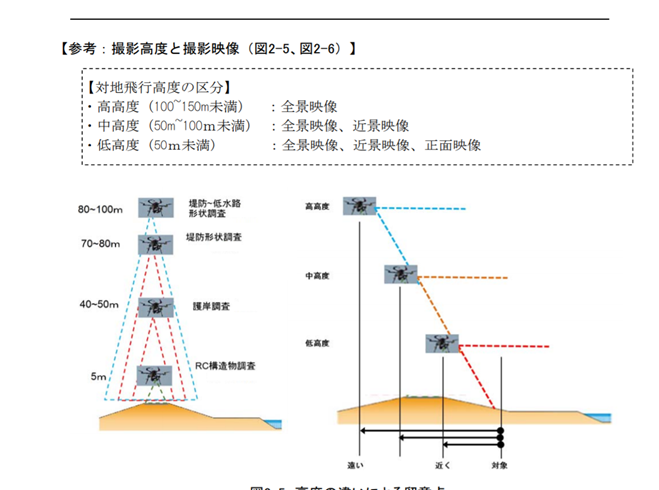
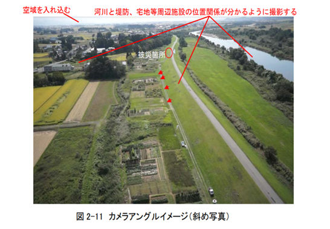
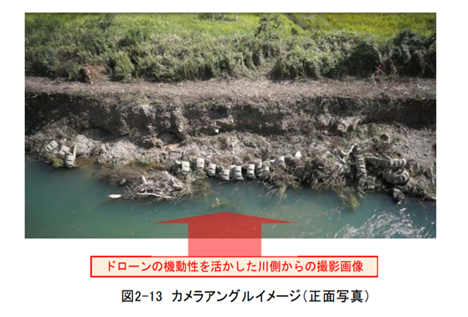
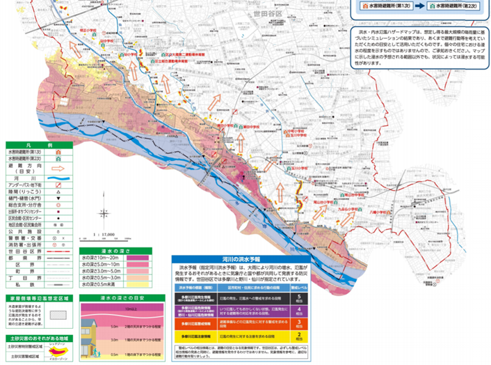
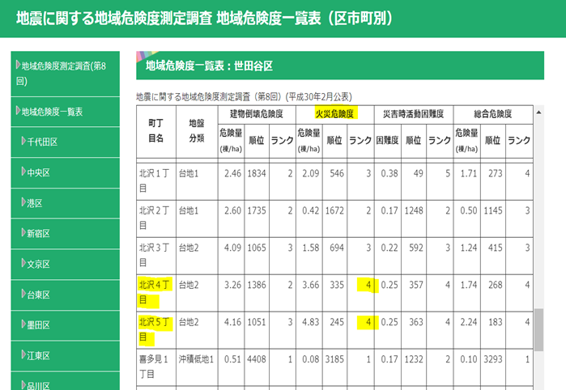
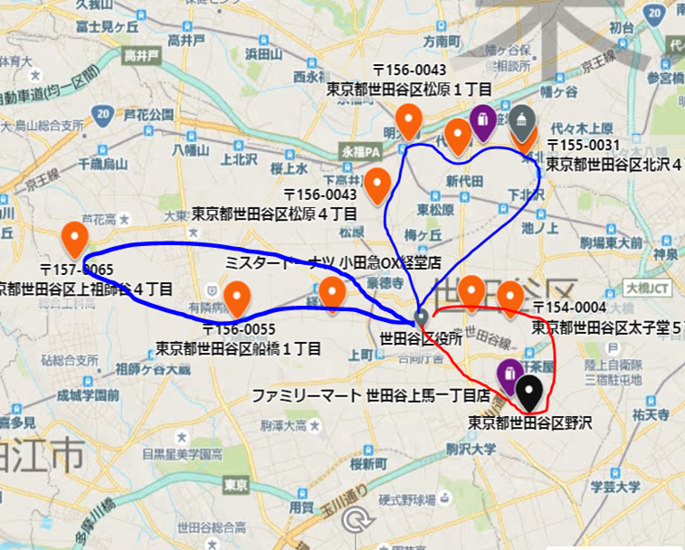
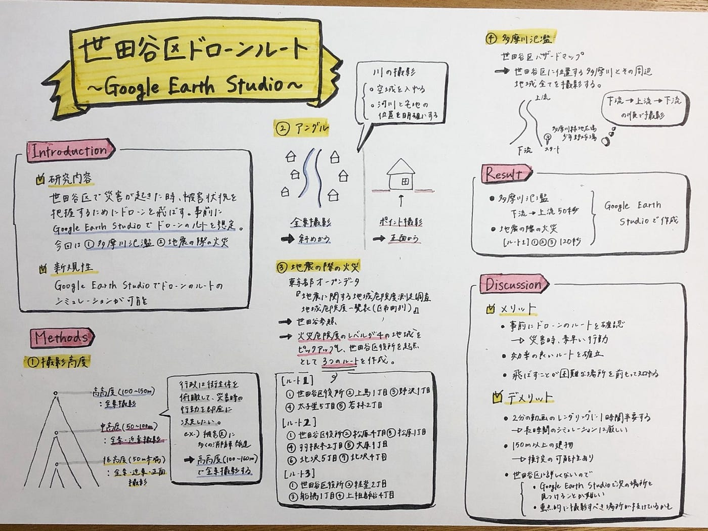

### **世田谷区ドローンルート～Google Earth Studio～**

### **##Introduction**

**###研究内容**

世田谷区で災害が起きて、被害状況を把握するためにドローンを飛ばす。事前にGoogle Earth Studioでドローンのルートを想定する。

今回は①多摩川氾濫②地震の際の火災、の2つの災害時を作成。

**###新規性**

Google Earth Studioでドローンのルートのシミュレーションができる。

### ##Methods

**###撮影高度の確認**

先行事例から

・高高度（100m〜150m未満）:全景映像

・中高度（50m〜100m未満）:全景映像、近景映像

・低高度（50m未満）:全景映像、近景映像、正面映像

[http://www.thr.mlit.go.jp/Bumon/B00097/K00360/drone/assets/doc/point.pdf](http://www.thr.mlit.go.jp/Bumon/B00097/K00360/drone/assets/doc/point.pdf)

行政は被害の大きい地域に多くの消防車を派遣するなど、街全体を俯瞰してみて、災害時の行動を即座に決定したい。

なので、街全体を見ることのできる100m〜150mの高高度からの撮影にした。

**###アングル**

街全体を把握したいので、先行事例から全景撮影に適する斜めから行う。

ちなみに正面アングルはポイント撮影に適している。

また、川の撮影では、空域を入れ、河川と宅地等の位置関係を明確にすることを意識する。

[http://www.thr.mlit.go.jp/Bumon/B00097/K00360/drone/assets/doc/point.pdf](http://www.thr.mlit.go.jp/Bumon/B00097/K00360/drone/assets/doc/point.pdf)

**###多摩川氾濫**

世田谷区のハザードマップから多摩川周辺全体が危険地域だと分かった。

なので、世田谷区に属する多摩川とその周辺地域全てを撮影する。

[https://www.city.setagaya.lg.jp/mokuji/kurashi/005/003/003/d00005601_d/fil/3.pdf](https://www.city.setagaya.lg.jp/mokuji/kurashi/005/003/003/d00005601_d/fil/3.pdf)

スタート地点は多摩川緑地広場少年野球場に設定し、下流→上流、上流→下流と折り返して戻ってくるルートに決定。

今回は下流→上流のみ撮影。

**###地震の際の火災**

東京都のオープンデータ「地震に関する地域危険度測定調査 地域危険度一覧表（区市町別）」より世田谷区を参照。

火災危険度のレベルが4の地域を優先的にドローンで撮影すべきだと考え、レベル4の地域をピックアップし、位置関係を明確にした。

[https://www.toshiseibi.metro.tokyo.lg.jp/bosai/chousa_6/12setagaya.htm](https://www.toshiseibi.metro.tokyo.lg.jp/bosai/chousa_6/12setagaya.htm)

世田谷区役所を起点として、3つのルートでレベル4の地域を撮影。

[ルート1]

①世田谷区役所②上馬1丁目③野沢1丁目④太子堂5丁目⑤若林2丁目

[ルート2]

①世田谷区役所②松原4丁目③松原1丁目④羽根木2丁目⑤大原1丁目⑥北沢5丁目⑦北沢4丁目

[ルート3]

①世田谷区役所②経堂2丁目③船橋1丁目④上祖師谷4丁目

今回は[ルート1]の①世田谷区役所②上間1丁目③野沢1丁目のみを作成。

### ##Result

①多摩川氾濫 下流→上流 50秒

②地震の際の火災 120秒

### ##Discussion

**###メリット**

・事前にドローンの実際のルートを確認できるので、災害が起きた時素早い行動が期待できる。

・効率いいルートを確立できる。

・飛ばすことが難しい場所を前もって知れる。

**###デメリット**

・2分の動画でレンダリングに1時間半要するので、長時間のシミュレーションは厳しい。

・150メートル以上の建物があるので、高度を150メートルだと衝突の可能性がある。

・世田谷区に詳しくないので、Google Earth Studioで次の場所を見つけるのが難しい。

・世田谷区に詳しくないので、重点的に撮影すべき場所が抜けている可能性がある。

グラレコ

パワポ

ギットハブ

[https://github.com/furuhashilab/sotsuron2020/projects/20](https://github.com/furuhashilab/sotsuron2020/projects/20)
