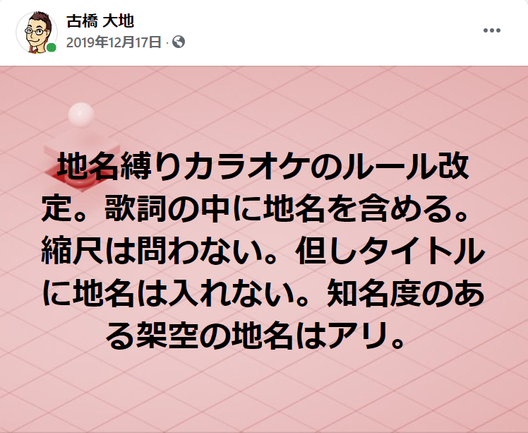
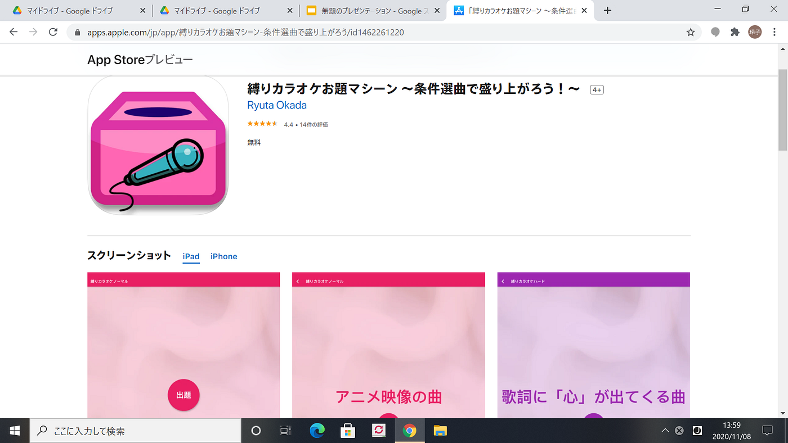
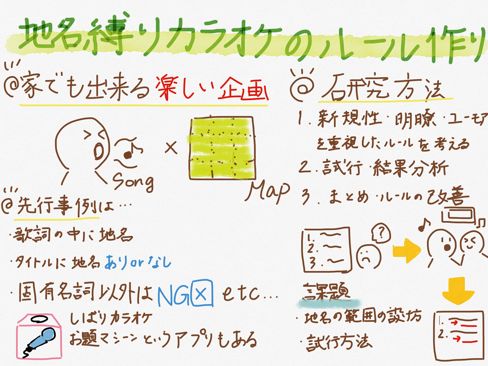

### ～地名縛りカラオケ…？～

こんにちは、古橋ゼミ4年の森玲子です。

今回私はゼミ論のテーマとして「地名縛りカラオケのルール作成」を選定しました。

**はじめに**

このテーマを目にすると、遊び要素が強いな…と思う方もいらっしゃるのではないでしょうか。私自身そう思ってしまうこともあります。

ですがこのテーマとした背景として、

①コロナ禍でカラオケ等アミューズメント施設に行くことが困難である今、誰もが家で楽しめるような企画を提案したい

②企画を提案するにあたり、自身のこれまでの活動（合唱）とゼミ内の活動（地理情報）を掛け合わせた何かをしてみたい

ということがあり、研究をしていこうと決意しました！

**Introduction**

では、この研究の先行事例を紹介します。

[①古橋先生による過去のルール改定](https://www.facebook.com/mapconcierge/posts/3065891406773143)

このように、歌詞の中に地名を含めること・対照的にタイトルに地名を入れてはならないことなど、細部まで凝られているルールであると捉えました。

知名度のある架空の地名はあり、という所が難しさもあり面白いなと思いました。

[②新橋洋楽カラオケ倶楽部さんの経験談](https://smcb.jp/communities/34922/events/165796)

こちらは先生のルール案とは異なり、タイトルに地名を入れることが必要です。

さらに、「川」「歩道橋」など固有名詞ではない地名はNGとなっています。ありきたりな地名を入れることが出来ないということは中々トリッキーであり、盛り上がるのでは？と考えました。

[③アプリ「縛りカラオケマシーン」](https://apps.apple.com/jp/app/%E7%B8%9B%E3%82%8A%E3%82%AB%E3%83%A9%E3%82%AA%E3%82%B1%E3%81%8A%E9%A1%8C%E3%83%9E%E3%82%B7%E3%83%BC%E3%83%B3-%E6%9D%A1%E4%BB%B6%E9%81%B8%E6%9B%B2%E3%81%A7%E7%9B%9B%E3%82%8A%E4%B8%8A%E3%81%8C%E3%82%8D%E3%81%86/id1462261220)

こちらは先行事例というよりかは、縛りカラオケとはどういうものなのか？という点に特化して調べたものです。

地名ではありませんが、

アニメ映像の曲や歌詞に「〇〇」が出てくる曲など、様々な事例があったためルール作成の参考にさせて頂きたいと思います。

**Methods**

それでは具体的な研究方法について説明します。

①ルールを作成する

・先行事例にない、新しいものとします。

・誰でも簡単に理解できるよう、わかりやすいものにします。

②実際に試行し、結果を分析する

・家あるいはカラオケにて？要検討

③分析結果を元に、ルールをまとめていく

・第三者から意見をもらい、改善していきたいと考えております。

**Results And Discussion**

こちらは、最終発表までに進めていきたいと思います、申し訳ございません。

今回は以上になります。進められていない部分が多々あるためスピードを上げて取り組んでいきます。

グラレコ

GitHub レポジトリURL

[furuhashilab/2020gsc_ReikoMori
You can't perform that action at this time. You signed in with another tab or window. You signed out in another tab or…github.com](https://github.com/furuhashilab/2020gsc_ReikoMori)

プレゼンテーション資料

青山学院大学 地球社会共生学部 地球社会共生学科 4年

森 玲子
