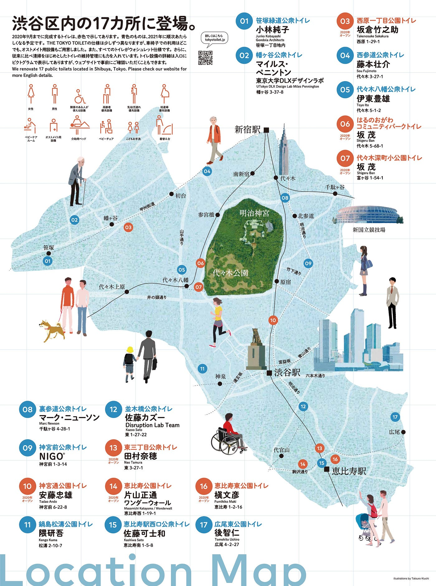
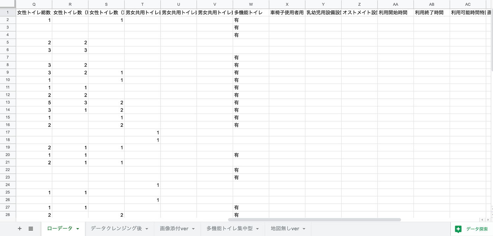
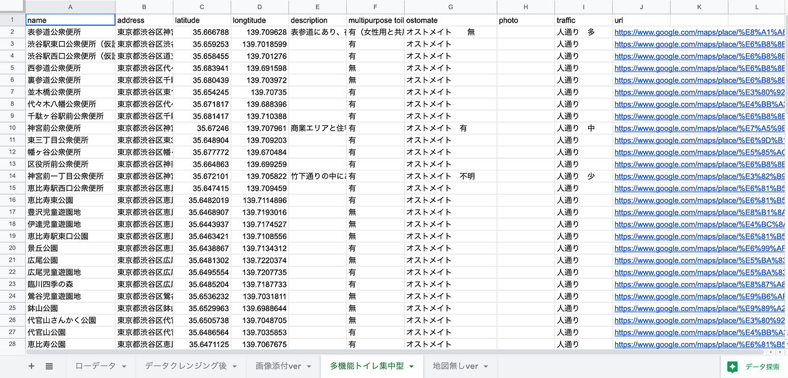
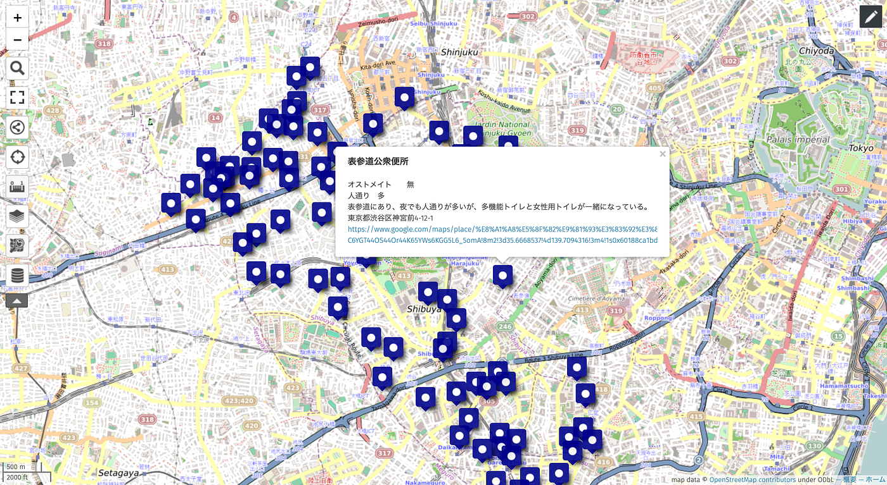
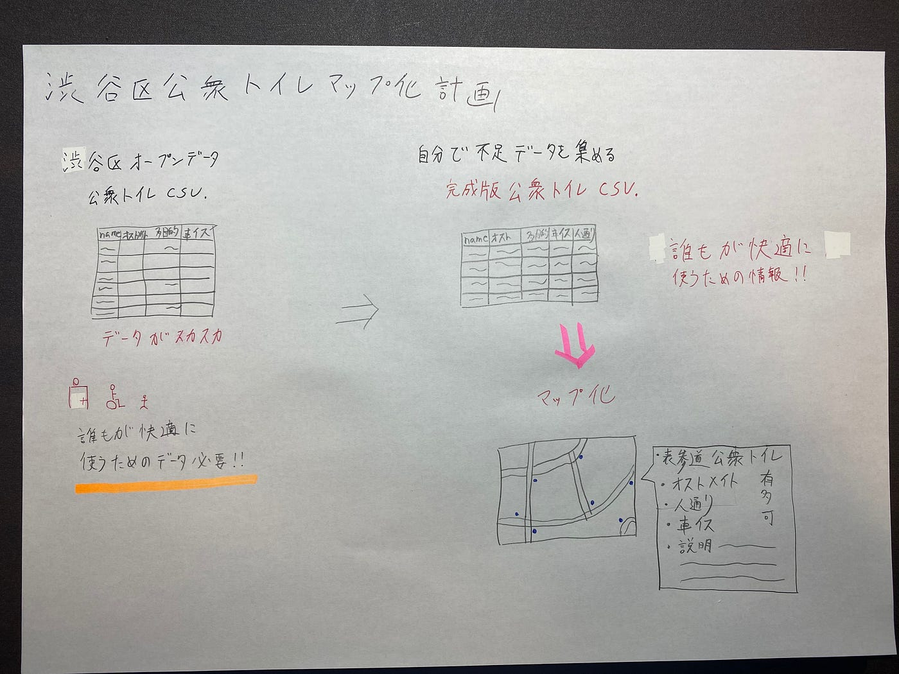

### 渋谷区の公衆トイレマップ化計画

地球社会共生学部 3年 1A118064 木多祐太

> _**Introduction_**

今回のゼミ論では、オープンデータを利用しマップ化するという事と、実際に足を使ってデータを集めるフィールドワークの要素も含めるといった、二つの要素を軸に進めていった。

調査対象を探していると、渋谷区内の17箇所に新たな公衆トイレを建設するという「THE TOKYO TOILET」プロジェクトというものを見つけた。このプロジェクトは渋谷区と日本財団が協力をし、性別、年齢、障害を問わず、誰もが快適に使用できる公共トイレを設置するというもので、プリツカー賞受賞者４人を含む、世界で活躍する16人のクリエイターによる優れたデザイン・クリエイティブの力で、インクルーシブな社会のあり方を広く提案・発信することを目的としているプロジェクトである。

[渋谷区内17の公共トイレが生まれ変わる「THE TOKYO TOILET」プロジェクト メディア公開 | 日本財団
日本財団は、誰もが快適に使用できる公共トイレを設置するプロジェクト「THE TOKYO TOILET」を実施しています。本プロジェクトは多様性を受け入れる社会の実現を目的とし、東京都渋谷区内の17カ所に新しい公共トイレを [...]www.nippon-foundation.or.jp](https://www.nippon-foundation.or.jp/who/news/pr/2020/20200805-46948.html)

このプロジェクトを知ってから、普段あまり使う機会の少ない公衆トイレに興味が湧き、渋谷区の公衆トイレに関するオープンデータを調べてみると、多機能トイレの有無に関するデータは入力されていたが、オストメイトの設置トイレ有無などの情報が入力されておらず、もっと改善の余地があるように感じた。その為、今回のゼミ論では、渋谷区の公衆トイレに関するオープンデータを改良し、「渋谷区の公衆トイレマップ」を作成する事にした。

既にオストメイトトイレの検索サイト「オストメイトJP」というものが存在していたが、駅や建物などの施設内の情報しかない為、今回は公衆トイレのデータを集めていく。

> _**Methods(中間発表時点)_**

・渋谷区のオープンデータサイトから、公衆トイレのCSVマップをダウンロードし、データクレンジングを行う。

・渋谷区にある82箇所の公衆トイレを周り、不足データを集め、情報量の多いCSVデータを作成する。（現在ここ）

・完成したCSVデータをuMapにインポートし、マップ化する。（進行中）

> _**Result (中間発表時点)_**

不足データの収集中であるが、現在のCSVデータをuMapに入力してみた。

CSVデータのデータクレンジングを行った為、文字化けなどの問題は発生しなかった。今後も同じようにCSVデータを完成させていく。

> _**Discussion（中間発表時点）_**

・故障中であるトイレが多い。

・ポップアップにどのような情報を載せるかが難しい。

> _**Github レポジトリ＆プロジェクト_**

・[2020年度ゼミ論Github レポジトリ](https://github.com/furuhashilab/2020gsc_YutaKita)

・[2020年度ゼミ論Github プロジェクト](https://github.com/furuhashilab/sotsuron2020/projects/16)

> _**発表用スライド_**

> _**グラレコ_**

