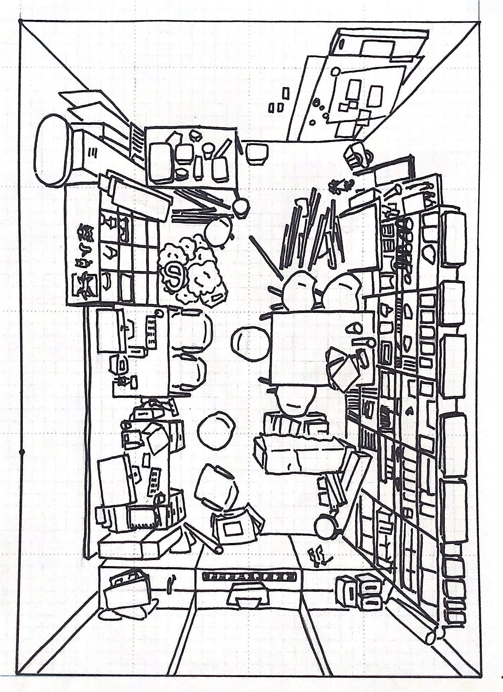
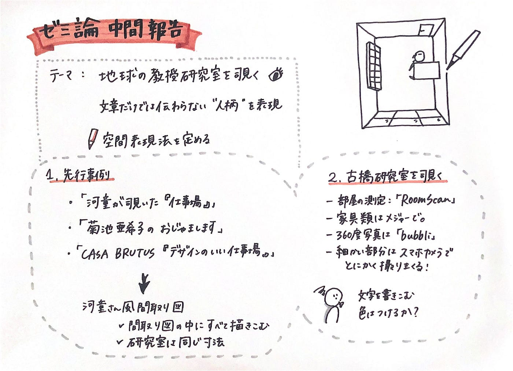

### 研究室を覗く

古橋ゼミ3年大岸のゼミ論中間報告です！

#### Introduction

「地球社会共生学部の教授研究室を覗く」
私が大学3年目の後半に差し掛かり感じたこと。それは、大学4年間の中で自分の学部の教授のことをどれだけ知ることができるだろう、ということです。
ゼミを選ぶ際、授業をとったことがある教授はなんとなく人柄を知っているけれど、関わったことがない教授はどんな人なのかさえ知らない…。ゼミ内容を紹介する冊子をもらったけれど、これを読むだけでは先生がどんな人なのか全然わからない…。
そこでこの研究を通して、文章だけでは伝わらない「こんな人柄の教授です」という部分を可視化していきたいと思いました。

今回の中間報告では先行事例を通して、研究室空間の表現法を定めていきました。

#### Method

「研究室」をテーマにするにあたり、世の中の「仕事場」をテーマにした先行事例を調査しました。

[河童が覗いた「仕事場」](https://www.amazon.co.jp/gp/product/4167535041/ref=ppx_yo_dt_b_asin_title_o04_s00?ie=UTF8&psc=1)
[菊池亜希子のおじゃまします](https://www.amazon.co.jp/gp/product/4087807126/ref=ppx_yo_dt_b_asin_title_o00_s00?ie=UTF8&psc=1)
[CASA BRUTUS「デザインのいい仕事場」](https://www.amazon.co.jp/gp/product/B07BQNMTJX/ref=ppx_yo_dt_b_asin_title_o01_s00?ie=UTF8&psc=1)

またこれらを通して実際にどのような表現をしていくか、古橋研究室を実験台に間取り図化をしました。

#### Result

**河童が覗いた「仕事場」
**河童さんの間取りといえば、天井から見たかのような俯瞰間取り。間取り図の中の文字まで俯瞰したようなスタイルで書かれています。
特徴はその瞬間を切り取ったかのような間取りの表現と、一つの間取りの中に部屋の中においてあるモノが細かく描きこまれていることだと思います。
河童さんの間取りは本人を知らなくても、その人が何をしている人なのか、どんな人なのかまで伝わってしまうような空間の表現力があると思います。

**菊池亜希子のおじゃまします**
菊池さんの間取り図は、シンプルに設計図を書いた周りにカラフルなイラストで部屋の様子を表現してます。
特徴は部屋の中だけでなく、会話に登場したシーンやそこにいる人を表現することだと思います。また、こだわりのものをピックアップしてイラスト化することで、その人の人柄やこだわりが伝わってくるような間取りでした。

**CASA BRUTUS「デザインのいい仕事場」**
CASA BRUTUSでは、国内外の「いい仕事をするためのオフィス環境」が紹介されています。
多くの写真と記事を通して、デザインのこだわりや社員の働く様子を紹介しています。
これは上の二つとは違い、間取りで表現するということではなく、オフィス空間のこだわりや良さを伝えるという表現でした。全体像は伝わりづらいですが、その分フォーカスしたい部分を写真と言葉で表現することで詳細に伝わりやすいという特徴を感じました。

#### Discussion

これらの3つを比較し、私の研究目的である「文字だけでは伝わらない、人柄を伝える」ための表現方法としては、妹尾河童さんの間取り図がイメージするものだと感じました。
また、今回研究室を比較するにあたり、部屋の構造自体は全て同じなので、その点でも河童さんの「間取り図の中に描きこむ」方法が合っているのではないかと感じました。

ということで、実際に古橋研究室を実験台に間取り図を描いてみました。

> 部屋の測定には「[RoomScan](https://apps.apple.com/jp/app/roomscan-lidar/id1504050801)」、家具類はメジャーで測定
360度写真は「[bubbli](https://apps.apple.com/jp/app/bubbli/id720480745)」、細かい部分はスマホカメラで撮影
トータルおよそ1時間

思っていた以上にモノが多く、描き起こしに丸3日ほど要しました…。
本棚の中のものや流れている音楽など、間取りの中に表現しきれていない部分はこれから書き込んでいきたいと思います。
また菊池さんの間取りのように、色を付けることで雰囲気が伝わりやすくなるのではないかとも思っています。しかしごちゃごちゃになっていしまう気もするので、シロクロとカラフルの両バージョンを作成して比較していこうと考えています。

今回の測定で研究室の部屋の設計を調べることができたので、この間取りを基準に、最終発表に向けて地球社会共生学部の教授の研究室を可視化していきたいと思っています！

#### ##発表用スライド

#### ##グラレコ

#### ##Github

[furuhashilab/2020gsc_YukiOgishi
You can't perform that action at this time. You signed in with another tab or window. You signed out in another tab or…github.com](https://github.com/furuhashilab/2020gsc_YukiOgishi/projects/1)

青山学院大学 古橋研究室3年

大岸 裕紀
