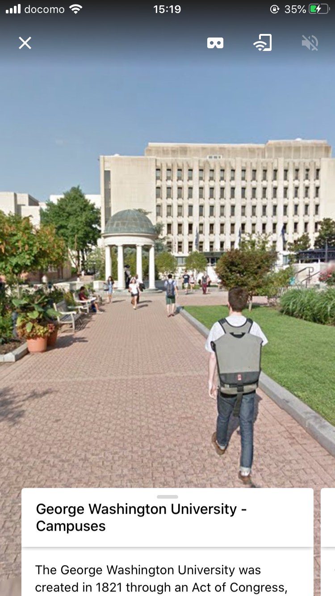
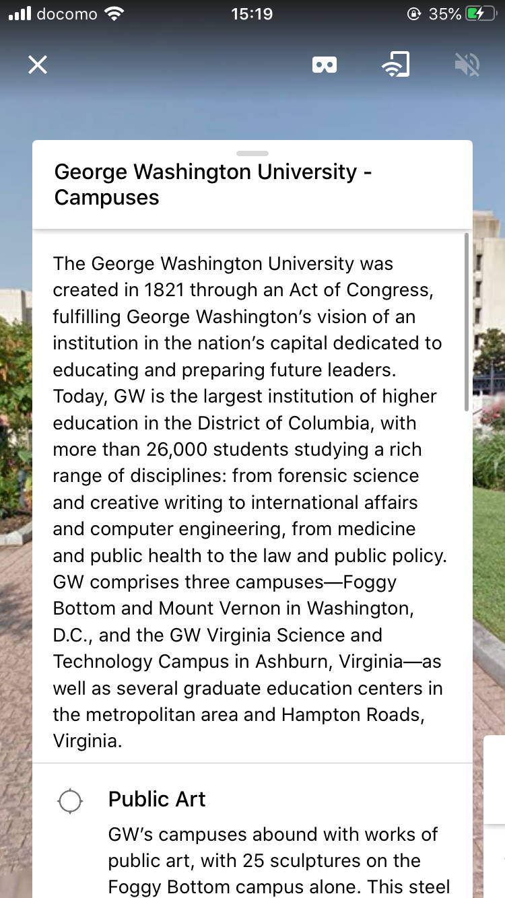

### Google Expeditionsを用いたキャンパスツアー作成

グーグルカードボードとexpeditionsを使って、相模原キャンパスのツアーを作成しようと思います。現在、expeditions内に大学案内ツアーを作成、公開している大学は多くがアメリカで、日本の大学はありませんでした。なので、大きく言うと日本で初めての試みだと思います。

VR

アメリカジョージワシントン大学の例です

ツアーを作成するにあたって、Google ストリートビューのパノラマを使う、360° カメラで撮影した独自の画像を追加する。スポットを当てて、この棟はどのような場所なのかを英語表記で説明文に記述する。

### 応用（AR)

キャンパスツアーとジオキャッシング を組み合わせて、expeditions内にグループツアーを作成。

例、ARを用いて、宝を案内する際に、色やサウンドを使いゲーム性を取り入れつつ案内できればいいなと思います。
