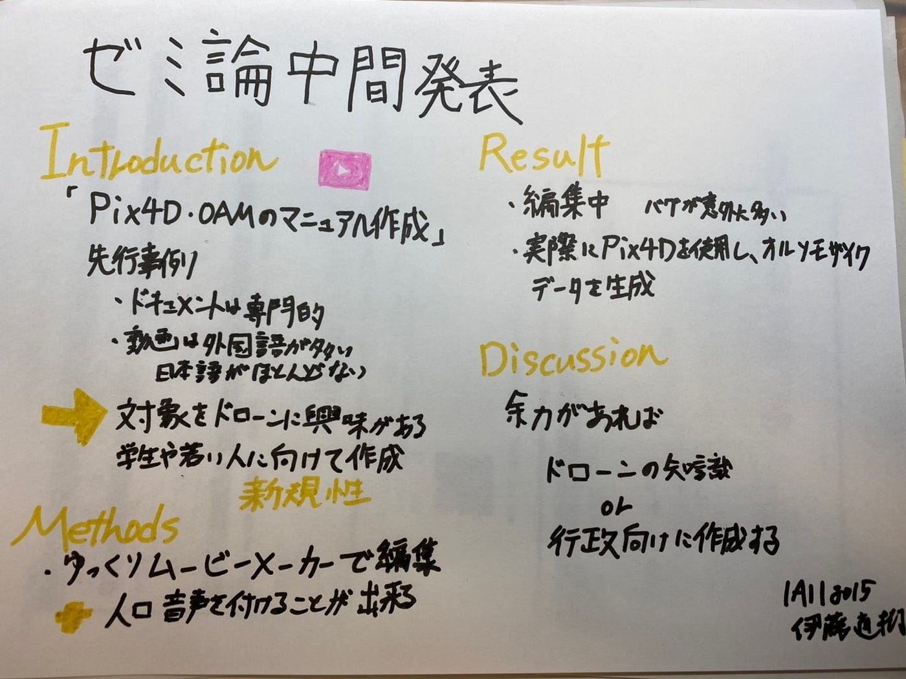

Pix4Dを用いたオルソモザイクの形成のマニュアル作成

今回、私のゼミ論は、「Pix4Dを用いたオルソモザイクデータの生成、OAMにアップロードするまでの動画マニュアル作成」をすることに決めました。

**Introduction**

なぜマニュアル作成をしようと思ったのかというと、ハッカソンの時に動画を見ることによって、ドキュメントで見るよりも分かりやすかったからです。ドキュメントではどのようなボタンを押せばよいのか分からなくなってしまったり、誤った認識で違うボタンを押してしまったりしてしまいました。動画では、見るだけでなく聞いて学ぶことが出来るのでよりマニュアルに相応しいと思いました。

先行事例を見てみると、ドキュメントでは[森林](http://taffrc.pref.toyama.jp/nsgc/shinrin/webfile/t1_58c629219b7f72c0e8d86782a6989592.pdf)や農業の視点からどのように空撮をしていけば良いのか記載されていることが多かったです。動画でPix4Dのマニュアルについて調べていくと、日本語で説明しているものはほとんどなく、外国語で説明しているものがほとんどでした。

またOpen Aerial Mapにアップロードするまでの動画のマニュアルは外国語の動画がほとんどで日本語はほとんどなかったです。

当初の予定では行政のために動画のマニュアル作成をすることを目標にしていきましたが、先行事例の状況をもとに、日本語で、ドローンに興味を持っている人、また古橋ゼミの今後入ってくるドローン部の後輩を対象に動画のマニュアル作成をすることにしました。新規性は、対象を学生やドローンに興味のある人を対象に動画のマニュアル作成をすることです。

**Methods**

今回使用する動画編集ソフトはAviUtlの補助編集ソフトのゆっくりムービーメーカーを用いて編集していきます。この編集ソフトでは、字幕を入れると自動的に人工音声が発声してくれます。そのため話すということを機械に頼ることが出来ます（先行事例の韓国語のものは違う人工音声を使用しています。）。

導入はこちらの[サイト](https://aviutl.info/yukkuri-moviemaker/#toc15)を参照しました。

無料で色々な機能を追加することが出来ますが、設定がかなり大変でした。

そしてPix4Dcaptureの空撮から、Pix4Dreactを用いたオルソモザイクデータの生成、そしてOAMのアップロードのマニュアル作成を行っていきます。

**Result**

10月28日に行われた、ドローン部の飛行訓練でPix4Dを実際に用いてオルソモザイクデータを生成しました。

**Discussion**

ゆっくりムービーメーカーを用いてマニュアル作成を進めていきたいと思います。早く動画編集が終わったら、

1. ドローンの事前準備についてのマニュアル作成

1. 行政に向けたマニュアル作成

に挑戦していきたいと思います。11月8日に行われたドローンジャーナリズムの授業で教えていただいた知識をマニュアル作成したら今後もっとドローン部が前進していくと思いました。

先行事例の参照はこちらです。

富山県農林水産省総合技術センター森林研究所 2020年1月

「[ドローンによる空撮と画像解析のやり方](http://taffrc.pref.toyama.jp/nsgc/shinrin/webfile/t1_58c629219b7f72c0e8d86782a6989592.pdf)」

内山庄一郎 2018年10月

「[SfM写真測量によるマッピング](https://hdtopography.github.io/learning/SfM-MVS/GIS_uchiyama_2018/20181021SfM%E3%83%8F%E3%83%B3%E3%82%BA%E3%82%AA%E3%83%B32018_%E5%85%AC%E9%96%8B%E8%B3%87%E6%96%99.pdf)」

Pix4D 「[Pix4Dcapture スタートガイド](https://support.pix4d.com/hc/ja/articles/202557269-Pix4Dcapture-%E3%82%B9%E3%82%BF%E3%83%BC%E3%83%88%E3%82%AC%E3%82%A4%E3%83%89)」

ドローン水稲モニタリング 2017年6月

「[オルソ画像](https://www.gsi.go.jp/gazochosa/gazochosa40001.html)」

KUU-SATSU.COM 「[Pix4Dcapture インプレッション](https://kuu-satsu.com/pix4dcapture/)」

山北調査設計株式会社 地質調査 ドローン 赤外線 [https://www.youtube.com/watch?v=lWaItF0hJvk&feature=youtu.be](https://www.youtube.com/watch?v=lWaItF0hJvk&feature=youtu.be)

Flying camera날으는 카메라「[👍👍👍pix4D capture 촬영설정 아이콘기능 알면 쉬워요」](https://www.youtube.com/watch?v=bfISfBQb1NY&feature=youtu.be)

TECH DRONE MEDIA 「[How to do 3D Mapping with Pix4D — part 1](https://www.youtube.com/watch?v=u-wkMmA8KZ0&feature=youtu.be)」

グラレコ

パワポ

[furuhashilab/2020gsc_NaokiIto
You can't perform that action at this time. You signed in with another tab or window. You signed out in another tab or…github.com](https://github.com/furuhashilab/2020gsc_NaokiIto)
