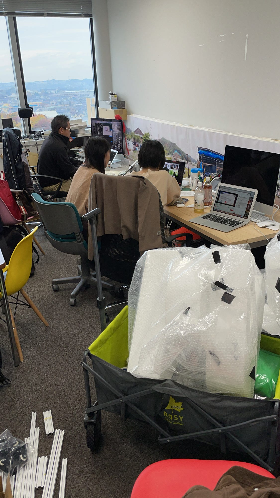
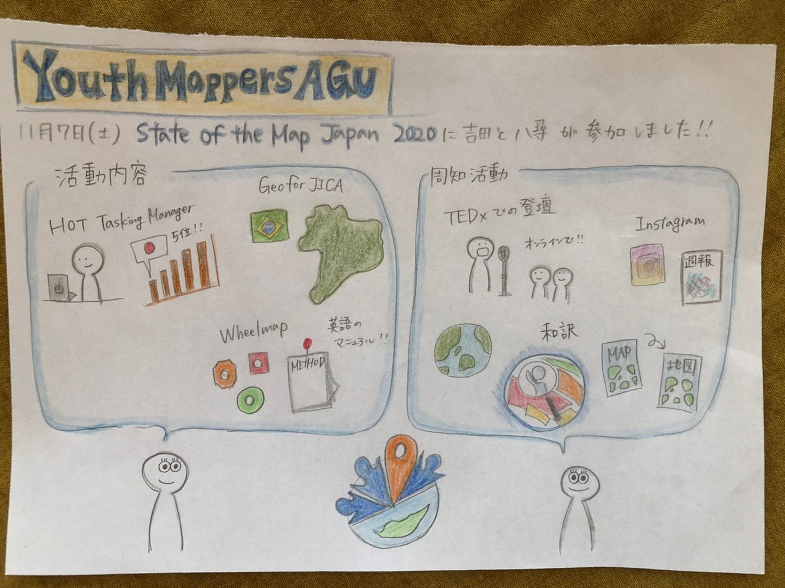

### State of the Map Japan 2020 終了

先日、State of the Map Japan 2020にユースの吉田と八尋が登壇しました。オンラインカンファレンスは今回が初めてだったので2人ともガチガチに緊張していました。

これまでTEDXと今回のState of the Map Japan 2020にユースは登壇してきましたが、私たちが発信していくべきものは何なのかがだんだんと分かってきたような気がします。

やはり地図を作るというのは一般の方々からしてみれば分かりにくい事だと思います。私たちがやるべき事はそんな堅苦しいイメージである地図をみんなが作れるものであると広めていく事だと思います。

12月にはHOTのライトニングトークが予定されています。これまでユースが行ってきた事を国内から世界に発信していくチャンスです。全力で挑みます。

#### 今週からの活動

・HOT発表に向けた準備

・海外他大学とのコラボ

海外大学とのコラボとしてガーナのYouthMappersUCCとマッパソンを行うことにしました。UCCと高橋がMTGを行った際にiDEditerではなくJOSMを使ってマッピングを行っているということだったので自分たちで習得してマッパソンに臨みたいと思います。

[https://learnosm.org/ja/beginner/](https://learnosm.org/ja/beginner/)

