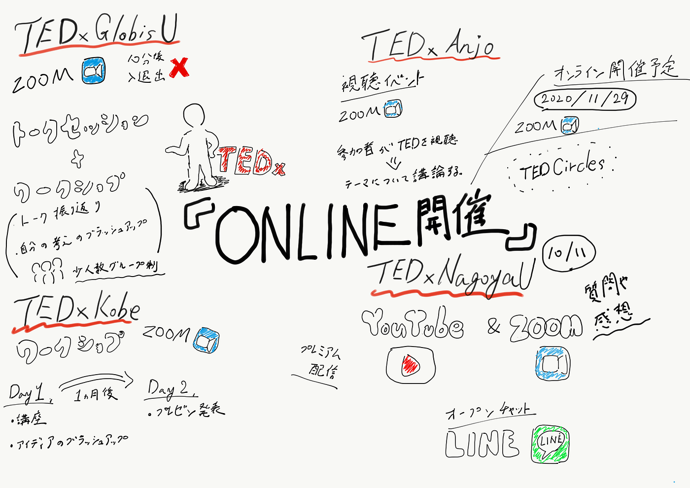

### TEDxオンライン開催事例

自分のゼミ論としては、TEDxAGUでのオンライン開催を通して、どのようにしていけばより効率良く、また質の高いイベントとなるのかをまとめ、他団体に共有できるようなものにしていきたいと考えています。

特に、自分はTEDxの中では、演出・撮影・編集に携わっていることが多かったので、そこに焦点を当てた成果物にしていきたいと思います。

そして、その前段階として今回の中間発表では、他TEDxのオンライン開催の事例がどのくらいあるのか、どのように行っているのかなどを調べてみました。

_・**[TEDxGlobisU_**](https://www.tedxglobisu.com/)

オンライン：ZOOM（＊イベント開始後**10分を過ぎると入出不可**にしている。）

/スピーカーのトークセッション＋ワークショップ

**ワークショップ**

・TEDxGlobisUのトーク振り返り

・参加者との意見交換を通じた、自分自身の考えのブラッシュアップ

_（＊少人数グループに分かれて実施）_

_**・[TEDxKobe](https://tedxkobe.com/event/event0031/)（_**ワークショップ）

オンライン：ZOOM

1日目 ワークショップ

・TEDxトークとしてオーディションで重視するポイントをスタッフと共に確認し、チューニングするためのワークショップ。

- TEDxKobeスピーカーチームより、講座「伝えたいことを見つめなおす」

- TEDxKobeスタッフと共に、アイデアのブラッシュアップタイム

1ヶ月後

2日目 発表（プレゼンテーション）

_**・TEDxAnjo_**

_視聴イベント_**（**[http://tedxanjo.com/events/](http://tedxanjo.com/events/)）

オンライン：ZOOM

参加者みんなで本家TEDのスピーチを観賞し、議論するイベント。

_オンライン開催予定_（[http://tedxanjo.com/tedxanjo2020/](http://tedxanjo.com/tedxanjo2020/)）

オンライン：ZOOM

_**・[TEDxNagoyaU_**](https://tedxnagoyau.com/events/2020)

YouTubeとZOOMを使用して行うイベント。TEDxAGUと似た体制で開催。

LINEのオープンチャットを使用し、参加者とのコミュニケーションを含めた円滑な運営を実施することができるようにした。

#### ＜スライド＞

#### ＜グラレコ＞

