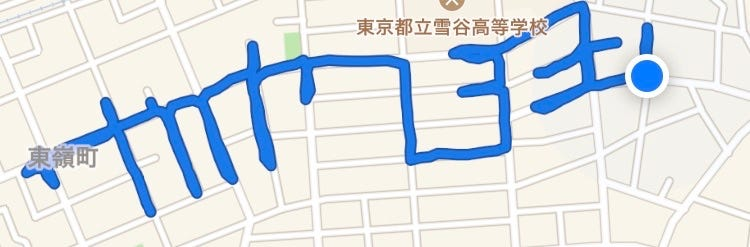
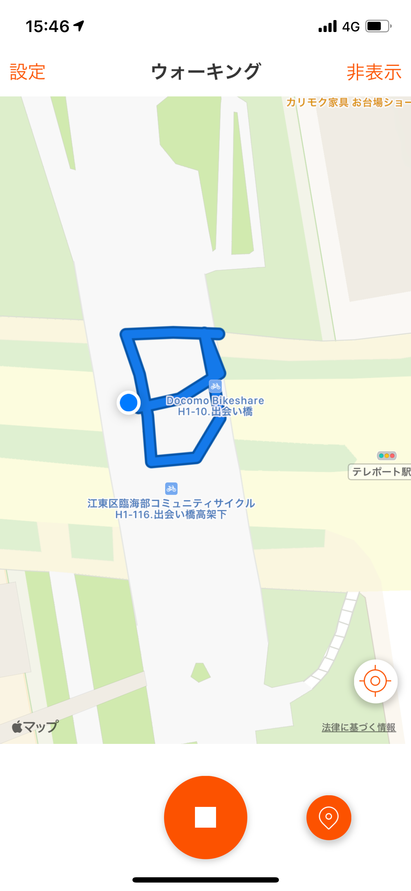
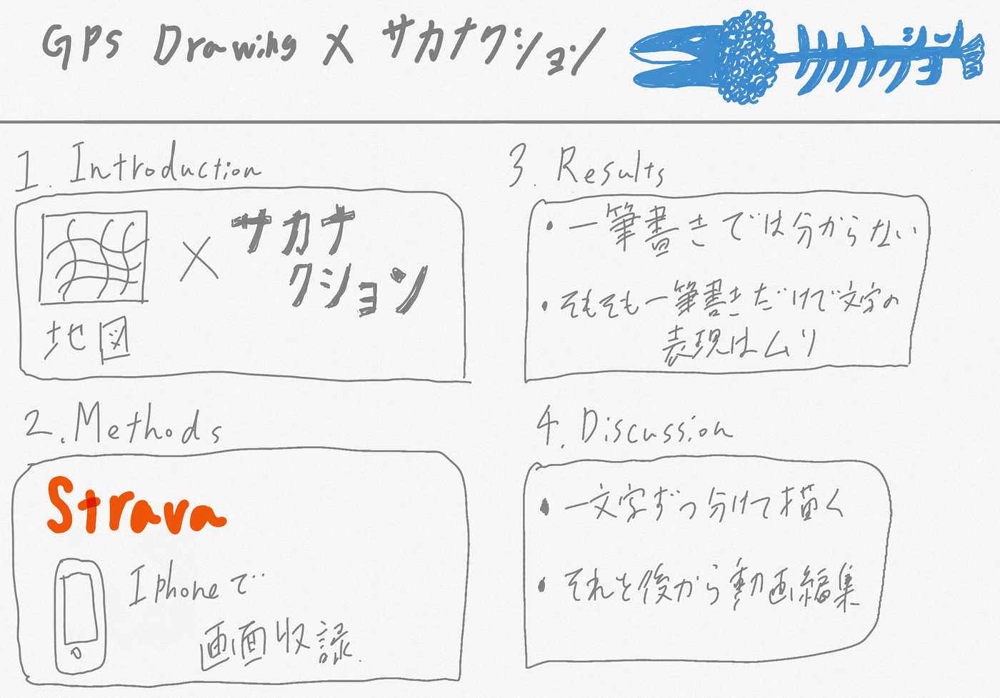

### もう一つ上のサカナクションファンになるために

こんにちは、日向野邦春です。

ゼミ論の中間発表ということで私はサカナクションに関連した内容を行いたいと思います。

#### Introduction

**サカナクションの曲をGPSの形跡で表現しよう**

なんじゃそりゃって思う方も多いと思いますが、このことを**GPS Drawing**と言います。様々な動物などの絵を一筆書きで表現することをさすのですが、今回は文字です。

[ARTIST
He is interested in geo-located media, and as he began GPS Drawing, his His work has been YASSAN was born in Saitama…gpsdrawing.info](http://gpsdrawing.info/artist.html)

#### Methods

まぁとにかく大変です。一筆書きでサカナクションの楽曲を表現しようとなると途方もない時間がかかります。今回は道と公園を上手に使い分けながら表現することに決めました。そこで使うのがStravaです。StravaにあるGPS記録の機能を画面録画して文字を描いていきたいと思っています。

#### Results

これは前期に歩いて表現したサカナクションの文字です。頑張れば分かるという感じだと思います。ここで分かったのは繋げて描こうとすると分かりにくくなってしまうという事です。

#### Discussion

この結果から、一筆書きで文字を表現するのではなく１文字ずつ分けて描いていく事で分かりやすくなるのではないかと考えました。もう一つは「難しい漢字は公園で表現」です。アルクアラウンドに出てくる漢字は全部で55種類です。その中でも僕や離という漢字は道で表現するのは困難だということに気が付きました。なので基本的には道路で表現しつつも難解な漢字は公園などの広い場所で表現することに決めました。

そして使う楽曲はサカナクションのアルクアラウンドです。(歩くので）

サカナクションのパロディ動画で有名なものだとレゴで表現した動画です。山口さんもTwitterでこの動画を拡散していました。

#### 新規性

今回の研究内容の新規性は「文字」にあると思います。そして、もう一つは全ての文字を描き終えた後に動画として作品にしなければならないということです。

目標は3年生終了までに1番を終わらせることです。

まぁ頑張っていきます。

