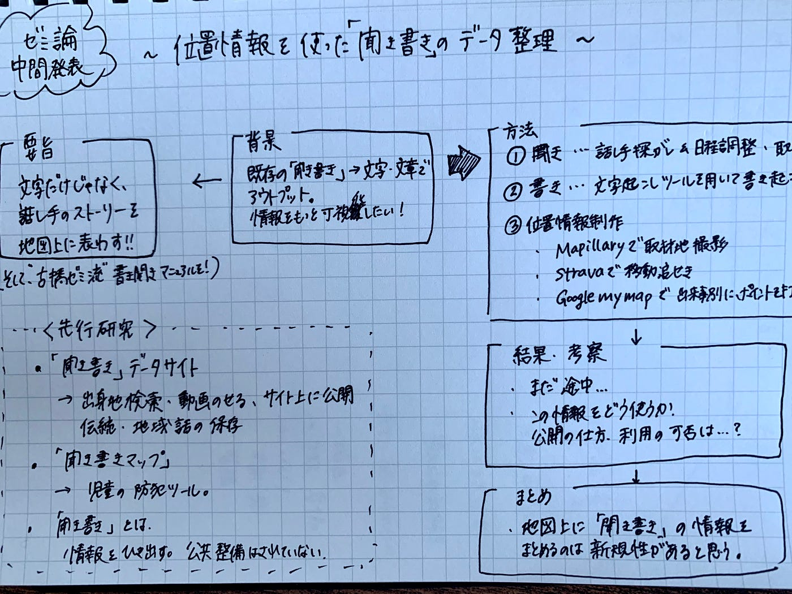

### ゼミ論中間発表〜位置情報を使った聞き書きデータの整理〜

こんにちは！3年の佐藤です。
ゼミ論中間発表頑張りましょう〜！=(^.^)=

★[GitHub レポジトリURL](https://github.com/furuhashilab/2020gsc_KahoruSato)
★[スライド](https://docs.google.com/presentation/d/1HyM2AfAJsyLd6Ewtsqc0fPfXFzvO0df8XrtiacZp9Ik/edit?usp=sharing)
★グラレコ

### ＃要旨

「聞き書き」とは、話し手の言葉を書き起こす情報収集の手法である。相手が話したいことを聞くという点で、インタビュー等とは異なる。通常「聞き書き」は伝統文化、芸術の継承・地域、世代間交流のために用いられることが多く、文章のみで情報を可視化している。
本研究では、文章情報と位置情報を取り入れて、「聞き書き」で得た情報を整理することで“情報の記録法”としての「聞き書き」を発展させる。

### ＃導入

＜目的＞
本研究では「聞き書き」に、位置情報記録ツールを取り入れて情報を整理することで“情報の記録法”として「聞き書き」を発展させることを目的とする。
また古橋研究室で「聞き書き」を実践した先例は無い為、本研究方法をマニュアル化し記録することで、後代に伝えることを目的とする。

＜研究背景＞
これまでの「聞き書き」は、話し手の言葉を書き起こして印刷するなり出版するなりで終わっていた。「聞き書き」で綴られるのは話し手の人生や伝統文化であり、情報量が多い。莫大な情報を文章だけに保存するのは勿体無いと思い、多角的に話し手の情報を表現したいと考えた。そこで、語られた中の地理情報を他媒体で表現することを考案した。

下記の先行研究①では、地域アーカイブに蓄積された聞き 書きの活用促進として, 整理・分類による聞き書 きの活用促進を図っている。サ[イト内](https://hana-isan.com)では、聞き書きの文章データの閲覧から、地域別検索が可能となっている。しかし地理情報については、出身地ごとの検索のみであり、一人一人のストーリーを出来事ごとにマップ上に乗せてはいないため、本研究には新規性があると考える。

### ＃先行研究

①岩手県立大学 ソフトウェア情報学部 寺嶋 一将・植竹 俊文・竹野 健夫
「[デジタルアーカイブにおける聞き書き活用支援システムの構築 」（2](https://ipsj.ixsq.nii.ac.jp/ej/?action=pages_view_main&active_action=repository_view_main_item_detail&item_id=181771&item_no=1&page_id=13&block_id=8)017）
「郷土研[究に着目した聞き書きの提示手法の提案」（2](https://www.jstage.jst.go.jp/article/jasmin/2017f/0/2017f_151/_pdf/-char/ja)017）
「郷土研[究に着目した聞き書きの提示手法の提案」
（](https://ipsj.ixsq.nii.ac.jp/ej/?action=pages_view_main&active_action=repository_view_main_item_detail&item_id=189026&item_no=1&page_id=13&block_id=8)2018）

②野村 和樹 ・岡 健司 （2019）
[『聞き書きマップ』 を活用した子どもの育みについての一提言](https://kawasakigakuen.repo.nii.ac.jp/?action=repository_action_common_download&item_id=224&item_no=1&attribute_id=22&file_no=1)

③勝木 渥（1990）
[「聞き書き」記録を用いた研究](https://www.jstage.jst.go.jp/article/jpsgaiyok/1990.4/0/1990.4_266/_article/-char/ja/)

下記の先行研究①では、地域アーカイブに蓄積された聞き 書きの活用促進として, 整理・分類による聞き書 きの活用促進を図っている。サ[イト内](https://hana-isan.com)では、聞き書きの文章データの閲覧から、地域別検索が可能となっている。しかし地理情報については、出身地ごとの検索のみであり、一人一人のストーリーを出来事ごとにマップ上に乗せてはいない。

先行研究②は、自身が前期授業でお世話になった原田豊先生が児童向けに提案した防犯マップ作成ツール「聞き書きマップ」についての論文である。聞いた情報をマップに落とし込むことで防犯・交通安全についての情報整理が可能になるだけでなく、「聞き」を通した地域世代間交流につながっている。

先行研究③では、「聞き書き」を通して集積された資料の公共の利用が整備されていないことが述べられている。人から聞ける情報と、その人がなくなってから集める情報とでは、生存中に話を聞いた方が桁違いに情報量が多い。例えば、聞き書きにより引き出された災害・防犯・歴史的事実の実態などの情報が役立つものとしてデータが公開され利用されたとしたら、世の中が豊かになるのでは無いかと考えた。

### ＃方法

聞き・書き・地理情報制作の３つに分類する。

> ＜聞き＞
・人生や経験、仕事について話したい・話してくれる人を探す。
・日程調整をする。
・取材する。

> 必要なもの
・音声が保存出来るもの（iphoneボイスメモ・ボイスレコーダー）

> ＜書き＞
・文字起こしツール（Google documentマイク・Texter）を用いて文書作成ツールで書き起こしをする。

> 必要なもの
・PC

> ＜地理情報制作＞
①取材地をMapillaryで撮影
②取材中に移動する場合はStravaで記録
③話し手のストーリーに出てきた位置情報をGoogleMyMapもしくはGooglearthに出来事と共に記録。

> 必要なもの
・PC
・Mapillary アプリ
・Strava アプリ
・Googleアカウント

自身が使ったことのあるツールを使っただけであるので、使うツールに検討の余地はある。

### ＃結果

地理情報制作については、①・②を実行できていない。
③は今実施中してみた。情報を可視化する点では見やすいと推測。

### ＃考察

位置情報ツールを用いることで新規性のある研究ができ流のではないか。
本研究で行なった「聞き書き」のデータ、そしてこれからの「聞き書き」のデータをどのように公開・利用していくかが課題だと考える。
聞き手が信頼のもので得た話し手の情報は、本当にオープンなものとして公開して良いのか、その情報を他者が利用していいのか、等を考察するのも良いのではないかと考える。

### ＃まとめ

「聞き書き」の情報を文章だけでなく、位置情報を把握することで、話し手のストーリーを空間的に捉える点で聞き書きが発展すると考える。
