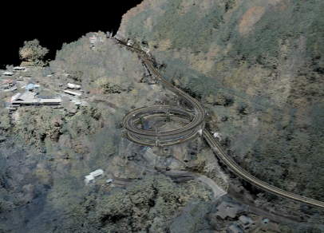
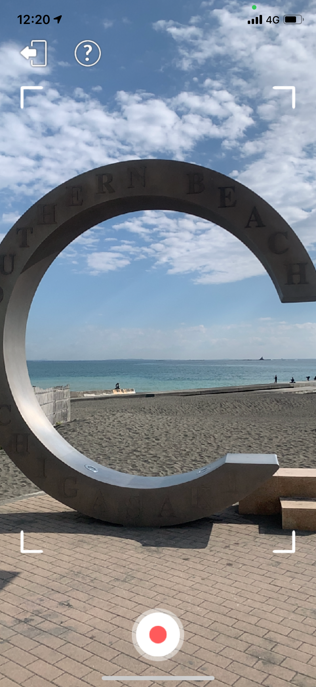
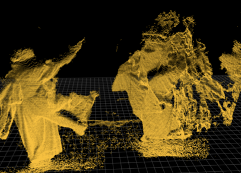
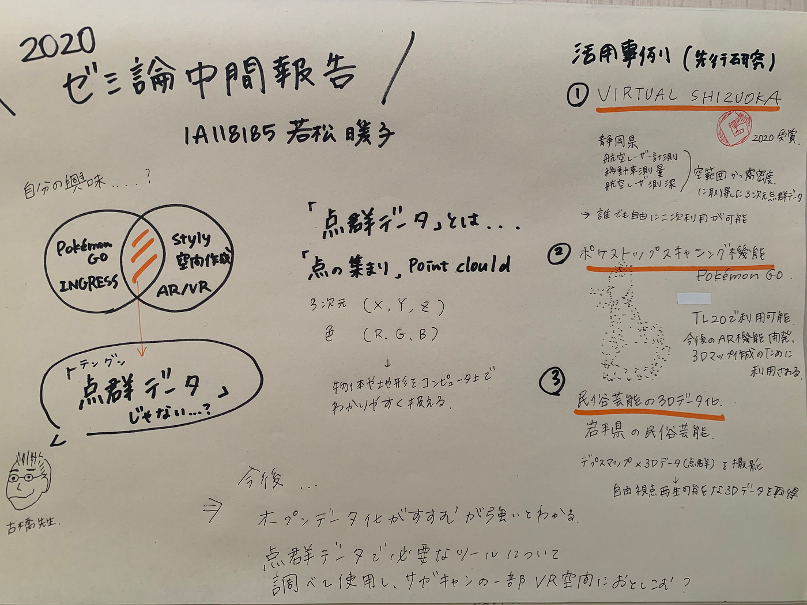

### テングンデータって何？！

＜＜＜ゼミ論中間報告＞＞＞

[furuhashilab/sotsuron2020
You can’t perform that action at this time. You signed in with another tab or window. You signed out in another tab or…github.com](https://github.com/furuhashilab/sotsuron2020/projects/21)

**# INTRODUCTION**

古橋ゼミマストのポケモンGOとイングレスのレベル上げやっているうちに、位置情報ゲーム面白いなと再発見した９月、stylyを通してAR、MR、VRに興味を持ち、これらに共通していることは何か、古橋先生にも相談してみると「テングンデータ」であるとわかった！！

（まず漢字から知りませんでした、、、）

そして「点群データ」の活用事例をたくさん調べていき、実際に自分でもサガキャンの点群データを実際に取れたらと考えています。

**# METHOD**

> １点群データとは

> ２点群データ取得方法

> ３点群データのメリット・デメリット

> ４活用事例

**# RESULTS**

**1 点群データとは**

「点の集まり」のこと、英語では point cloudと呼ばれる

点の１つ１つにはスキャナーからの相対的なX,Y,Z情報や、カメラの画像データから得た色の情報（RGB）を持つことができ、点の集合体【＝3次元点群】によって物体や地形をコンピュータ上でわかりやすく扱える！

点群データはポリゴンデータ、平面データよりも独立した点の情報から構成されているため、精度が高いことが特徴

**2 点群データの取得方法**

点群データは主に

> _・３Dレーザースキャナーを利用した３D計測_

> _・ドローンを使った航空レーザー測量_

> _・モービルマッピングシステム（MMS）と呼ばれるレーザースキャナーを搭載した車両を使った移動型3D計測_

> _・ハンディ型_

> _・水中型_

などから取得可能

**３点群データのメリットデメリット**

▶︎メリット

- 非接触での測定・記録ができる

- 危険な場所のデータも取得、

- データを保存すれば加工も簡単に行うことができるという点

▶︎デメリット

レーザーを反射しないもの（窓や鏡など）からデータの取得ができない

点群データからポリゴンデータ、CADへの時間がかかる

複雑な地形である場合、機械を何度も移動させて撮影を行わなければならない

**4 現在どのように使用されているのか**

地図の作成、橋やトンネルなどインフラの劣化点検、災害の被害確認や位置情報に至るまで空間情報の中で多岐にわたり使用されている

活用事例①virtual sizuoka

2020年グッドデザイン賞を受賞したバーチャル静岡

静岡県が運営する三次元点群データが無料で使えるウェブサイトのこと！

すごいところは仮想空間に３Dで静岡県を構築し、そしてそれがオープンサイトとなっていることです！

これによって自由に利用することが可能になり、防災マップの作成やゲームへの運用がしやすいようになっています。

活用事例②ポケストップスキャン（TL20から利用可能）

ポケモンGOが３Dマップ作成のために活用し始めた！

今後の３Dマップ作成と新たなAR技術の進歩のためにユーザーを利用していると言ったところでしょうか、、、

投稿すると何か報酬があるわけではないです笑笑

実際にやってみた！

ただポケストップの場所を360度回って１５秒程動画を撮影するだけ。簡単にアップロードできますが、WiFi環境下でないと少しギガ負担が大きいかもしれないと感じました。審査もあるそうです。

活用事例③民俗芸能保存

ニコンが共同で岩手県の民族芸能継承問題を解決に向けて点群データを利用し、３Dデータ化

目的に合わせた編集が可能で、観光資源としてのCGの作成、体験用アプリの作成、復興再現によって継承を支援を行っている

# discussion

一度保存することができると加工や活用がしやすいものであるとわかりました！しかし、その測定に時間と手間がかかることが課題、、、（人間の手でやるよりは遥かに簡単であっても）

オープンデータ化が進む流れであると強く感じました

バーチャル静岡に始まり、大阪経済大学とベンチャー企業が共同で3次元点群データをダウンロードせずに素早く確認・操作できる無料のソフトウエア「3D PointStudio」の開発が行われています。

# 今後の調査

点群データで必要なツールについて調べて、それを使用し、最終的にサガキャンの点群データをとってVR空間にしてみたいと考えています。

日本以外における活用事例を今回は調査することができなかったのでそれも調べていきます。

# グラレコ

# 発表用資料
