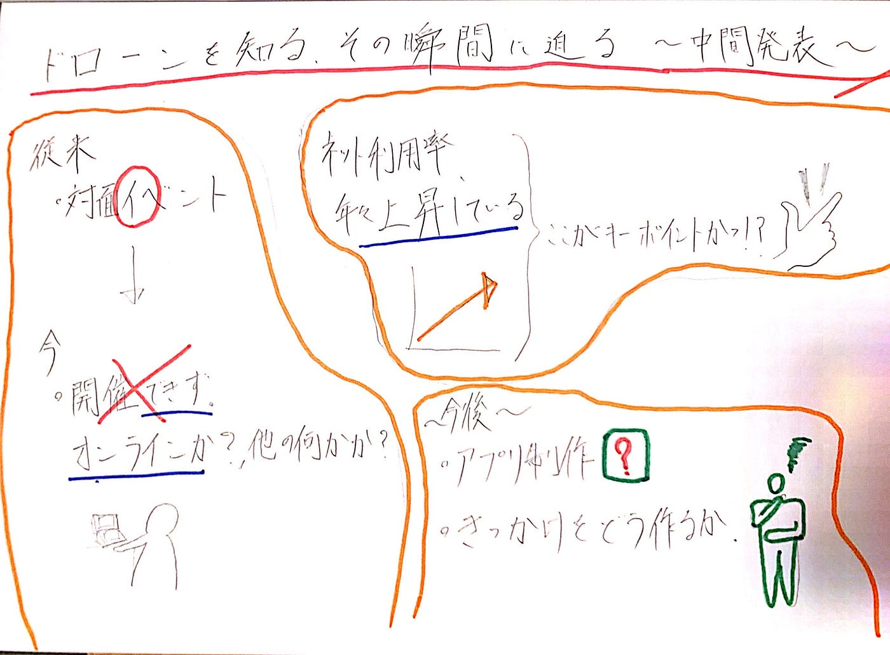

### ドローンを知る瞬間に迫る

**Introduction**

今回私は子供達がドローンと触れ合うきっかけを増やしたいと考え、ゼミ論のテーマとして「今特有のドローン伝播法（アプリ）」を新たに設定した。

このテーマにした理由は以下の通りです。

1. この先子供達にドローン普及の新たな担い手になってほしいと考えたため

1. 新型コロナウィルスの影響で従来行われていたイベントができなくなったことを受け、新たな方法を模索する必要があると考えたため

1. 非対面形式で、子供達にドローンを知ってもらう抑のきっかけ作りを編み出したいと考えたため

**Method & Results**

先行研究

〜なぜ従来イベントがダメなのか、考えられる理由に迫ってみた〜

・[ウイルス対策に効果あり？ スマートフォンやキーボードを正しく除菌する方法](https://wired.jp/2020/03/22/how-to-clean-your-smartphone-keyboard-mouse-safely/)（Well Being, 2020）

・満員電車で「新型コロナ」感染は起きるのか？鉄道のプロが解説

→今までゼミ合宿などの参加を通して、ドローンについての説明をする際どうしても「蜜」になる場面や、リモコンを他の人に渡すシーンが多々見受けられた。この先行研究や経験を通し、人との干渉を極力抑えることができる方向性に一段落した。

〜現在の小さい子供にとって身近なデバイスは何か〜

[青少年のインターネット利用実態調査](https://www8.cao.go.jp/youth/youth-harm/chousa/h29/net-jittai/pdf/sokuhou.pdf)（内閣府、2018年）

→やはり今の子供はインターネットデバイスに身近に関わっているようで、年々上昇傾向だ。自分が小さい時とはかなり違ったためこの結果には大変驚いたが、これを踏まえて今後はスマホやタブレットをメインとしたアプリのベース考案等に着手すべきだと考えた。

**Discussion**

➀変えるべきところと、変えないべきところの線引き

従来通りのドローンイベントが一切開催できなくなってしまったことを受け、それに代わる新たな伝播法を考える上で重要となってくるのは当然その中身である。今後は従来イベント主旨の中でどの要素を変え、どの要素を残すのかをしっかりと線引きしなければならない。

➁子供の認知を広めるための練りこみ

現在ではドローンを自分の手で操作しない「プログラミング」の観点からドローンの操縦を試みる動きがより強まっている。ただ問題なのはその認知度である。今どれほどの子供たちがこの動きを知っているかが少々不明なため、今後このプログラミングの概念と子供達を結び付ける広報的手段を考える必要がある。

➂シンプルさを追求したアプリ考案

今回のメインターゲットの年齢層を「5~8歳」としたため複雑ではなく、シンプルでわかりやすくさせるのが肝である。 一番伝えるべき要素を、今後先生と相談等しながら決めていきたい。

グラレコです
