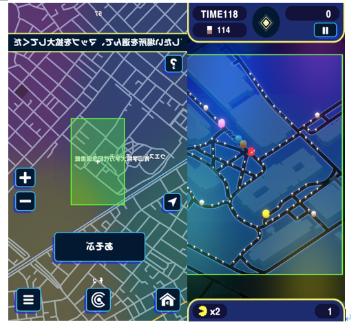
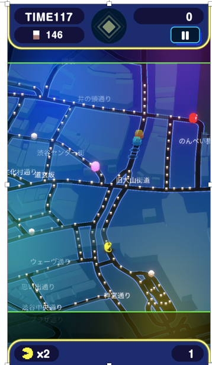
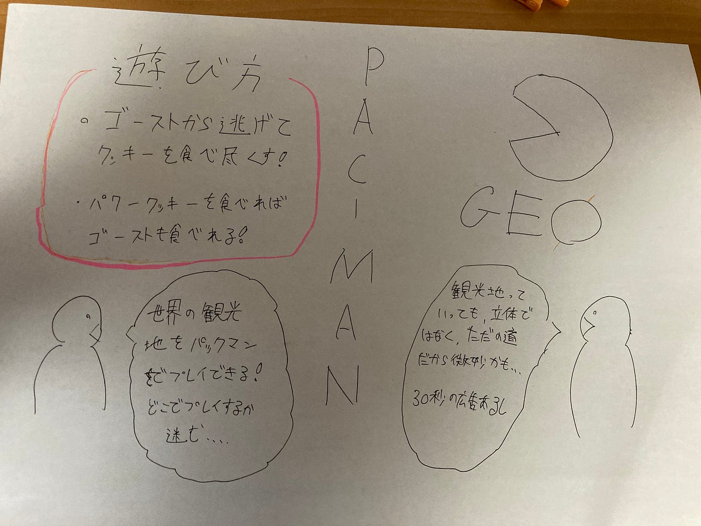

### パックマンジオやってみた！！

### 世界中をパックマンで走り回ろう

『PAC-MAN GEO（パックマン ジオ）』は地図情報を活用することにより、現実世界を舞台にしてパックマンを遊ぶ、地理情報ゲームです。

実際にやってみた！

相模原キャンパスでやってみました。ゴーストから逃げて4分間の間にクッキー（白い点）を食べ尽くせばクリアです！パワークッキー（大きな白い点）を食べれば、ゴーストを食べることもできます。操作性はスムーズにできて、ゲーム性があり楽しかったです。

このアプリは世界を飛べることができるのがいい点です！マップに反映されていない、または道が少ない地域ではパックマンをすることができませんが、大陸をまたいで、道があるところ全てでプレイできます！

ちなみに、道がいっぱいあるところの方がプレイしていて楽しいです。

左図は、渋谷駅前でのプレイですが、クッキーの量もたくさんあり、何より道が混雑しているので逃げやすいです。シンプルにパックマンが面白い。

やってみて思ったことですが、観光地をプレイできるのに、あまり立体的ではないのが残念です、、、

あくまで、パックマン重視なので操作性に難が出ちゃうのでしょうがないと思いますけど、やはり109であったり、ハチ公は渋谷象徴なので欲しかったです。

あと、このアプリ広告があります！うざいです！

まだ、始まったばかりのアプリなのでこれからどのように改善、成長していくか楽しみです!

ダウンロードは[こちら](https://apps.apple.com/jp/app/id1516765758?mt=8)

紹介映像は[ここ](https://www.youtube.com/watch?v=44NuwhCco2U)

グラレコです

