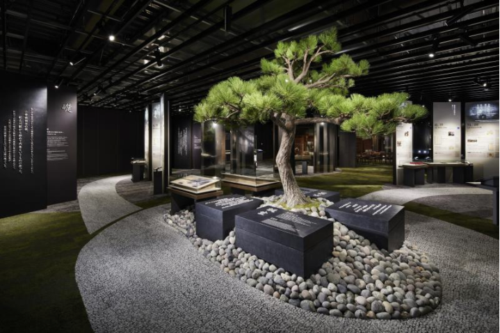
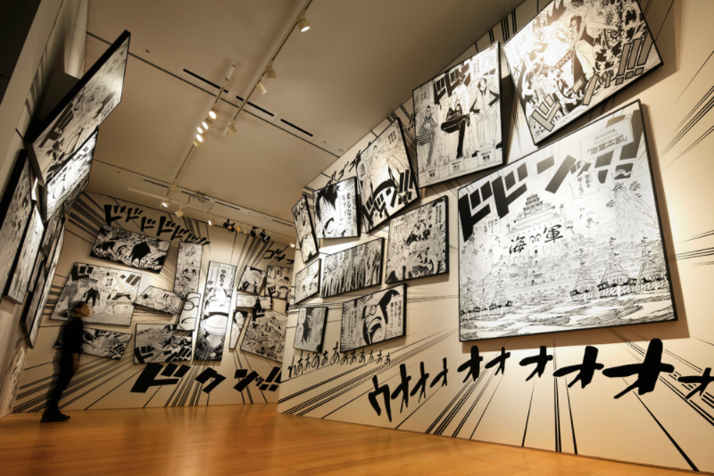
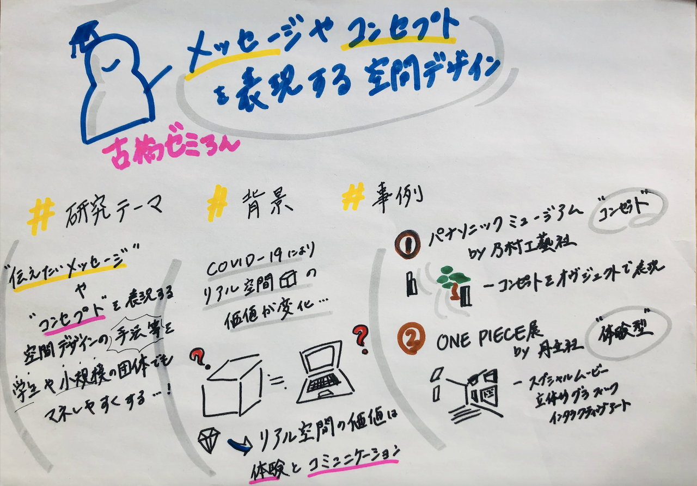

### 「メッセージやコンセプトを表現する空間デザイン」ゼミ論中間発表

### # 概要

COVID-19の流行によりリアルな空間の価値や意義が問われている。これまでリアル空間がになってきたそれぞれの役割がオンラインで代替できることが証明されると同時に”リアルな場”であることの真の価値が模索され、人々がリアル空間に求めることや期待することが変化した。

オフィシャルショップやショールーム、イベントの場などのあらゆる空間は、これまで以上に”体験すること”や”伝えたいメッセージを表現するコミュニケーションツール”としての役割を重視してきている。

本研究の目的とゴールは、メッセージ性の強い空間創造の特徴を探りその手法をまとめ、学生や小規模で活動を行なっている個人や団体でもそれらの空間づくりを行うことができる様にメソッドやノウハウをまとめることである。

### # 研究手法

- メッセージ性を重視した空間の事例からその特徴と手法を探る

- 実際にそれらの空間に足を運び、その空間が掲げるコンセプトやメッセージを体感できたか等をまとめる

- メッセージ性のある空間づくりの特徴と手法等をまとめ、それらを低コスト小規模でも真似ることができる様編成する。

- （本研究でまとめたマニュアルを用いて空間づくりの実践）

#### # 先行研究・事例

#### パナソニックミュージアム 松下幸之助歴史館

/ 伝えたいメッセージを確実に表現する空間創造 **乃村工藝社**

松下幸之助・パナソニック創業者の経営観、人生観に触れることができ、その“心”を広く継承することを目的としコンセプトは“松下幸之助に出逢える場所”とした。特徴は松下幸之助氏の人生の道筋を表現した会場の”道”、来場者はこれを辿ることで経営理念、創業者が残してきた数々の事績、言葉を学ぶことができる。

#### ONE PIECE展

**/ こころを動かす空間をつくりあげるために 丹生社**

2次元の「マンガ」の世界を、3次元の空間へどのように表現し、つくりあげていったか。”空間”というメディアの力を最大限に活用しながら取り組んだプロジェクト。「会場を訪れた人に入口から出口までどんな気持ちの流れで展覧会を体験してもらうか」という展示ストーリーの検討が行われスペシャルムービーを核に、立体的なグラフィック、造形、[インタラクティブアート](https://ja.wikipedia.org/wiki/%E3%82%A4%E3%83%B3%E3%82%BF%E3%83%A9%E3%82%AF%E3%83%86%E3%82%A3%E3%83%96%E3%82%A2%E3%83%BC%E3%83%88#:~:text=%E3%82%A4%E3%83%B3%E3%82%BF%E3%83%A9%E3%82%AF%E3%83%86%E3%82%A3%E3%83%96%E3%82%A2%E3%83%BC%E3%83%88%EF%BC%88%E8%8B%B1%3A%20Interactive%20art,%E3%81%AB%E3%81%97%E3%81%9F%E4%BD%9C%E5%93%81%E3%82%82%E3%81%82%E3%82%8B%E3%80%82)など、リアルスペースだからこそ実現できる体感型の展示を配置されている。

### # 議論と結果

#️ メッセージ性のつよい空間デザインの特徴

① 当たり前だけど、伝えたいコンセプトやテーマが明確である

②テーマを連想させる様なオブジェクトが効果的に配置されている

③見る側の導線に配慮がある

④五感に訴えかける様なデザインの仕様になっている（[https://www.kajima.co.jp/tech/universal_design/comprehensibility/five_senses.html](https://www.kajima.co.jp/tech/universal_design/comprehensibility/five_senses.html)）（[https://anuht.or.jp/files/libs/4346/202002261023287074.pdf](https://anuht.or.jp/files/libs/4346/202002261023287074.pdf)）

メッセージ性のつよい空間の特徴としては、まず第一にコンセプトがはっきりと定まっておりそれらを連想させる様なイメージがあることが挙げられる。そして、ただ”見せる”のではなく見る側を包括する様な動線の作り方やインタラクティブアートの設置などが工夫されており参加者の感情や体験を重視しているものが多かった。

### # 考察と今後の研究の流れ

今回事例研究をへて最終的なゴールとしてもうけている、学生や小規模でも効果的にメッセージ性の強い空間づくりをおこなうノウハウまとめを作成するにあたり今後は実際にそれらの規模感で行われている空間に足を運び #️ メッセージ性のつよい空間デザインの特徴 で挙げた要素と組み合わせて作成を行なっていく。

### # グラレコ

発表スライド

[https://docs.google.com/presentation/d/1aDZbAJ3gTaRfzNo6ygxIQ-uCXMhPu7iVkVs0dXaUEFY/edit?usp=sharing](https://docs.google.com/presentation/d/1aDZbAJ3gTaRfzNo6ygxIQ-uCXMhPu7iVkVs0dXaUEFY/edit?usp=sharing)
