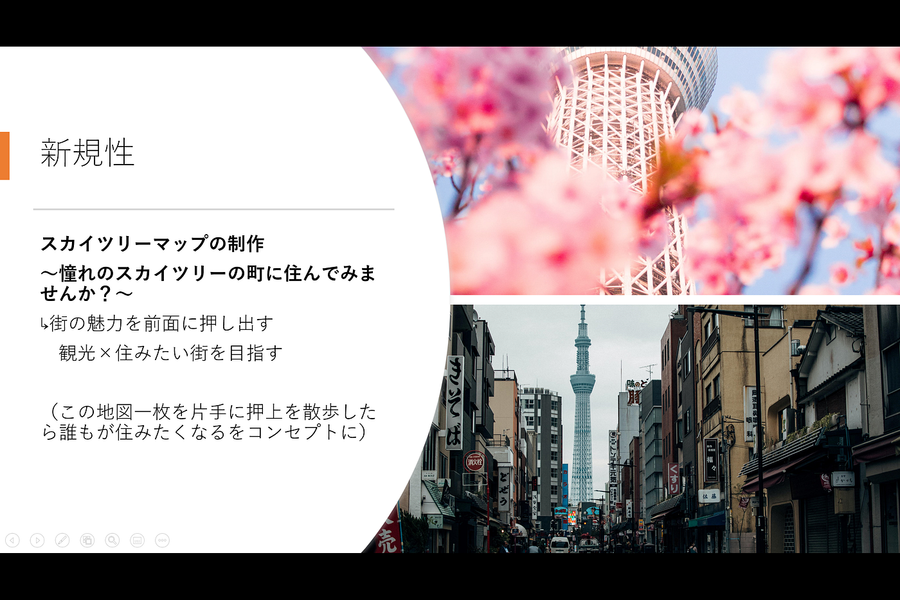
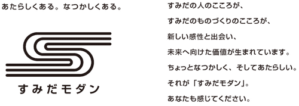
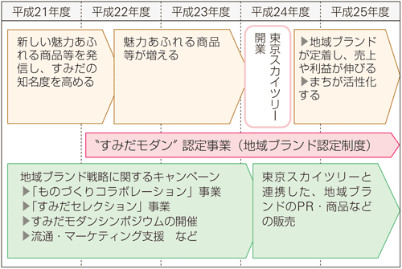
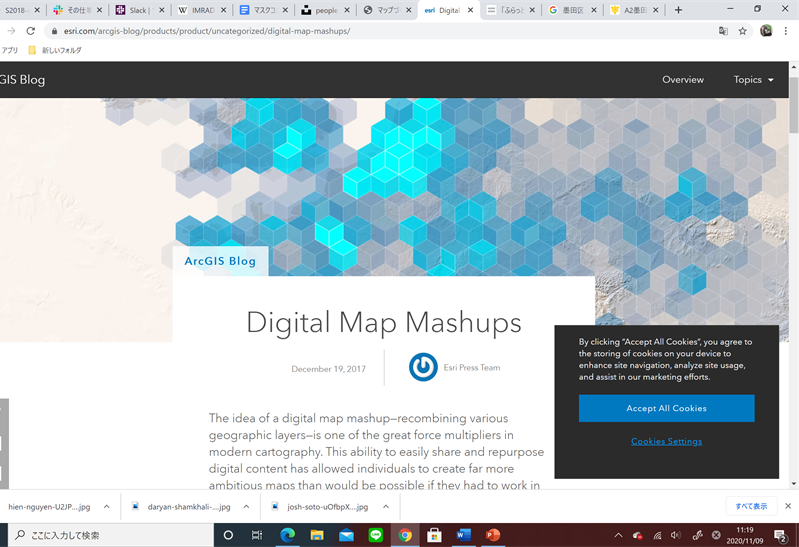

### 墨田区におけるまちづくり～デジタル地図をデザイン～

#### 私がやりたいこと

### Introduction

私は11月の間の一か月押上駅でシェアハウスをすることになりました。街を歩いて感じたこと、、、スカイツリーとのギャップがすごい、、

スカイツリーの周辺はソラマチなどは300店舗ほどのブランド店が立ち並ぶ商業施設となっているのにもかかわらず、そこから一歩街であるくとシャッター街、お年寄りが目立つスカイツリーが目の前にあるとは思えない活気のない町並みが広がっていました。そのような現状を「下町らしさ」ととらえることも出来ますが、観光客をここまで引き寄せられるランドマークが存在する中よりよいまちづくりを考えられるのではないかと、何か私にできる事はないかと感じてこのようなテーマを設定しました。

#### 墨田区の現状

**〇実際に歩いてみて感じたことの他にも様々な問題を抱える地区でした。**

> ・少子高齢化

> ・首都直下型地震

> ・低所得率（23区中17位）

> ・シャッター問題

> ・お客がソラマチに奪われてしまう

**〇すみだ地域ブランド戦略のロゴマーク“すみだモダン”とキャッチフレーズ**

（墨田区報より[https://www.city.sumida.lg.jp/kuhou/backnum/091121/kuhou01.html#:~:text=%E5%8C%BA%E3%81%A7%E3%81%AF%E6%98%A8%E5%B9%B4%E3%81%8B%E3%82%89%E3%80%81%E5%9C%B0%E5%9F%9F,%E3%82%AD%E3%83%A3%E3%83%83%E3%83%81%E3%83%95%E3%83%AC%E3%83%BC%E3%82%BA%E3%82%92%E4%BD%9C%E6%88%90%E3%81%97%E3%81%BE%E3%81%97%E3%81%9F](https://www.city.sumida.lg.jp/kuhou/backnum/091121/kuhou01.html#:~:text=%E5%8C%BA%E3%81%A7%E3%81%AF%E6%98%A8%E5%B9%B4%E3%81%8B%E3%82%89%E3%80%81%E5%9C%B0%E5%9F%9F,%E3%82%AD%E3%83%A3%E3%83%83%E3%83%81%E3%83%95%E3%83%AC%E3%83%BC%E3%82%BA%E3%82%92%E4%BD%9C%E6%88%90%E3%81%97%E3%81%BE%E3%81%97%E3%81%9F)）

#### 目的

この調査をする目的は全部で三つあります

①実際に押上（大東区近辺の）フィールド調査をし、自分なりに考えるスカイツリー周辺におけるまちづくりを**地図を用いて提案する**

②活性化を考えたい。

③地方のイメージを崩し、もしくは引き立たせられるようなまちづくりを行いたい。

#### 先行研究

> •「下町地域における再開発・まちづくりの手法の検証 ―清澄白河地域・押上地域の比較を通じて―」

> [http://www.waseda.jp/sem-muranolt01/SR/S2018/S2018-abe.pdf](http://www.waseda.jp/sem-muranolt01/SR/S2018/S2018-abe.pdf)

> •「まちづくりにおけるデジタル地図の活用」

> [http://www.shinshu-u.ac.jp/group/env-sci/Vol40/paper2018/40_05_Ishizawa.pdf](http://www.shinshu-u.ac.jp/group/env-sci/Vol40/paper2018/40_05_Ishizawa.pdf)

> ↳Mapmashpとワークショップをを用いたまちづくり。観光ツアーの実施

> インディゴが提供する「Map MashUp Manager」は、“位置と時間をキーに、情報空間と実空間をシームレスに結びつける”ことをコンセプトに、スマートフォンやタブレットなどのマルチデバイスに時間・場所に連動したマップ・コンテンツを提供可能なクラウドサービスです。特長は、既存のイラストマップ（屋外）やフロアマップ（屋内）などの画像データを位置測位と連携可能とすること、ならびに各種のソーシャルメディアや動画／音声など様々なチャネル・メディアに分断された既存の情報群を、簡単な操作でそれらマップ上に“マッシュアップ”可能なことにあります。これにより、リアルタイム性と表現力が高い、魅力あるコンテンツをマップ上に集約して提供することが可能になります。（softbankホームページ）

> •「マップづくりを契機とした地域魅力の発信とまちづくりへの展開」

> [https://www.gisa-japan.org/conferences/proceedings/2009/papers/3G-1.pdf](https://www.gisa-japan.org/conferences/proceedings/2009/papers/3G-1.pdf)

> ↳『とよのいいとこマップ』のページの一部

…

・住民の視点に立った街づくり

↳「住民が居住している地域の現状や 成り立ち（地域的資源）を理解してその知識を有し ていることが必要である。つまるところ，住民が地 域の実態を自らの手で探り，的確に把握・評価し， そして地域的資源を発見することが，その第一歩」
