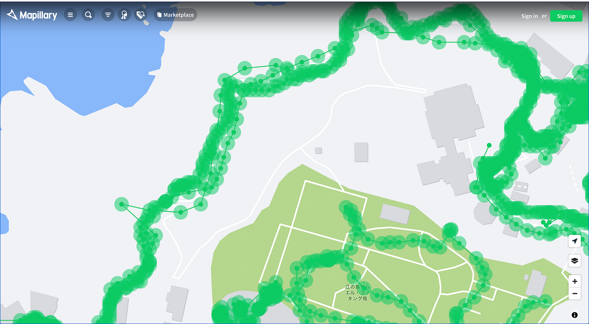
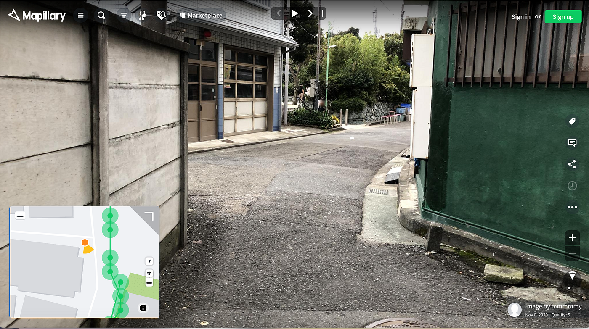
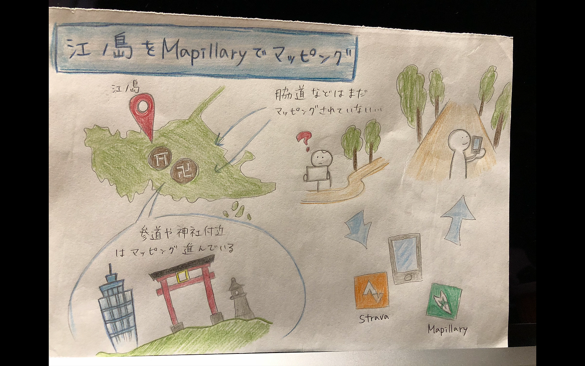

### 江ノ島のMapillary を整備してみた

ゼミ論では、江ノ島の道をMapillaryを使ってマッピングしていきます。

Introduction

Mapillaryで江ノ島を見てみたら参道や大通りなどはマッピングされていたが脇道などはあまり進んでいないことに気がつきました。

そこで今回は観光客が多くが通るような参道や展望灯台周辺などではなく、脇道などのあまり観光客が通らないような道のマッピングを行っていきます。

Methods

今回使った物は、自分のスマートフォンのMapillary 、Stravaです。

〜方法〜

Mapillaryを立ち上げ撮影開始して歩く

同時にStravaも記録する

撮影が終わったらMapillary、Stravaをストップする

Mapillaryに撮った画像をアップロード（かなり時間かかった）

Result

今回は青山学院大学相模原キャンパスのチャペルの前で練習し、その後江ノ島に実際に行って撮影してきました。今回はまだ一部しか撮影できていませんが今後残りの道も進めていきます。

Discussion

立ち入り禁止の看板が置かれていたり、私有地で入れない場所があったりして作業できないところが何箇所かみられた。

ゼミ論GitHubレポジトリURL

[https://github.com/furuhashilab/2020gsc_MamiYahiro](https://github.com/furuhashilab/2020gsc_MamiYahiro)

[https://github.com/furuhashilab/sotsuron2020/projects/26#card-48891226](https://github.com/furuhashilab/sotsuron2020/projects/26#card-48891226)
