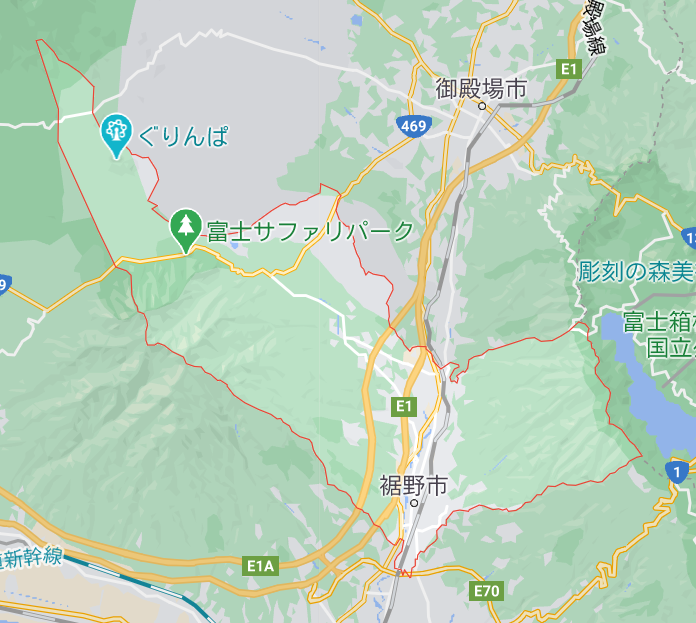
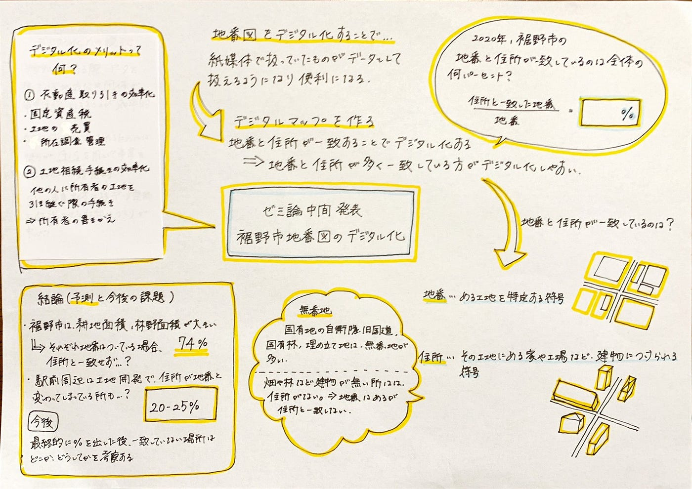

### 裾野市地番図のデジタル化

ゼミ論中間発表 松山蘭

｜序文

私は古橋先生の現在行っている、裾野市の地番図デジタル化作業に対し、裾野市は2020年現在、地番と住所が一致している場所は全体の何パーセントであるのかをゼミ論のテーマとしました。

地番図は法務省が管理する地番の記載された地図です。しかし、これらは紙媒体で管理されているため、デジタル化することでデータとして扱うことが出来るようになり、便利になります。

地番と住所が一致している箇所が多いほど、より正確なデジタルデータが出来るだろうと考えられます。これにより、精度の高いデジタルデータが作ることが出来、使用者の効率が上がり、不動産取引の効率性が上がることが期待されます。

実際、地番図自体のデータ化は他の方法でも行われていましたが、住所と一致されているデジタル化は行われていませんでした。そのため、住所と地番の一致を求め、そのパーセンテージを出すことに新規性を出しました。

そこで、裾野市の地番の数を分母、住所と一致した地番の数を分子として、地番と住所が一致している場所は全体の何パーセントかを求めたいと思います。

また中間発表では、デジタル化することで改善される点と、裾野市の地番と住所の一致している割合を予測したいと思います。

｜本題

１、デジタル化することのメリット

①不動産取引の効率化

先行研究より、地番・家屋現況図データベースの構築方法があります。この作業では、地番・家屋状況図及び家屋課税台帳と家屋調査票並びに航空写真、住宅地図帳を参照しながら家屋棟番号を調査し作成します。[(固定資産業務におけるGIS導入・利用の手順と留意点、今村政夫、篠田順弘、高瀬忠志、永田浩一郎)](https://www.jstage.jst.go.jp/article/jsprs1975/34/1/34_1_27/_pdf/-char/ja)

このデータ化により、正確な土地の範囲が定められ、さらに家屋番号とも結びつけられることで、固定資産業務が効率化します。そのほかにも、このデーターベースで管財課、用地課など他部門への利用の効率性も上がると考えられています。この効率化は地番と住所のデジタル化にも共通するものと考えられます。

また、ここまでの作業で地番・家屋番号が同じデータとして作成されますが、さらにその土地の所有者を特定する住所とは結びついていません。

②土地相続手続きの効率化

故人の家の土地、またその他の所有していた土地を引き継ぐ際、デジタル化されていると相続の手続きが効率化すると考えられます。

その土地の所有者を書き換える際、地番と所有者がデータ化されていれば、書き換えの手続きが簡素化します。

２、地番と住所の一致している割合の予測

①地番と住所の関係

地番とはある土地を特定する符号であり、住所とはその土地にある家や工場といった建物につけられた符号です。

しかし、国有地の自衛隊や旧国鉄用地、国有林、埋め立て地などは無番地が多いのです。

さらに、畑など土地の上に建物が存在しない場合は住所がないため、地番しか存在しない土地もあります。

（住所と地名の大研究、今尾恵介）

その点裾野市は、耕地面積や林野面積の割合が大きく、[裾野市のデータによると](http://www.machimura.maff.go.jp/machi/contents/22/220/details.html)、総土地面積に占める耕地面積が６％、林野面積が６８％となっています。また、裾野市の国有林の割合は公開されていませんでした。

これらの耕地、林野が国有の土地でなく、それぞれに地番を持っているとすると、地番のみ存在するため、住所と一致しません。

また、裾野市は裾野駅周辺の市街地で土地開発が盛んなため、各土地に建物があったとしても、地番と住所が一致していない箇所も多くあることが予想されます。

②日本の住所と地番体系

番地については、その所在を表す根拠となった法律の違いによって、番地をそのまま使う場合と、住所表示を行う場合とで二種類に分かれています。

しかし、住所表示を実施した地域の場合は不動産登記による一筆の地番と建物のハウスナンバーを表す住居表示の二種類の体系が併存しています。[（石山一義、2009）](http://repo.nara-u.ac.jp/modules/xoonips/download.php/AN10533924-20090300-1026.pdf?file_id=4220)

つまり、住所表示 を実施していない地域であれば地番がそのまま使われているので住所と一致させる必要がなくなるのです。

③予測

①，②より、裾野市は住所表示されており、さらに地番のみの土地、また地番と住所が一致しない土地も存在することから、住所と地番が一致する割合は全体の100％にはなりません。

耕地面積が６％、林野面積が６８％で計74％。また、市街地での地番と住所の一致しない割合も含めると全体の80％ほど一致できないと考えます。そのため、裾野市の地番と住所の一致している割合の予測は20％以上25％以下と考えます。

｜結論

デジタル化をすることのメリットとして、不動産取引の効率化、土地相続手続きの効率化があると考えます。

また、住所と地番の一致する割合の予測として、裾野市は郊外に耕地面積、林野面積の割合が大きいため（７４％）、それぞれの耕地や林野に地番がついている場合、住所が存在せず、逆に、駅前周辺は土地開発が盛んなため、住所と地番が一致しない箇所も出てくる可能性があります。そこで、20%〜25%が一致する割合と予測します。

|今後の見通し

12月末までにパーセンテージを出し、一致しなかった場所や地番のみ存在した土地を調査する。

・参考文献

固定資産業務におけるGIS導入・利用の手順と留意点(今村政夫、篠田順弘、高瀬忠志、永田浩一郎、1995)

住所と地名の大研究(今尾恵介、2004)

日本の住所・地番体系を考慮したジオコーティングデータベースの為のモデル化(石山一義、2009)

静岡県裾野市、市町村の姿　グラフと統計でみる農林水産業(総土地面積、林野面積：2015年農林業センサス、耕地面積：令和元年面積調査）

・グラレコ

・スライド

・ゼミ論用レポジトリ [https://github.com/furuhashilab/2020gsc_Rantsuyama](https://github.com/furuhashilab/2020gsc_Rantsuyama)
