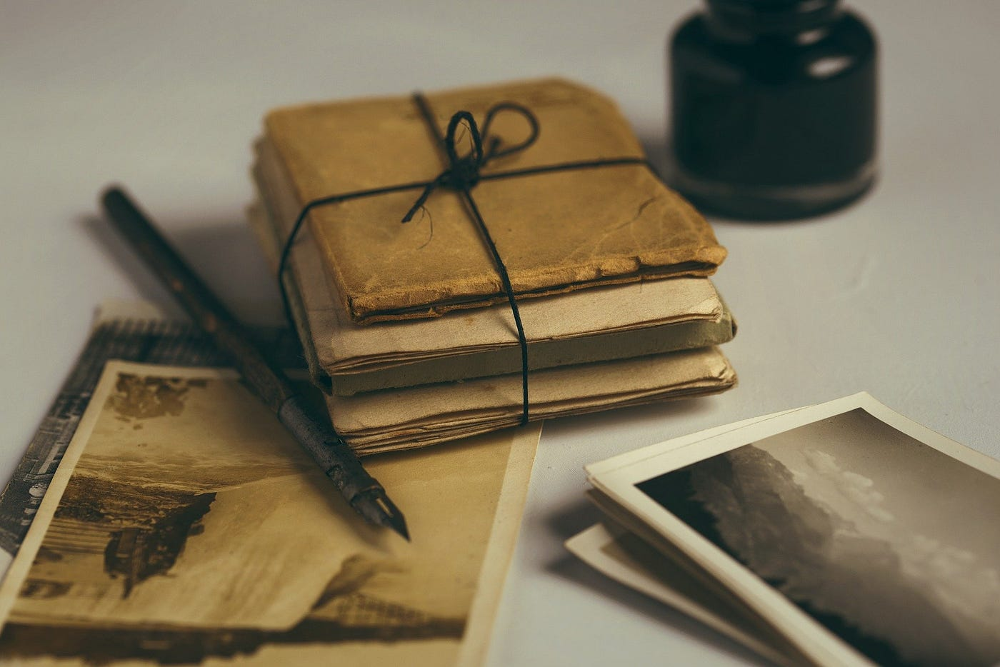

### レターボクシングから学べる”ワクワク感”

#### **＃レターボクシングとは？**

概要：
世界の様々な場所に隠されているボックス。その中にはノートとスタンプが入っている。隠し場所の情報を頼りに、ボックスを見つけ出し、中のノートに持参したスタンプを押す。また、ボックスの中に入っているスタンプを自分のノートに押すというオリエンテーションのようなゲーム。

レターボクシングWebサイト：
[https://www.atlasquest.com/](https://www.atlasquest.com/)

歴史：
イギリスのダートムーア中央部にある村。
チャグフォードのジェームス・ペロットが、１８５４年、人里を遠く離れた荒野の一里塚の中にガラス瓶を仕込んだ。それを旅行者が興味本位で探し始めたことが由来とされている。

日本のレターボクシング：
現在、上野・仙台・大阪・兵庫など、大きな都市を中心にレターボクシングが確認されている。

#### ＃レターボクシングと芸術

レターボクシングって中にあるスタンプを自分で押すのと、ノートに自分のスタンプを押してくものだよね？

**これって、一種の芸術鑑賞なんじゃないかな？って思うわけよ**

芸術（スタンプ）を鑑賞するために、わざわざ足を運ぶ。
しかも、これのすごいところは、実際に行かないとどんな芸術（スタンプ）が見れるのかわからないってわけよ！

この世の中。スマホでググっちゃえば、大抵のことがわかっちゃうよね。

『モナリザ展やってるんだー！見に行こ！』

とかではなくて、

『何見れるかわからないけど見に行こう！』

これって、モナリザが見れる！ってわかってるより、ワクワク感半端ないじゃない？笑

ブラックボックス展なんてその良い例だよね！
（公式サイトがなくなってる&割と物議かもしてるから、知らない人は自分でググってみて笑）

#### #バンクシーとレターボクシング

ちょっと話は変わるけど、
みんなバンクシー大好きだよね！？

彼？彼女？って2000年のはじめから作品を出し続けてるらしい（諸説あり)

2000年のはじめなんて、スマホなんてもちろん無いし、みんな持っててガラケーだよね

こんな時代にバンクシーの絵を見に行く人たちのことを想像すると

『バンクシーの絵ってすごいらしいよ！』

って噂がながれて、それを実際に足を運んで見に行ってたんじゃないかな？

これって、レターボクシングに似てると思わない？笑

#### よくわからないけど、すごいらしい。

この、キーワードがみんなの足を動かしたんだろうね。

しかもそこには、バンクシーは実際にこの場に来て、壁に絵を書いてたっていう、ただ唯一の真実だけがある。

この作者が自分と同じところに立ってこの絵を描いてたんだ・・・。

このことを想像するとなんだかすごくワクワクしない？笑

作者（埋めた人）が実際にここに来た事実があるってのも、バンクシーとレターボクシングの共通点だよね！

#### #レターボクシングから学ぶべきこと

僕たちがレターボクシングやバンクシーの例から学べることってなんだろう？

それは…..

#### 人は未知のものと遭遇することをワクワクする！

ってことだと思うんだよね。

ここから、活かせる例としてすごく画期的なアイデアを思いついたから、是非最後まで読んでみて！

今までの君の常識が少し変わると思うよ

#### #展示の新しい形

芸術作品。広く言えばエンタメ作品。

こういったものを作ってる人の大きな悩み。

#### 『発表する場所がない』

作品はあるのに、場所がない。借りるのにもお金がかかる・・・。

あれ？

バンクシーって場所代かかってたっけ？
レターボクシングって設置にお金必要だっけ？

感の良い人ならもう気づくかな？笑

ぼくが提案するのは・・・。

#### ”ハコのいらない展覧会”

作者について不明。ましてや、どういった作品なのかもわからない。

だけれども、場所だけはわかってる。

これに、ソソられる人は一定数いると思うんだよね。

美術館や展示会には箱（会場）があるのが当たり前。
そんな常識だったりルールを破るきっかけになるんじゃないかなと思ってるんだよね。

場所に縛られずに、入場料もなく鑑賞できる、美術館ができたらもっと、芸術が広がって行って、芸術ってものが良い意味で敷居が低くなると思うんだよ

こんなコロナで大変な時期だからこそ、芸術に触れて心を豊かにする必要性があるんじゃないかな？

寄稿日：2020/11/10
平澤彰悟
