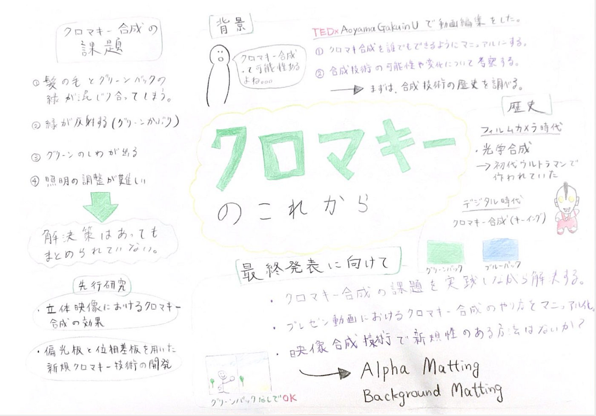

### クロマキー合成を当たり前に誰でも使えるようにしたい。

ゼミ論ではクロマキー合成について深掘りし、動画制作において、特にプレゼン動画においてクオリティの高い撮影と編集が当たり前にできるようにしたいと考えています。

初のTEDxAoyamaGakuinUのオンライン開催でクロマキー合成を駆使して、９人のスピーカーさんのプレゼン動画を撮影、編集しました。

ゼミ論ではクロマキー合成を使ってプレゼン動画を撮影、編集する方法をマニュアルにし、また合成において問題となる部分でその解決策がまとめられていない物を纏めたものを成果物にしていきます。それに加え、合成技術はこれからどのように進化していくのかを考察し、実装できるものはないかも考えていきます。

中間発表では、まず「合成技術の歴史」について調査しました。今の合成技術がどのような流れでできたのか？その基礎知識がない状態なので、その歴史を調べて背景を調べました。

#### 時代ごとの合成技術

＜フィルムカメラ時代＞
・ 光学合成
これは別々に撮影したフィルムを重ねて合成させる技術です。
合成時はマスクという黒い画像を入れて不要な部分だけ隠すことで合成できる。隠したい部分を複雑な形状で切り取らないといけないのでかなり手間がかかる方法でした。

文章だけではイメージし辛いので、この技術が使われていた作品を見て見ました。

ウルトラマン
60年代〜70年代のウルトラマンでは、この光学合成を使って合成していました。ウルトラマンの映像を時代ごとに見ていくと合成の進化がわかりました。初期の頃の映像ではマスクの黒い輪郭が残っていたりします。

＜デジタル時代＞
今回のテーマであるクロマキー合成はデジタル処理ができる環境でできるようになりました。マスクで手間のかかる合成からキーイングの技術で容易に合成できる技術です。

#### クロマキ合成とは？

これはキーイングという技術の一種で色成分の一部を切り取るようなイメージです。色彩という意味の「クロム」をベースに「キー信号」を使うということで「クロマキー」と呼ばれています。

#### なぜ、グリーンバックやブルーバックが使われているのか？

緑や青は肌色と補色関係にあり、映りが良く見えます。また、最近はブルーよりもグリーンが多く使われますが、グリーンはブルーよりも肌の血色が良く見えるという点やノイズが少なかったり、少ない照明でも明るく映るという点で多く使われています。また、人物の服装、小道具などと合わせてどちらを使うべきかを選ぶのが基本的です。そしてデジタル処理においてはRGBに合わせるのが最も効率がいいのでこの色が使われています。
今では、天気予報を始め、プリクラなどでも使われています。

#### クロマキーの課題

このような簡単になったクロマキーでも問題点はあります。
TEDxでグリーンバックを使う中で感じた課題をまとめると
・髪の毛とグリーンバックの緑が混じり合ってしまう
・緑が肌や服に反射してしまう(グリーンかぶり)
・グリーンバックのシワが出てしまう
・合成する背景に合わせて証明をセットする必要がある

などがあります。このような課題に対する解決策は今はそれぞれ記事や動画でまとめられていますが、撮影や編集の流れの中で実践的に使えるようになっていないのが現状です。

#### これまでクロマキー合成に関してどのような研究がされていたのか？

**[立体映像におけるクロマキー合成の効果に関する研究(2004)
*池田 佳代, 沼田 秀穂, 青木 輝勝**](https://www.ieice.org/publications/conference-FIT-DVDs/FIT2004/pdf/J/J_031.pdf)

・クロマキー合成した時に立体にみえにくい現象について研究していました。これはものの配置によって立体に見せるようにするという手法でした。TEDxでは、STYLY空間と組み合わせることでなんとか立体的に見えるようにできましたが、合成背景によってはまだまだ課題となってくると思います。

**[偏光板と位相差板を用いた新規クロマキー技術の開発(2020)
*麻野井 祥明, 伊﨑 章典**](https://www.jstage.jst.go.jp/article/itej/74/6/74_1010/_pdf/-char/ja)

・緑が被写体に反射しないようにするためにはどのようにすればいいのかを研究していました。この研究では「偏光板」を使うことによって反射を軽減できるという結果になっています。

#### 最終発表に向けて

最終成果物としては今回まとめたクロマキー合成における課題、そして、その他細かい部分で問題になる可能性がある部分を自分で撮影して実践しながら解決方法をまとめたいと思います。実践しながら「ここも課題だ」と新たな発見もあると考えているので自ら撮影してみることにしました。

また、プレゼン動画（TEDxに限らず、オンライン授業の撮影、国際会議でのプレゼン）などでクロマキー合成を使用した撮影と編集を誰でも当たり前にできるようにそのフローをマニュアル化します。これは課題となっている部分の解決策とセットにして成果物にします。

それに加えて、「映像合成技術で新規性のある方法はないか？」についても研究したいと考えています。
現在調べている物としては、「Alpha Matting」という分野であり、これはグリーンバックのような特殊な道具がなくても、背景を自動で解析し、被写体のみを切り抜くことが可能な技術です。このような技術の深掘りやzoomなどで使われているバーチャル背景の技術などが動画編集においてどのように実用化できるかを調べたいと思います。これは卒論でより深掘りしても面白いと思っています。

[Background Matting: The World is Your Green Screen
Using a handheld smartphone camera, we capture two images of a scene, one with the subject and one without. We employ a…grail.cs.washington.edu](https://grail.cs.washington.edu/projects/background-matting/)

#### スライド

#### グラレコ

