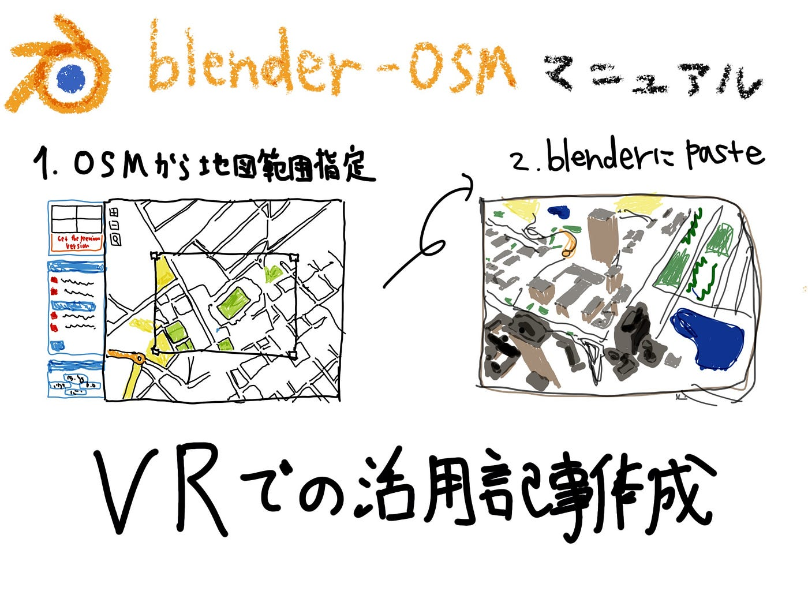

### blender-OSM

blender-OSMアドオンの導入マニュアルをスライドで作成した。

### 新規性

blender-OSMに関するアドオンの使い方はネット上にいくつか見られるが活用例としてVR空間に落とし込んでみるという内容は発見することができなかった。そこでblender-OSM、VRソフトを使用する人たちの裾野を広げたいという思いでVR空間での使用法を記事にまとめ、公開することを目的にしたい。.

先行事例

**Three-dimensional modeling of buildings and structures for simulation of wind effects on urban areas**

[https://iopscience.iop.org/article/10.1088/1751'7-899X/451/1/012162/pdf](https://iopscience.iop.org/article/10.1088/1757-899X/451/1/012162/pdf)

アドオン導入マニュアル

‘

