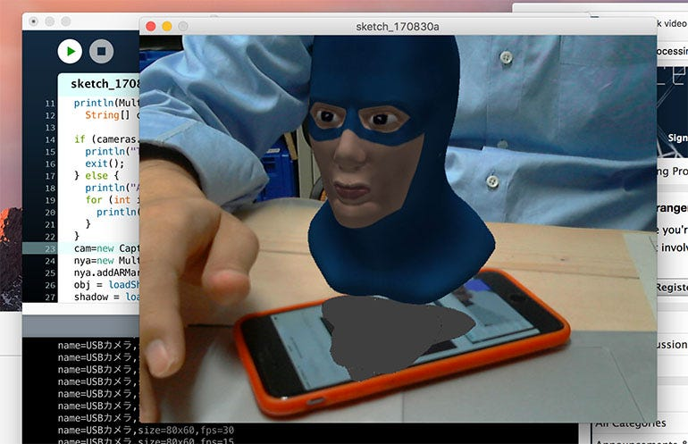
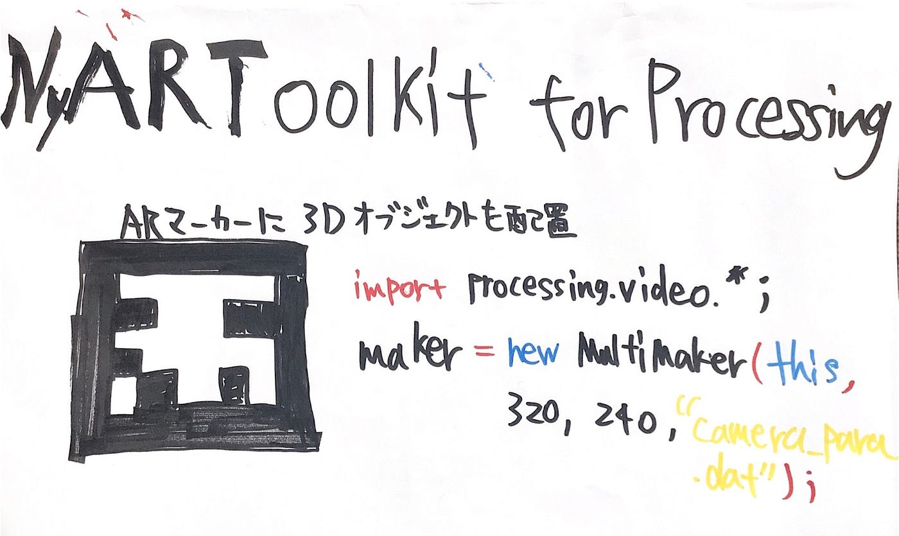

### ARToolkit

今回はProcessingを使ってARの生成に挑戦しました。今回使用したのは「**[NyARToolkit for Processing](http://nyatla.jp/nyartoolkit/wp/)」**というソフトになります。**ARToolkit** は奈良先端科学技術大学院大学の**[加藤研究室**](http://imd.naist.jp/index.html)によって 開発された拡張現実（Augumented Reality: AR）のためのソフトウェアです。そのARToolkit のProcessing向けのライブラリがNyARToolkit for Processingになります。

**[Githubページ**](https://github.com/nyatla/NyARToolkit-for-Processing/releases)

Blenderでモデリングしobj形式で出力すればこのように自作のARを作れます。

### カメラ映像の表示でエラー

[https://github.com/furuhashilab/fabla-bu/issues/7](https://github.com/furuhashilab/fabla-bu/issues/7)

### グラレコ

＜参考＞

[https://mukai-lab.info/pages/classes/programming_1/chapter12/](https://mukai-lab.info/pages/classes/programming_1/chapter12/)

[https://kkblab.com/make/processing/ar.html](https://kkblab.com/make/processing/ar.html)

[http://lecture.nakayasu.com/?p=1302](http://lecture.nakayasu.com/?p=1302)
