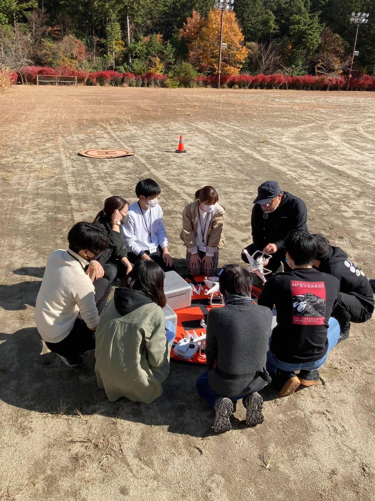
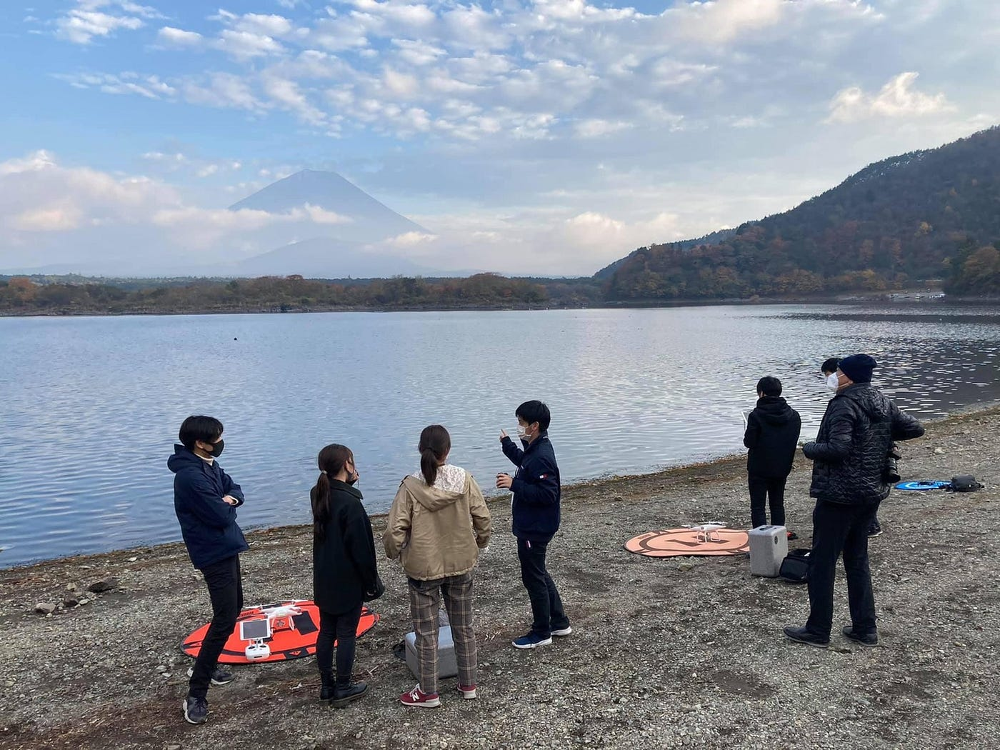
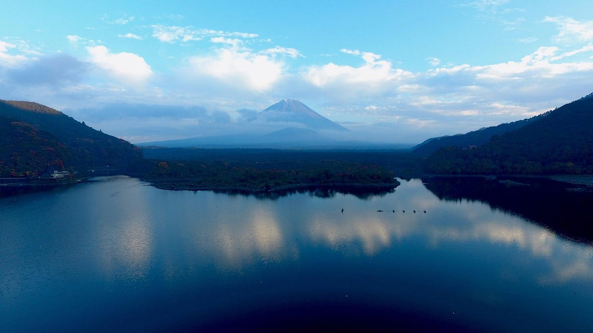
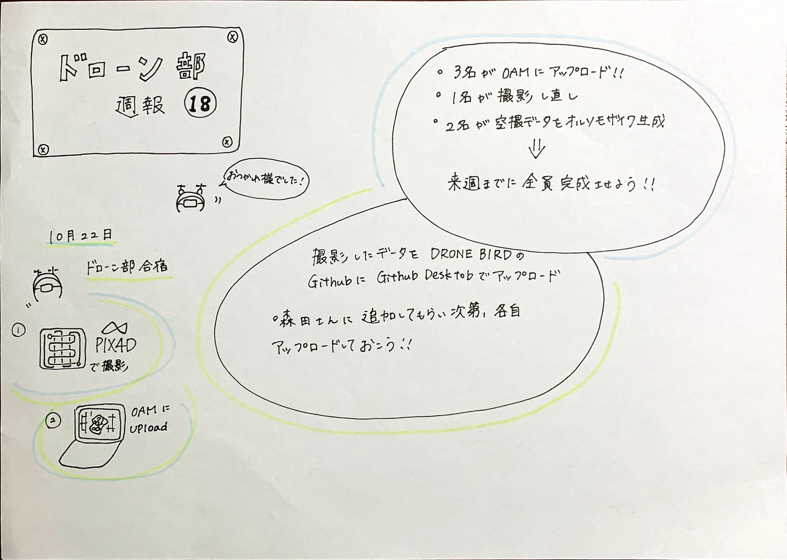

### ドローン週報⑱

＃ドローン部合宿を終えて

ドローン部は10月22日に横瀬に日帰り合宿に行ってきました。

３年生は二度目のドローン飛行をし、少しずつ慣れた手つきになってきました！

｜Pix4Dcaptureを用いてオートパイロットで空撮した後、Pix4Dreactで空撮データを解析＆オルソモザイク生成。そしてOpenAerialMapに投稿。までの一連の作業を個人で完成させるのを今回のタスクとしました。

３名は完成し、1名はうまく撮影できていなかったため後日取り直し。２名はあとOpenAerialMapにアップロードするだけになりました。

来週までには全員完成させる予定です！

｜また、撮影したデータをドローンバードのGithub にGitHub Desktop というソフトを使用してアップロードします。
⇒GitHub Desktop を使うと、ブラウザ経由ではできない容量の大きいデータでもアップロードを行うことができます。

ドローン部のメンバーは森田さんに自分のGithubアカウントを追加してもらい次第、今回撮影した写真をアップロードします。

Pix4Dreactの権限付与お願いします！

＃ドローンジャーナリズムの課外授業

11月8日にドローン部の３年生はドローンジャーナリズムの操縦訓練に河口湖に行ってきました。

プロドローンパイロットの渡辺さんの元、飛行前点検から細かく指導していただきました。

｜事前準備

①環境確認

②必要機材の確認

③事前点検

１、プロペラに傷やゆがみがないか

２、ねじが全てついているか（ねじが外れるとモーターに入って壊れる危険性あり）

３、モーターに異常がないか（軽く回してしっかり回るか、異常なふくらみがないか）

４、カメラに異常がないか

５、バッテリーは充電されているか

④安全確認

１、期待の電源を入れる

２、スマホ（iPad）の接続を確認する

⇒安全確認「右よし 左よし 後方よし 安全確認よし」

「プロペラ回します 離陸します」

また、ドローンを飛ばす際、操縦係、地上安全確認係、上空安全確認係と三人がかりで飛ばしました。

午後からは富士山が顔を出してくれました！湖畔でとてもきれいな富士山を空撮することが出来ました。

飛行前の点検、安全確認は今までしっかり学んでこなかったため、非常に貴重な時間でした。

渡辺先生、小平先生、古橋先生とサポートのドローンバード隊員の方ありがとうございました。

グラレコ

