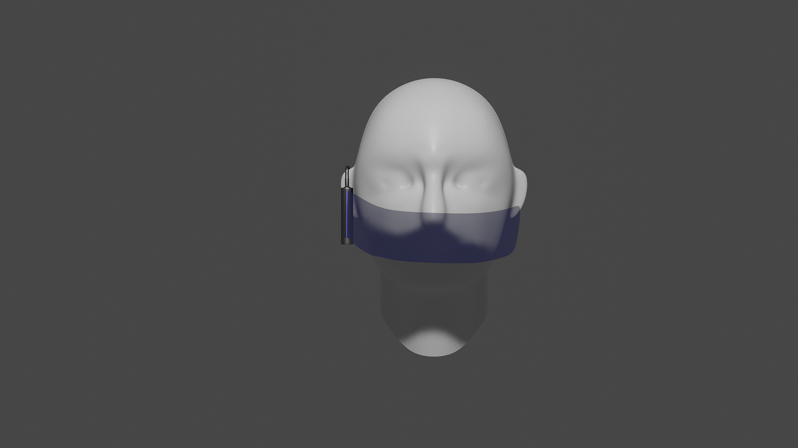
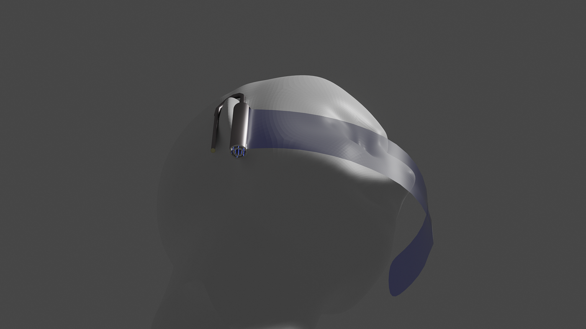
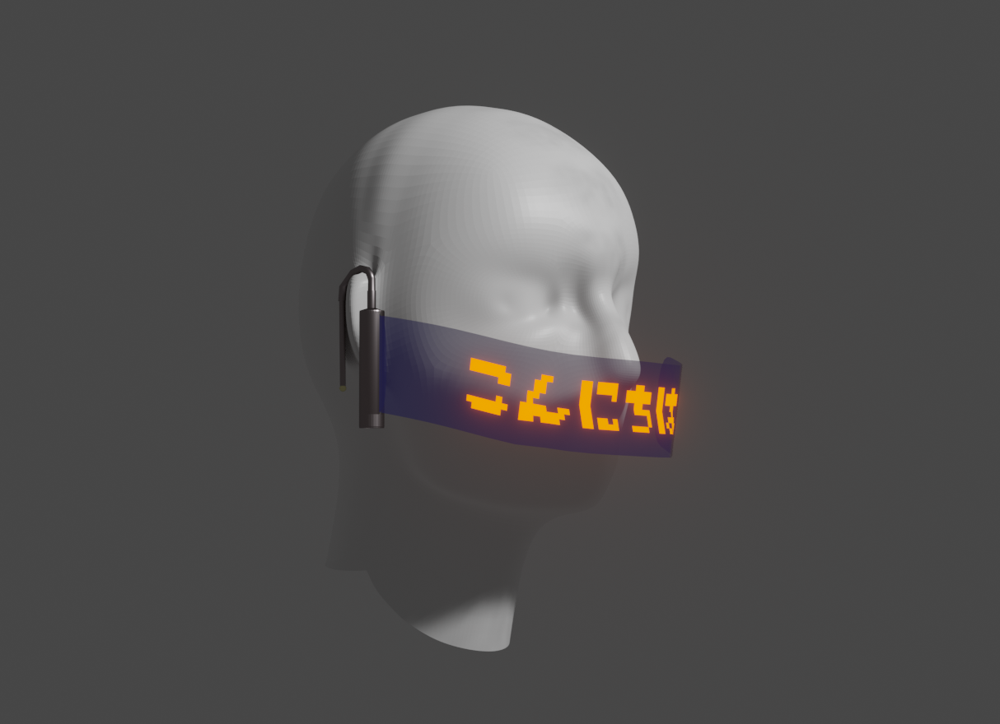
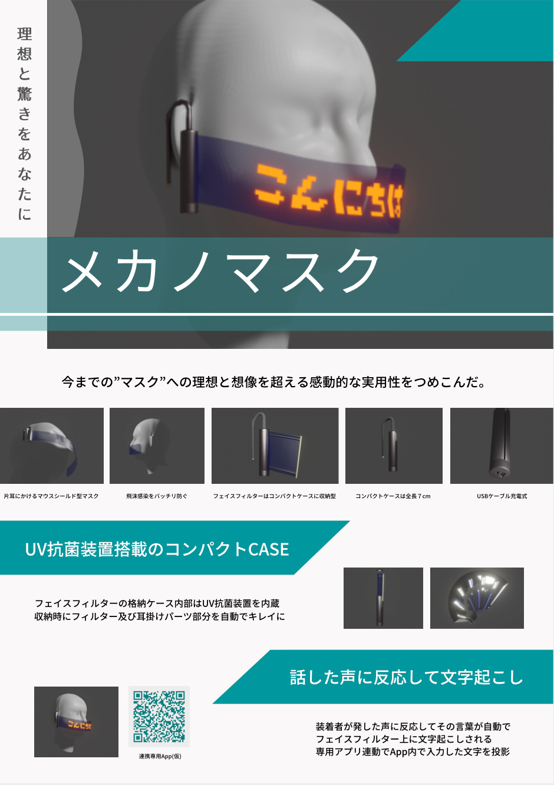

### マスクコンペに参加してみた

空間デザイン部の次の活動は「マスクコンペ」です！

今回は「これからのマスクを考える」アイデアコンペティションにエントリーしてみました。

[Mask x Technology |
下記3点を添付の上、下記アドレスまでご連絡ください entry-lodge@mail.yahoo.co.jp 「これからのマスクを考える」アイデアコンペディションのエントリーについて、以下の内容をご確認ください。 【権利侵害の禁止】…lodge.yahoo.co.jp](https://lodge.yahoo.co.jp/pr/mask/)

2020年はコロナウイルスの流行によって、マスクの着用が当たり前になり、機能性やデザインの課題が結構あります。

ということで空間デザイン部としては、いいデザインを考えつつ、課題も解決できればと思っています。

TEDxでBlenderのプロになった川嶋がマスクのデザインの制作をしました。完成品はこちら。

こんな感じです！
このマスクの概要はこちら！

機能性もデザインも次世代感があり、今のマスクの課題も解決できてるのではないでしょうか。

以上今週の週報でした。

### グラレコ

すぐ載せます🙇‍♂️
