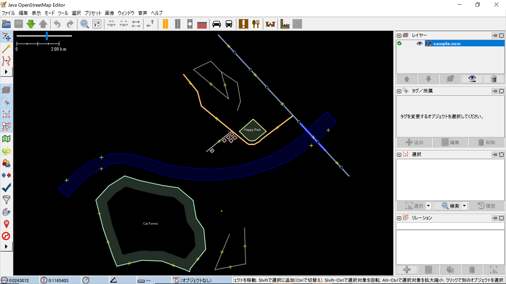
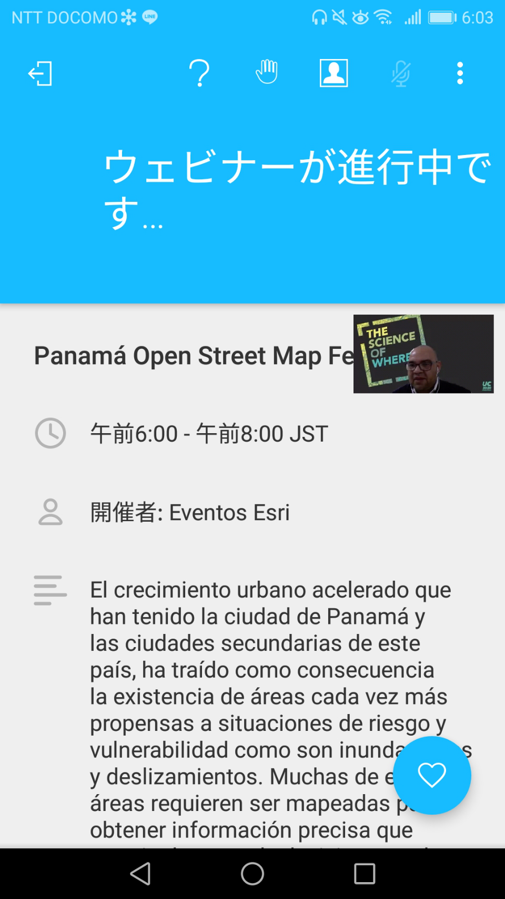
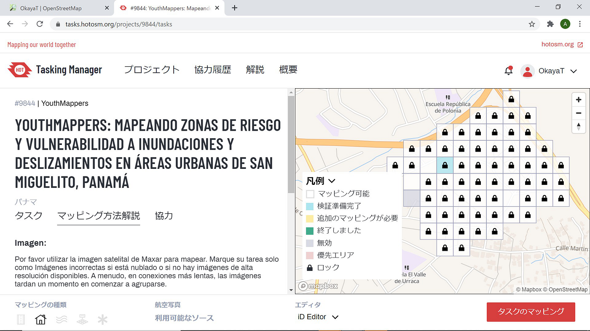
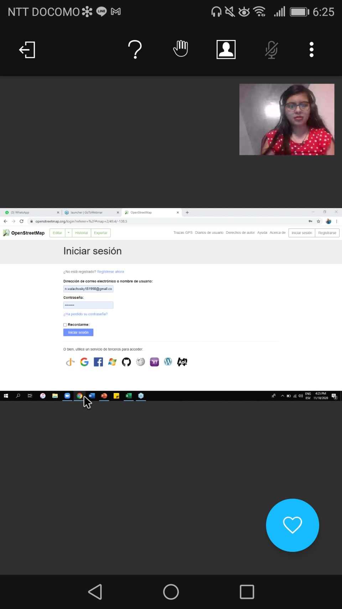
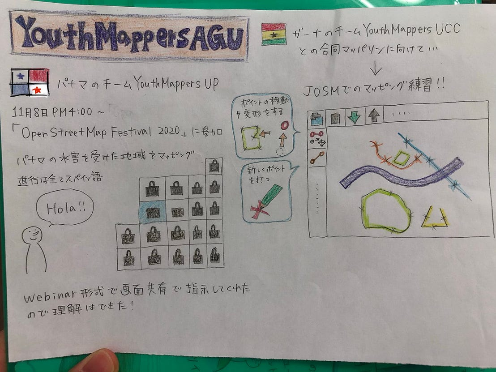

### 海外チームとの連携

最近YouthMappersAGUは世界各国のYouthMappersチームと連絡を取り、親睦を深めたりコラボイベントについて検討したりしています

今回は、

**①ガーナのチームYouthMappersUCC**

②パ**ナマのチームYouthMappersUP**

との活動について報告します

#### ①ガーナのチームYouthMappersUCCとの活動

YouthMappersUCC(以下UCC)とは、近いうちに合同でマッパソンを開催することを考えていて、現在それに向けて準備を進めています

UCCでは、常にJOSMを使ったマッピングを行っており、コラボイベントの際には参加者全員が同じ方法でマッピングしたほうが良いということだったことから

普段IDエディターを使ってマッピングをしている私たちもJOSM使ったマッピング方法を習得することになりました

詳しくわかる人が一人もいない中で、説明ページを見ながら手探りで学んでいるので今回の集まりではセットアップと簡単な操作方法しか確認できませんでしたが、

今後UCCの助けもかりながらスキルアップしていきます

#### ②パナマのチームYouthMappersUPとの活動

YouthMappersUP（以下UP)とは、つい最近交流を始めました

こちらからの合同企画の提案に、まずはUPが開催するイベントにどうぞと招待していただいたのでパナマの時間で11月18日の午後4時から開催されたオンラインマッピングイベント、「OpenStreetMap Festival 2020」にメンバーの一部が参加しました

内容は、参加者全員でHOT TaskingManagerに用意されたパナマの水害を受けた地域のタスクに取り組むというもので

タスクが一気にロックされる光景は圧巻でした

司会進行はすべてスペイン語で行われておりスペイン語が分からない立場としては何を言っているのか全く分かりませんでしたが、Webiner形式で画面共有を使ってやるべきことを指示していたので問題なく参加することができました

まだマッピングイベントを一から企画したことがない自分たちにとって、日本でのマッピング普及活動にも応用できる要素が多く、進行方法や利用するアプリなど色々なことを学ぶことができたので今後の活動に生かしていきます

また、今後UPとどのような活動をすることができるかわかりませんが、今回のイベント参加で他チームから刺激を受ける事の重要性を実感したので交流を続けて切磋琢磨していきたいと思います

担当:髙橋彩子

