### ついに集合！グラレコ部横瀬合宿。

2020年11月18日にグラレコ部の合宿を行いました！！今年度はオンラインでミーティングをしていたので、今回がなんとグラレコ部初めての対面…！

### ＃まず最初は、ツール紹介

初めて対面で会うということで、普段使っているグラレコツールを各々紹介しました。アナログ版、デジタル版両方、情報共有しました。

#### ＃＃アナロググラレコ

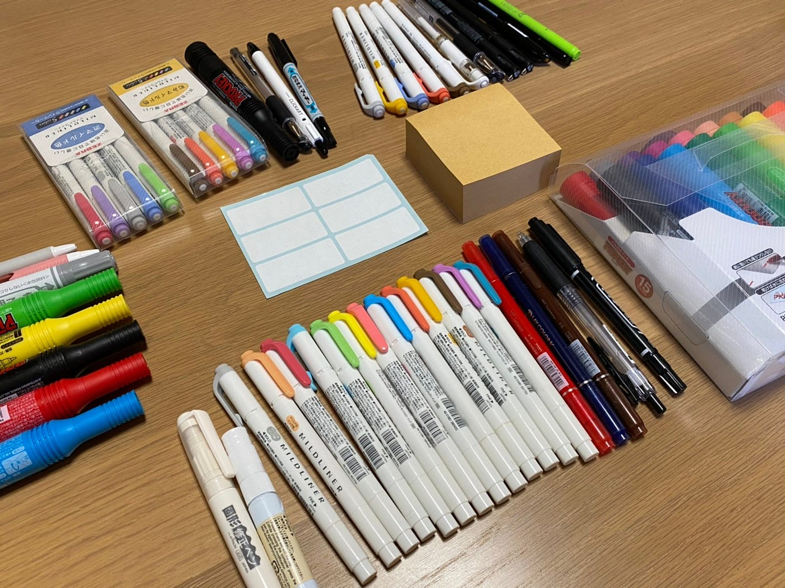

**↓各々のお気に入りツール**

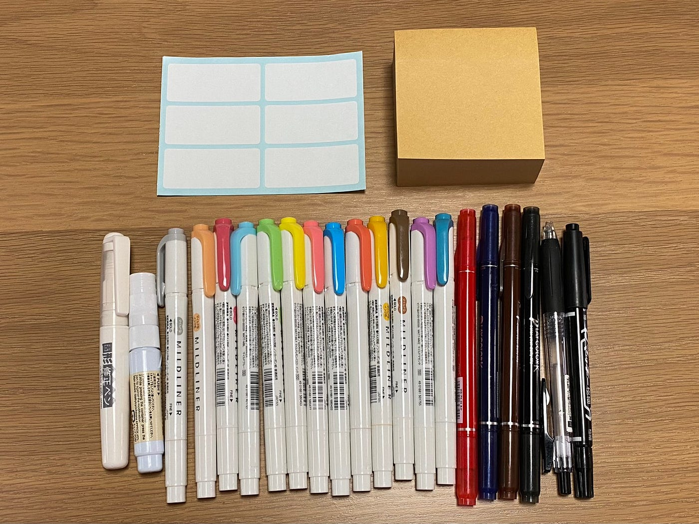

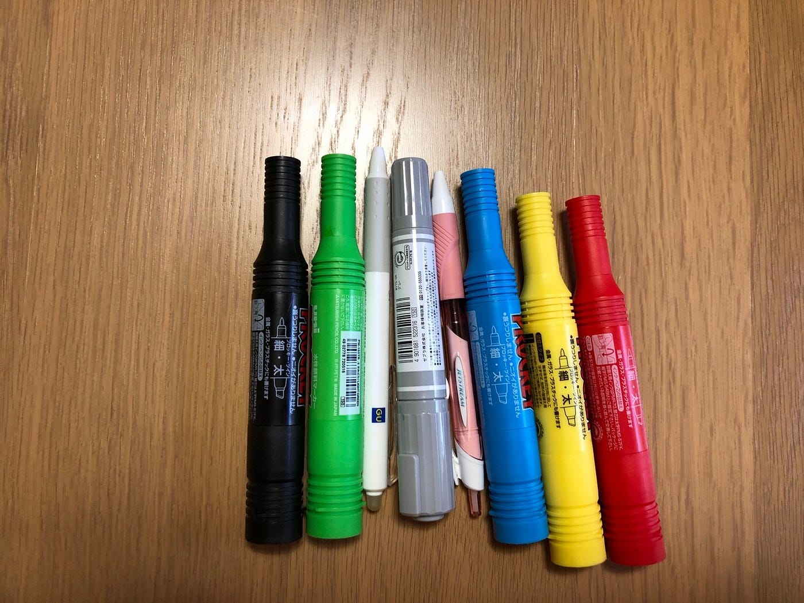

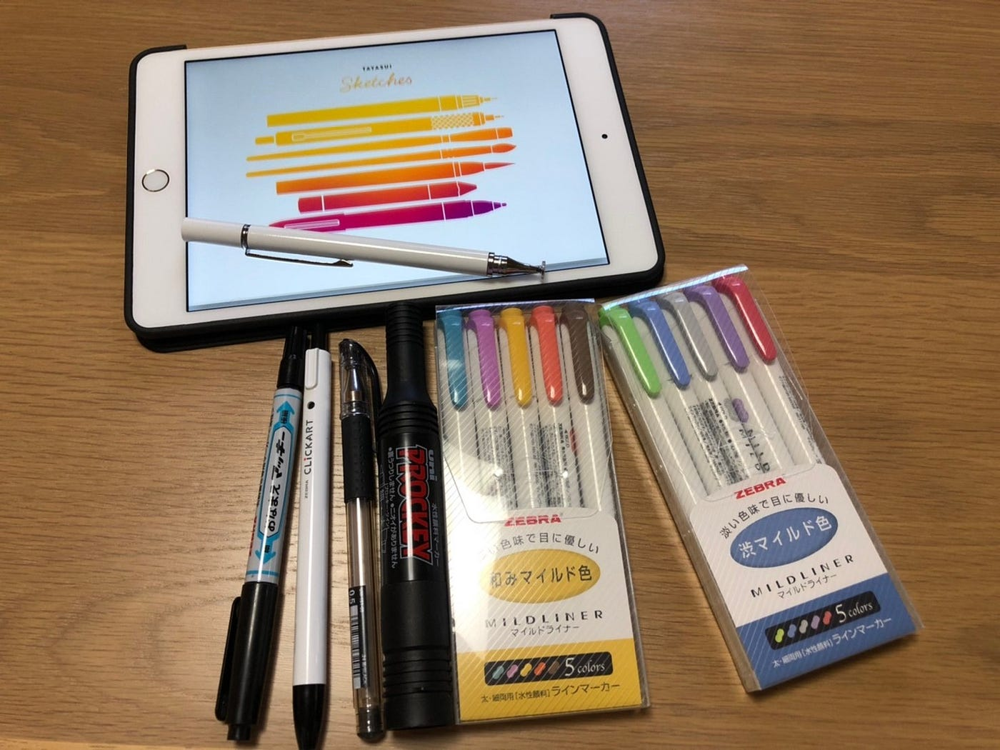

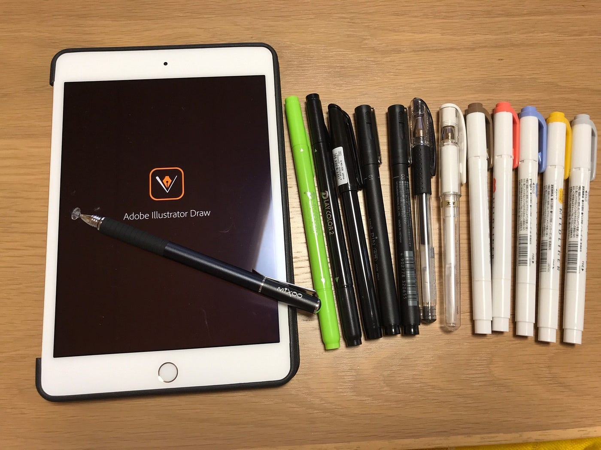

### ＃＃iPadグラレコ

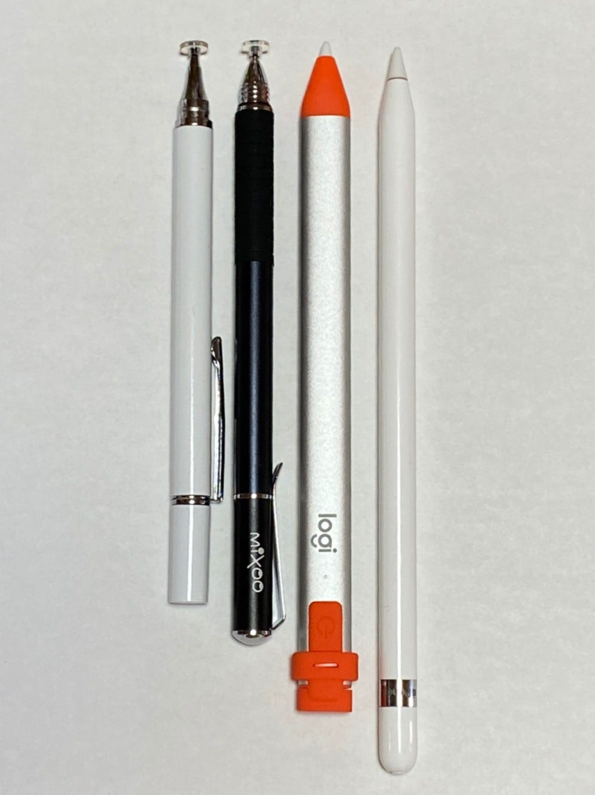

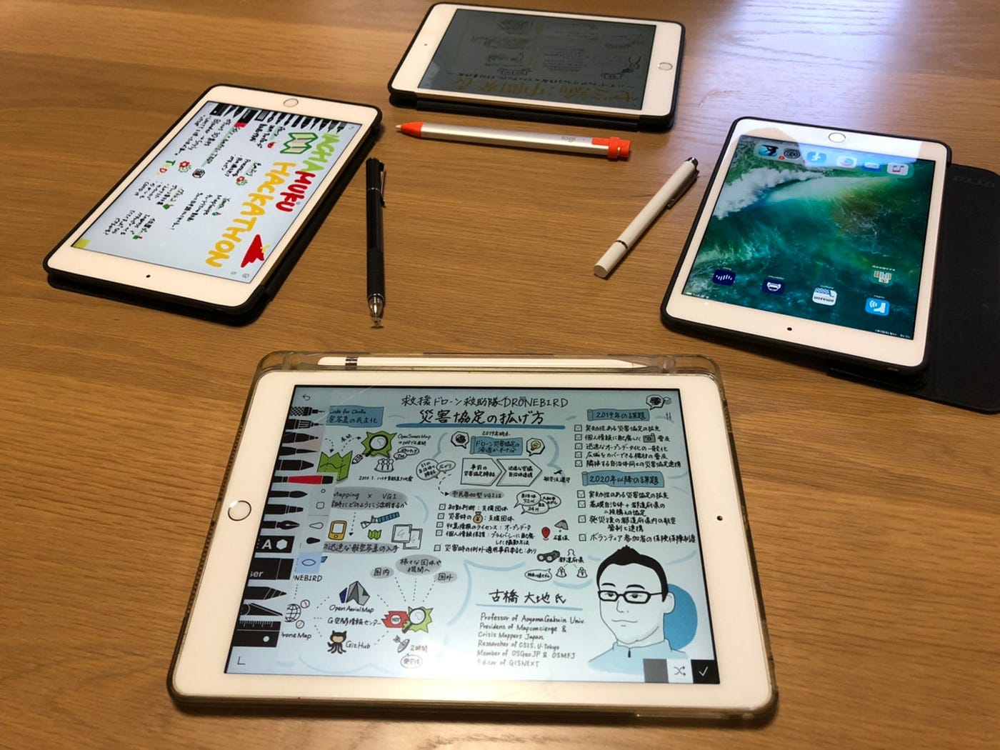

タッチペンを使ってみた個人の感想として、意外にも百均wattsが使いやすかったです。

**おすすめアプリ（全て無料で使えます）**

[‎Tayasui Sketches
いつも楽しく使わせていただいています。最初のスケッチブックの表紙で右の方にサンプルのぬりえがあり、子供用のぬりえもありました。はみ出ない処理(スマートボーダー)がされているのか最初のタッチ部分からはみ出た部分は描画されませんでした。3枚目以…apps.apple.com](https://apps.apple.com/jp/app/tayasui-sketches/id641900855)

[‎Adobe Illustrator Draw
‎Adobe Draw に代わって、制作に必要なツールと機能を備えた 2 つの新しいアプリケーションが登場しました。Adobe Fresco と Adobe Illustrator iPad 版をご紹介します。 Adobe Fresco…apps.apple.com](https://apps.apple.com/jp/app/adobe-illustrator-draw/id911156590)

[‎Adobe Photoshop Sketch
‎外出の多いアーティストでも、Adobe Sketch があれば、ひらめいたその場で自由にアイデアをカタチにできます。Photoshop の強力なブラシエンジンを活用し、そのパワーをお使いの iPhone と iPad…apps.apple.com](https://apps.apple.com/jp/app/adobe-photoshop-sketch/id839085644)

### ＃これからのグラレコ

古橋先生からこれからのグラレコの可能性についてお話を伺いました。

■登壇者と作るグラレコ

事前に登壇者から話す内容のスクリプトをもらいグラフィッカーがグラレコに挑むというもの。登壇者とグラフィッカーの認識のズレをなくし、グラフィッカーの負担も軽減できそうです。

■登壇者がグラレコをする

今まで登壇者とグラレコをする人は分かれていましたが、分けずに喋りながらグラレコを行うというもの。古橋先生が挑戦してみたそうですが、やはり難しいそう…。事前にプリセットを作っておくといいかも。

[Log into Facebook
Edit descriptionwww.facebook.com](https://www.facebook.com/mapconcierge/posts/3952157741479834)

### ＃Code for Japan Summit 2020

以前グラレコした、Code for Japan Summit2020 古橋先生登壇部分グラレコを見直しました。

古橋研頻出単語（地図やドローンなど）はイラスト化されているのに対し、抽象的な言葉がイラスト化できていないという課題が…。

[Log into Facebook
Edit descriptionwww.facebook.com](https://www.facebook.com/mapconcierge/posts/3935224736506468)

### ＃State of the Map Japan 2020

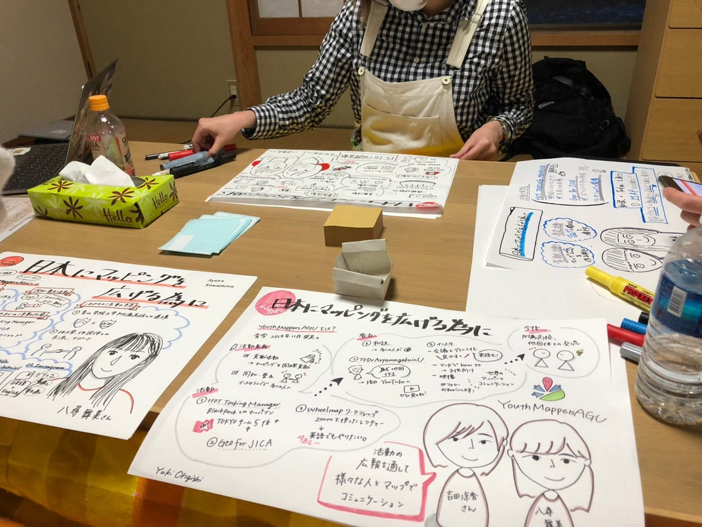

そこで、Code for Japan Summit2020の反省を活かすため、State of the Map Japan 2020のYouth Mappers AGU登壇部分をグラレコしてみました。

Youth Mappers AGUの記事は[こちら](https://medium.com/furuhashilab/state-of-the-map-japan-2020-%E7%B5%82%E4%BA%86-7af84d9f931c)

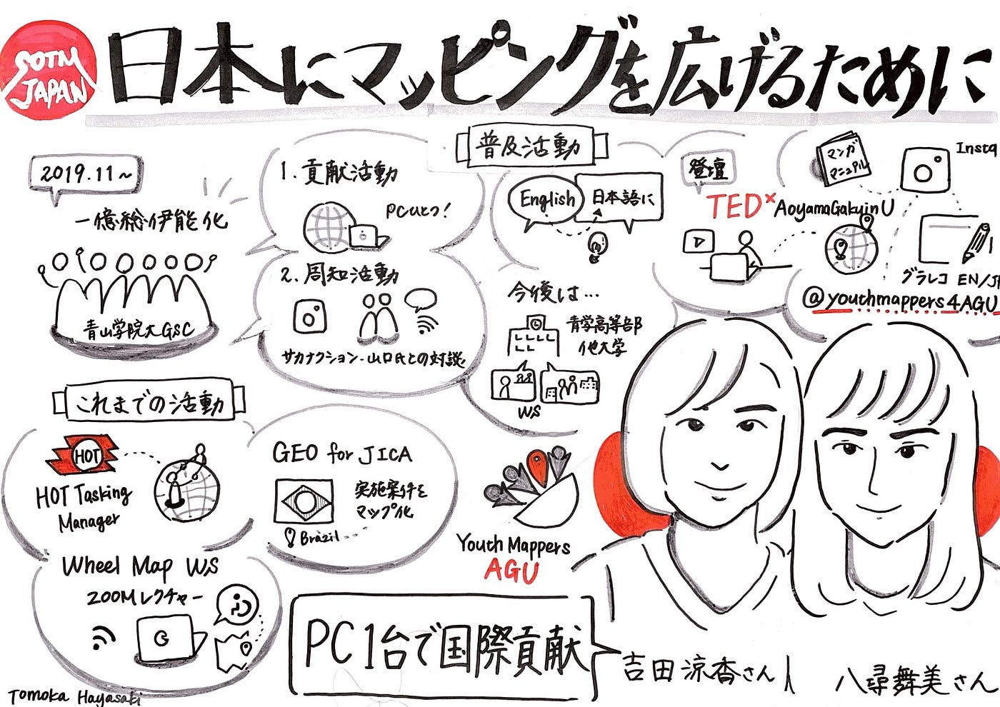

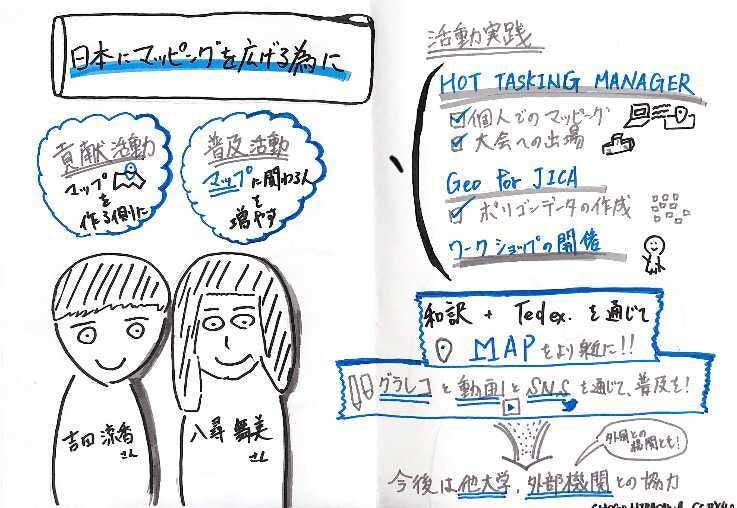

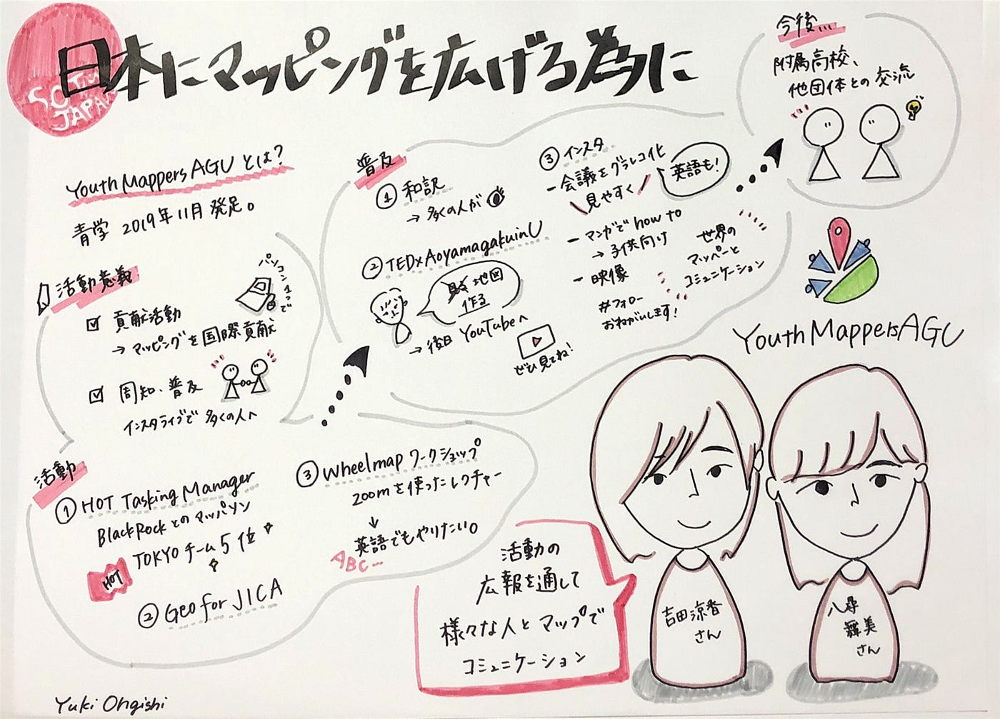

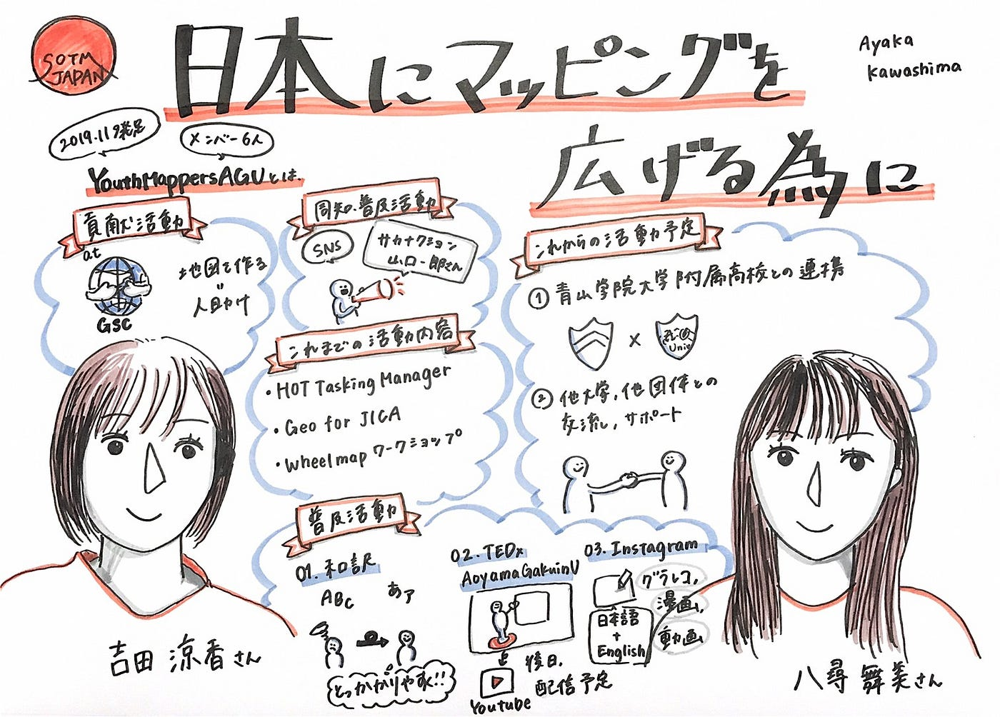

お互いのグラレコを鑑賞し合い、いいところを参考にイラストを練習しました。

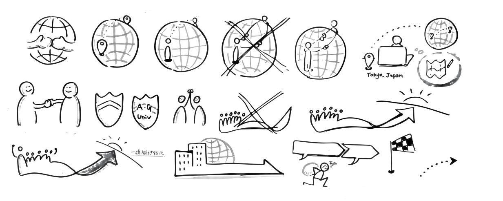

初めての対面で、時間を測りながら、一緒にグラレコをするのは非常に勉強になりました。今回の合宿では、全員アナログでグラレコを行ったのですが、次回はぜひデジテルでも挑戦してみたいです！

ということで、無事グラレコ部合宿終了！古橋先生ありがとうございました！！

### ＃部員増えました

横瀬部から佐藤かほるが移籍しました！

### ＃グラレコ

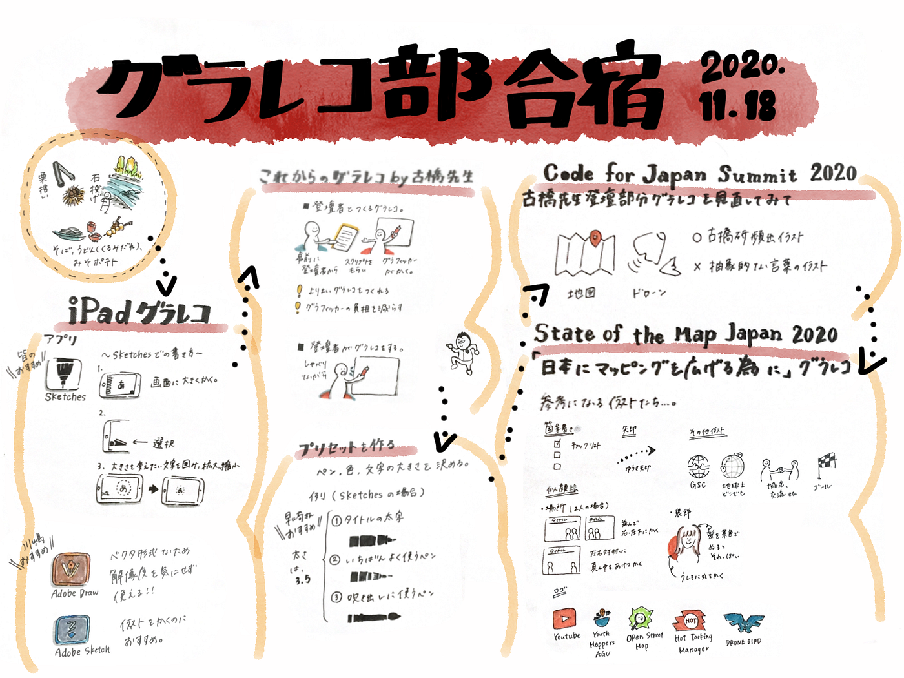

青山学院大学 古橋研究室3年

川嶋 彩香
