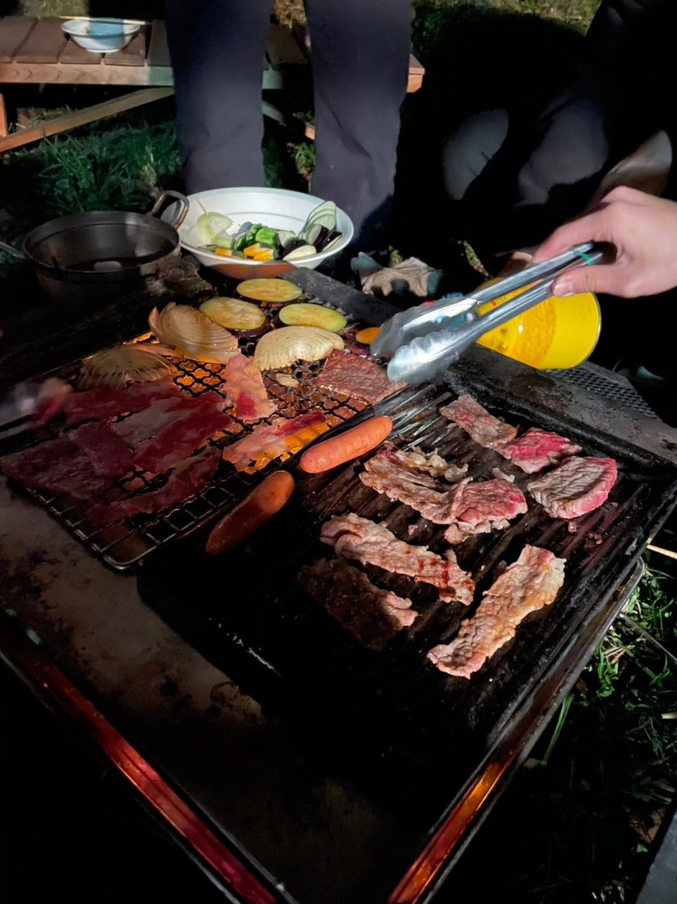
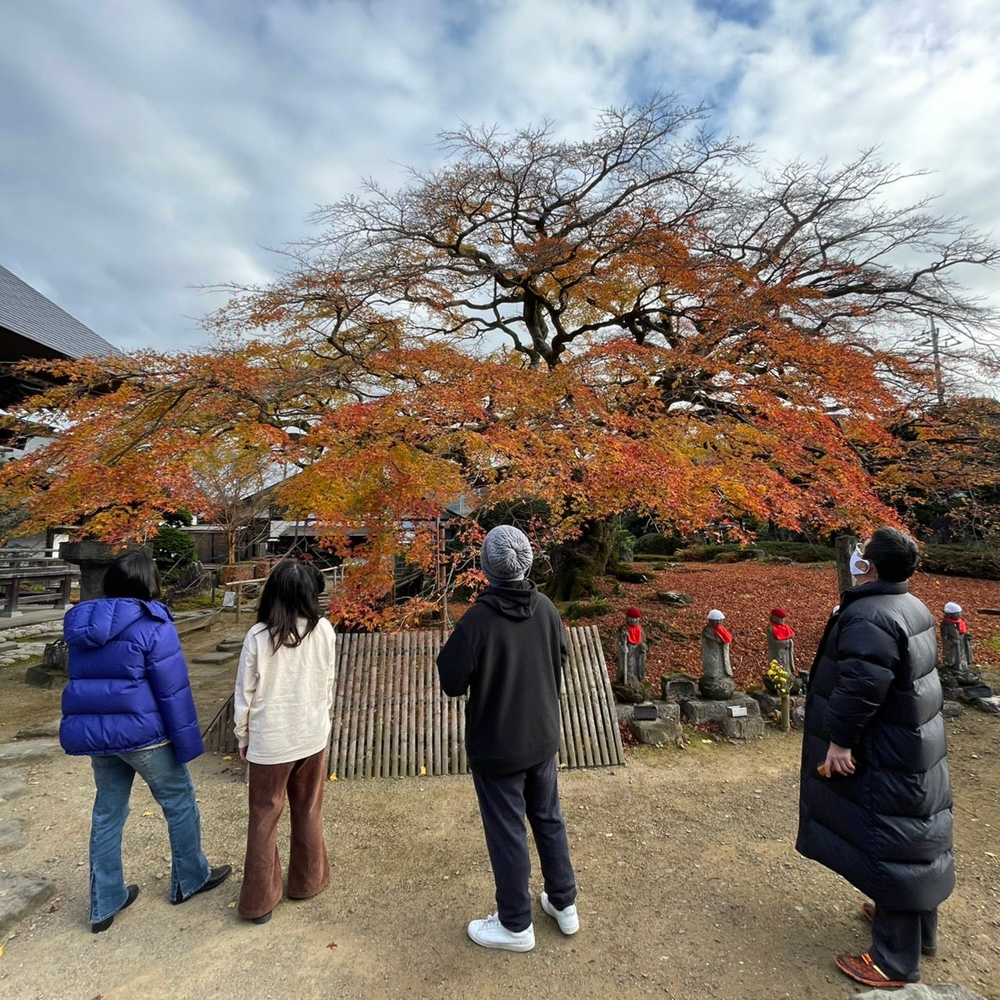
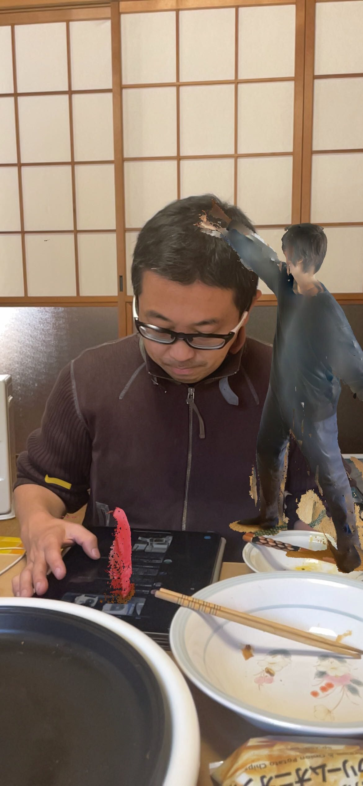
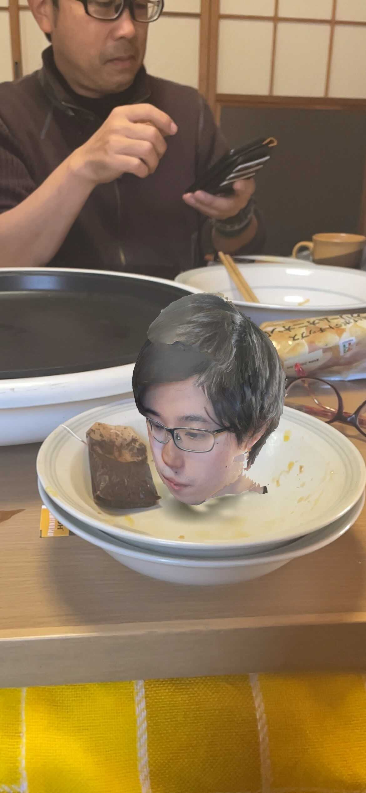
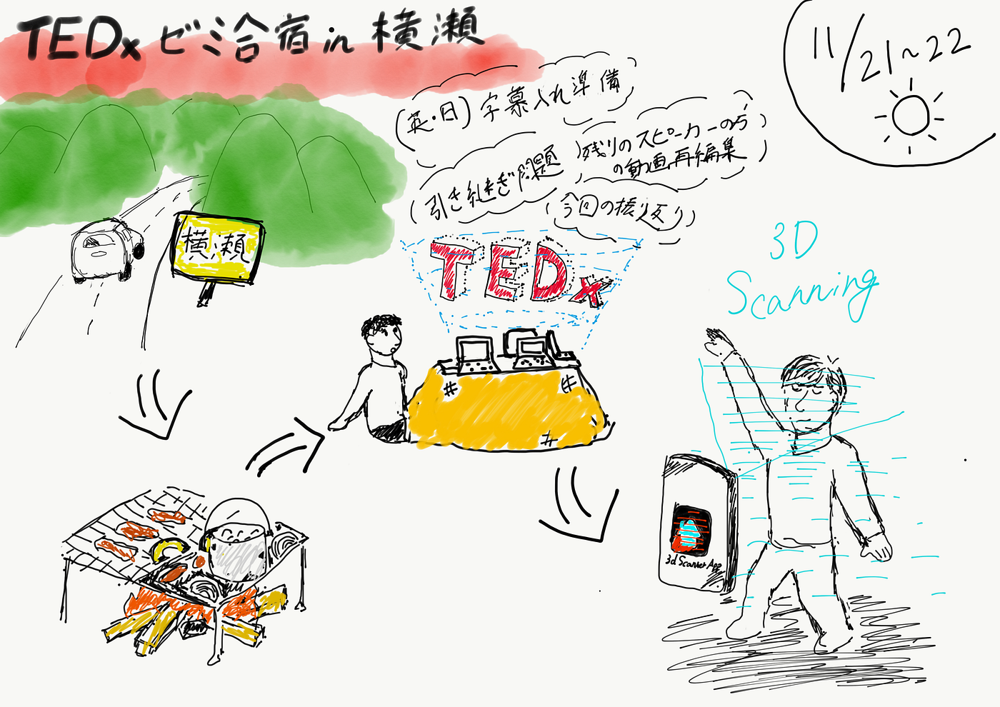

### TEDx合宿 in 横瀬

肌寒さが身にしみる冬隣。公私ともに年末に向けて慌ただしい時期に入りましたが、皆様お元気でご活躍のことと拝察申し上げます。こちらも庭の柚子がようやく収穫出来る時期となりました。

さて、TEDxAGUと致しましては、

11月21,22日に渡って古橋ゼミ内のTEDxAGU部として合宿を行いました。古橋ゼミ生以外にもTEDxAGUのオーガナイザーの大滝や他ゼミ生の高橋も参加しました。

初日は、昼過ぎ位に全員が集合し、夜のBBQの為の準備で各自買い出しや調理準備、BBQセットの配置等に時間を費やしました。

ある程度落ち着いた後、今回のスピーカーの方々の動画の再編集と本家TEDへの申請準備を行いました。動画の方は、残り１名のスピーカーの方の編集が残っており、綿密なコミュニケーションを取りながら、動画を作成しており、合宿内で完成させる事ができ、後はスピーカーの方に確認して頂くのみとなっています。

今後の予定としましたては、全スピーカーの動画を完成・確認が出来たら、本家TEDへ申請し、許可が降りた後にYouTubeへ動画をアップし、字幕を日本語版・英語版の２言語体制で差し込む予定です。

TEDxAGUの引き継ぎに関しては、現状2年生メンバーがいなく、現メンバーも何人が残り、何人が脱退するのか把握出来ていないので、引き継ぎするメンバーの確保が曖昧となっている状況です。なので、メンバー確保の問題も視野に入れながらこれから話し合っていければなと思っています。

また、今回は初のオンライン開催となり、ゼロベースからのスタートで試行錯誤しながら準備・開催を行っていたので、一度オンライン開催の基盤となるようなものを作れたらなと考えているところなので、今回行ったことの情報整理や課題抽出等出来ればいいなと思っています。

ちなみにTEDx関連の活動以外では、朝に紅葉を見に散歩をしたり、ドローン操縦を体験したりしました。

また、iPhone12に搭載されている”LiDARスキャナ”を使用しメンバーの青木を３Dデータとして取得し、どのような事が出来るのか試し、次回以降のTEDx開催へのヒントを得ることが出来ました。

#### ＜グラレコ＞

