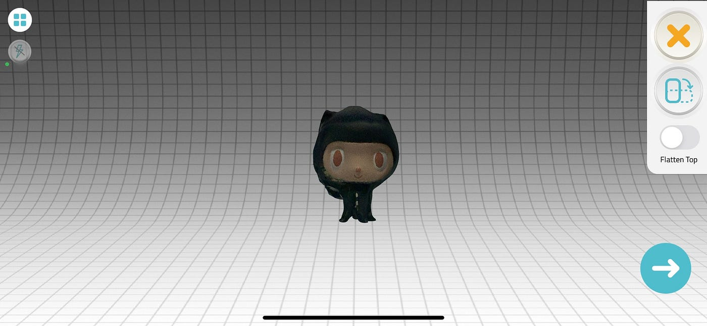
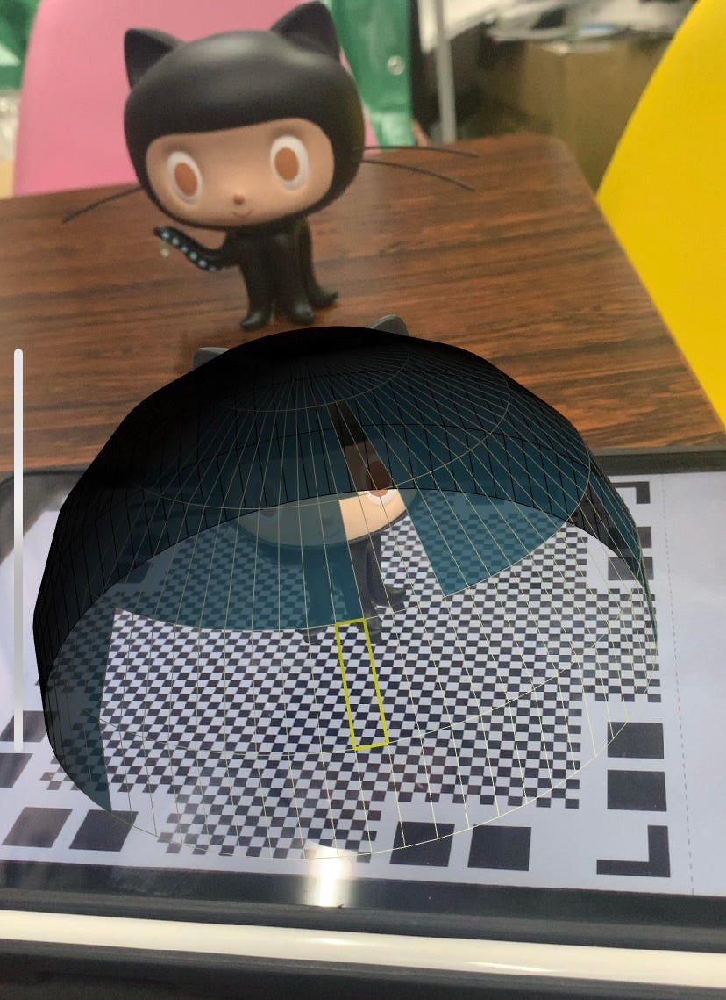
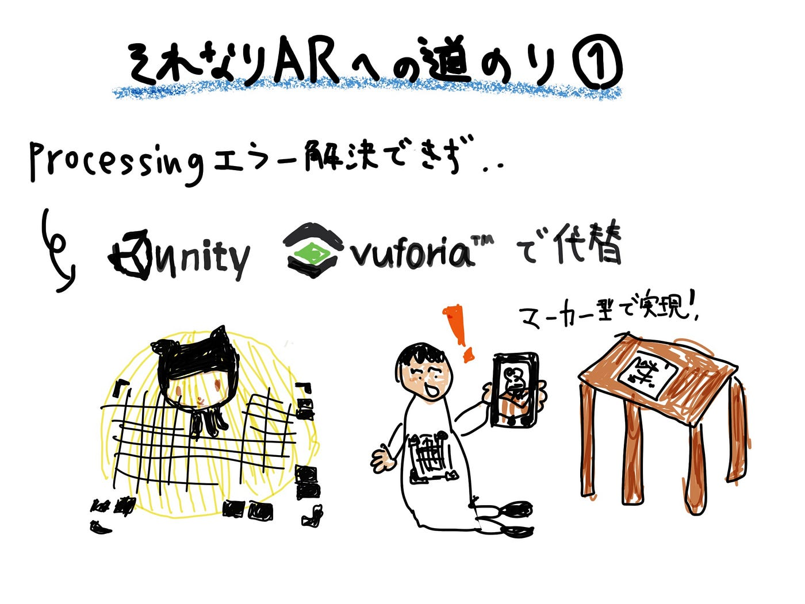

### それなりARへの道のり①

#### 前回エラーのWEBカメラ表示が解決しない！

前回はカメラ表示のプログラムにて、

```
A library relies on native code that's not available.
Or only works properly when the sketch is run as a 32-bit application.
```

というエラーが出ていました。このエラー、一見32-bitで動作させてね～と言っているようですがこれは**Processing本体のあるフォルダを日本語フォルダ以外(Cドライブ直下など)に入れる．**つまり，**Processing本体までのパスに日本語が含まれてはいけない** という内容らしいです。解決法を探して彷徨っていたら[こちらのブログ記事](https://3846masa.hatenablog.jp/entry/2015/05/20/021912)にたどり着き、これでいけるか！と試してみましたが結局無理でした。

もうよくわからなくなってきました。。。

#### Processing一時離脱

なかなか先に進めないのでProcessingでのARづくりは一旦離脱することにしました笑。そもそも自力でサーチしてキャッチできる情報が少なすぎるのとARを作るなら他のソフトでやる方が質の良いものになるんじゃないかとも直感的に思います。

### 次はUnityで

今度はUnityでAR作成を始めます。

ゴールはこのオクトキャットの3DオブジェクトをARで生成することです。blenderで一からモデリングしてもよかったですが今回はモデリングが目的ではないので3Dスキャンアプリでベースを作ってからblenderで軽く整形します。





Processingではマーカー型のマーカー型ビジョンベースARを目指しました。理想はマーカーレスの表示なのですが物体認識の技術など学術的な知識が必要となる場合も多いとのことなのでUnityでも比較的気軽に試せるマーカー型でいきたいと思います。

使うのはUnityと**[Vuforia**](https://onetech.jp/blog/vuforia-ar-application-development-library-features-6002)です。VuforiaはARアプリの開発などに使用されているらしいです。

### グラレコ


