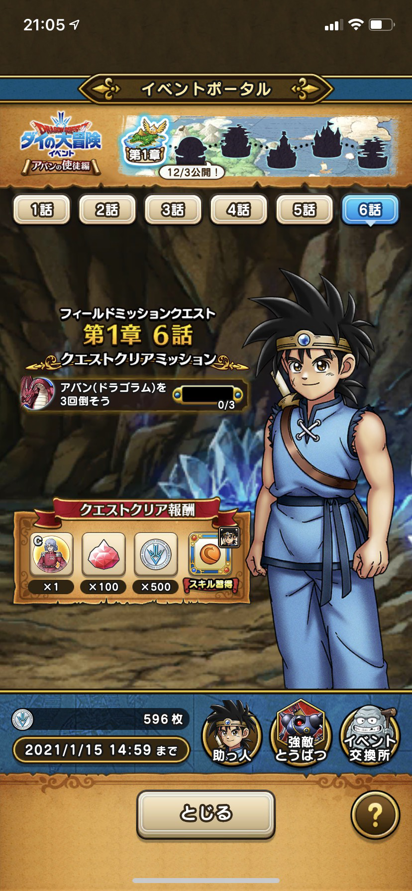
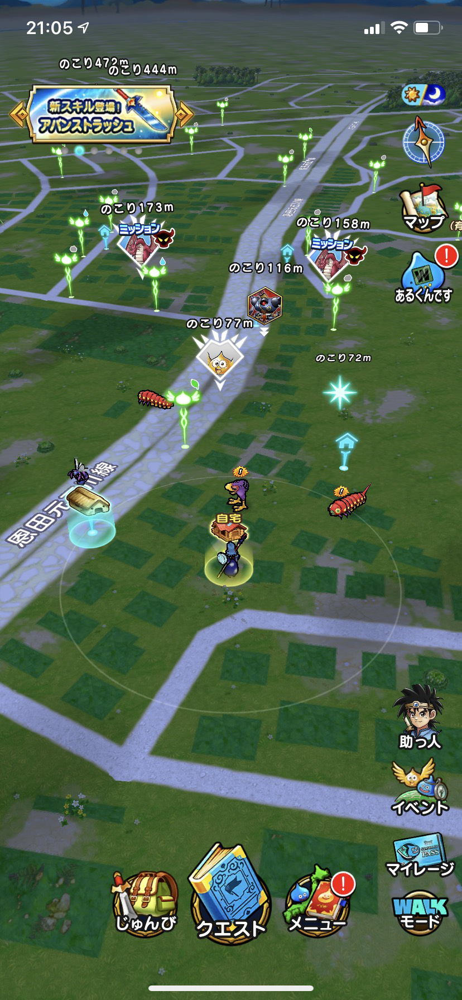
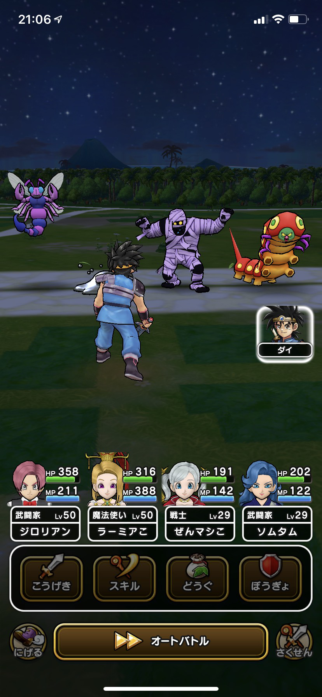
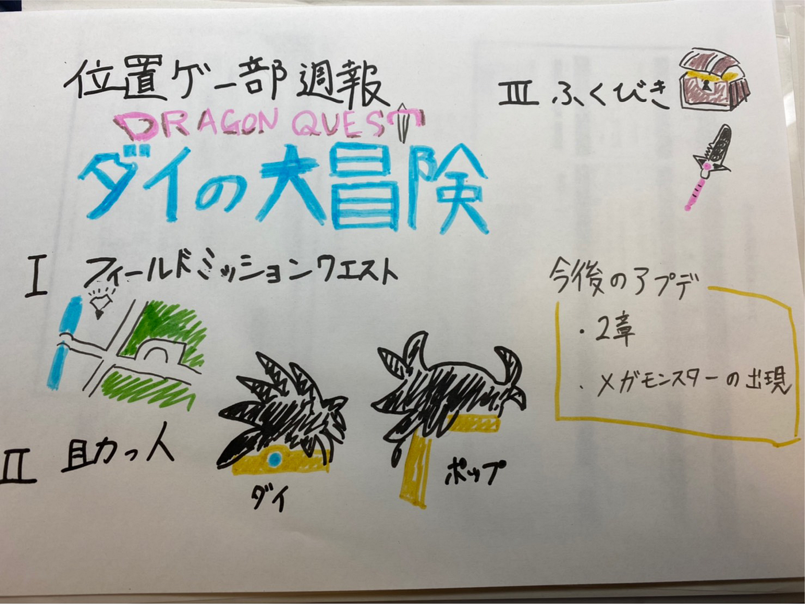

### ドラクエウォーク ダイの大冒険コラボ

11月26日から「ダイの大冒険」とドラゴンクエストウォークのコラボが始まりました。今回は実際にコラボを楽しんでみたので皆さんに紹介したいと思います。

**ダイの大冒険とは**

そもそも「ダイの大冒険」について知らない人もいるかもしれないので説明します。ダイの大冒険とはドラゴンクエストの世界線をもとにした漫画作品で、1989年から1996年にかけて週刊少年ジャンプで連載されていました。私も小学生くらいの頃に古本屋でダイの大冒険を見ていました。そして10月3日からテレビ東京系列で毎週土曜日の朝9時30分からダイの大冒険のアニメが始まりました。あらすじやキャラクター紹介もあるのでぜひ公式サイトを見てみてください。

アニメ公式サイトは[こちら](https://dq-dai.com/)

**具体的な第一章のコラボ内容**

1. 新システムの「フィールドミッションクエスト」をクリアしてストーリーを進めることが出来る。

ドラクエウォークの新しい機能として今までは目的地に行ってクエストをクリアするだけだったのがあちこちにあるミッションをクリアすることでクエストを進行できるようになりました。物語の主人公であるダイと一緒に冒険をして大冒険をしているみたいでやっていてとても楽しいです。

2. 助っ人として「ダイの大冒険」のキャラクターを使用することが出来る。

魔物と戦っていると今まではフレンドが登場していたものがダイの大冒険のキャラクターが出るようになりました。有用性で行くとフレンドのほうが強くて頼りになりますが、声優さんのボイスもあるので戦っていて楽しいです。

3. キャラクターの武器や防具がふくびきに登場する。

実際に主人公のダイが所持している武器や防具がふくびきに登場します。これにより原作で使われる必殺技を使えるようになります。武器の評価は、斬属性とデインを使い分けることが出来る「アバンストラッシュ」が特徴的です。また自身の攻撃力と防御力を向上させる「竜の紋章」があります。ダイの大冒険が好きな方はぜひ狙ってみてください。（200回回せば確定で武器が出ます。）私は何回か回しましたが出ることはありませんでした。

**今後の追加点**

12月3日から2章の追加、また大人数で戦うことが出来るメガモンスターのハドラーが追加されます。

**まとめ**

ドラクエウォークの傾向として章が上がるごとに難易度が上昇していく傾向があります。なので第一章は初心者の人でも簡単に楽しむことが出来ます。またドラクエウォークにありがちだった目的地に行くだけでストーリを進めるということが改善されたので冒険をしている感じが増したと思います。ぜひまだドラクエウォークをしていない人はしてみてください。

グラレコはこちら。

