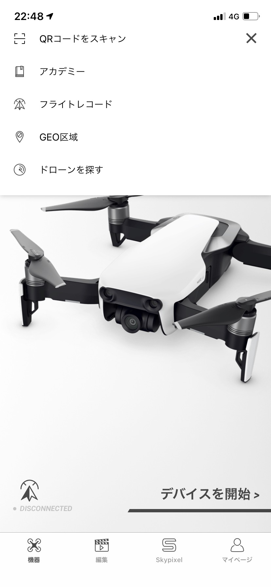
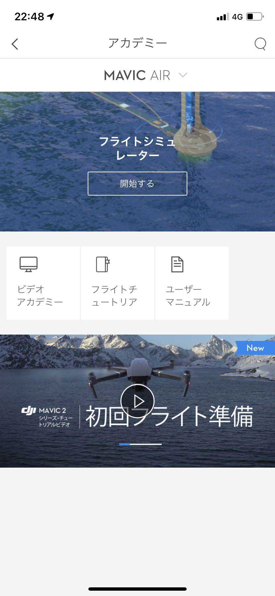
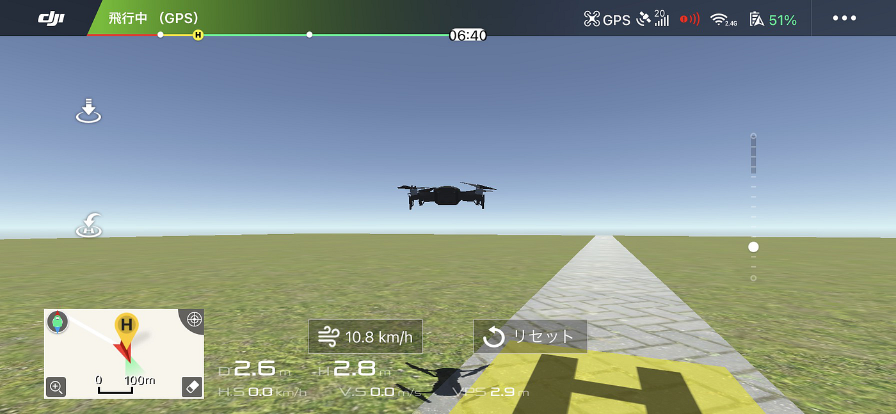
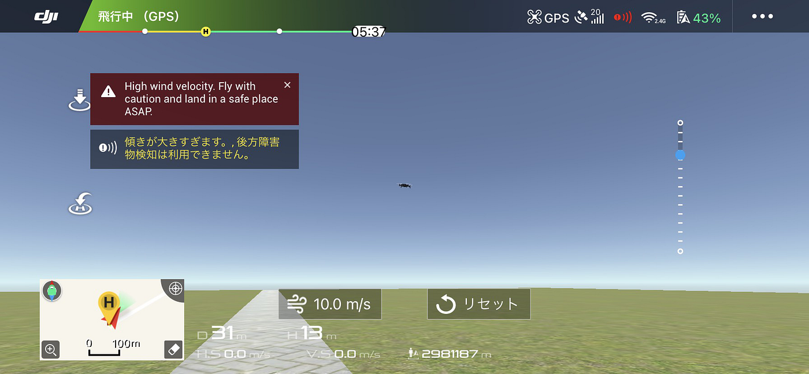
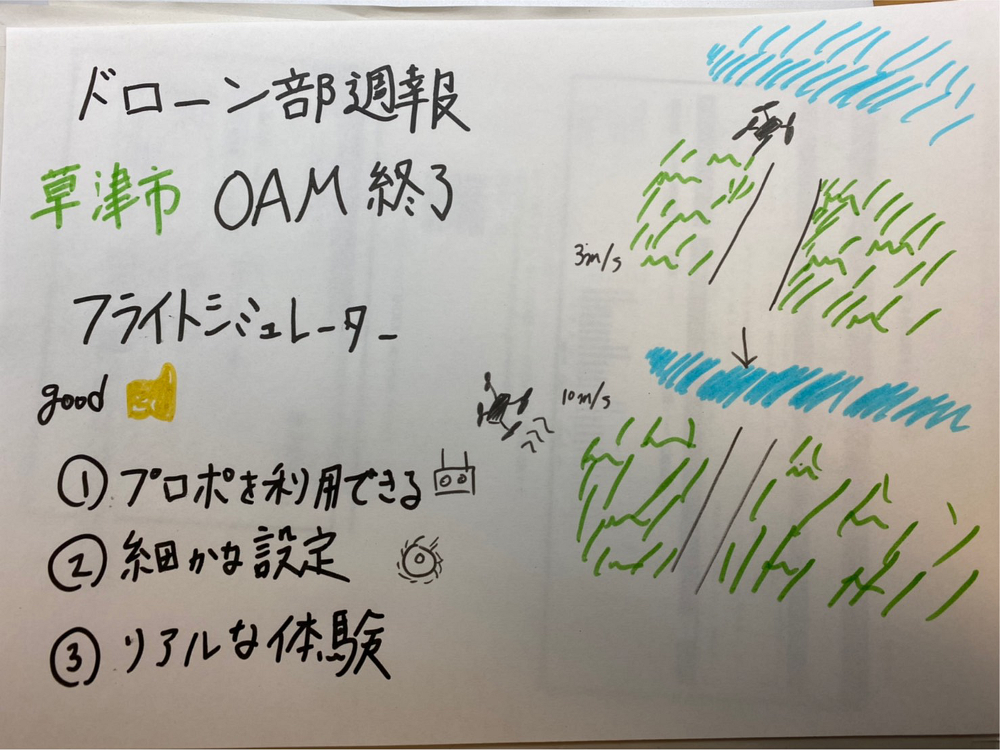

### ドローン部週報 19

**ミーティング**

ドローン部のミーティングで、草津のOAMの点検作業をドローン部全員で協力して行いました。主なエラーの対処としてもう一度QGISでやり直すことによってアップロードをすることが出来るようになりました。

今回の週報はDJI GO 4を用いたフライトシミュレーターを使ってみました。なぜ今回このことを調べようと思ったのかというと、今までドローンのシミュレーションは異なるアプリを使うと思っていたのでまさかDJI GO 4を使って利用することが出来るとは知らなかったからです。

**手順**

1. まずモバイル端末とドローン、プロポの接続をします。

1. そしてメニューを開き、「アカデミー」を選択し、「フライトシミュレーター」を開始します。

3. 設定などを変更し、プロポを用いてドローンを飛行する練習をすることが出来ます。（Mavic Airを用いたのでMavic Airが表示されます）

**実際にシミュレーターを使用してみて**

操作感は実際に操縦している時と比べ、違和感を感じました。少しもっさりしている印象を受けました。しかし実際に設定を細かく設定が出来る点、また風などの影響によってどのくらいの影響が生じるのか把握することが出来ました。およそ7m/sくらいまでは少し機体が横に行くくらいで操作はできる範囲内でしたが、10m/sを越えると機体が思うように動かなくなってしまいました。

今まではほぼ無風もしくはおそらく風速3m/sくらいのところで飛ばしていましたが、それが風が強くなるとこんなにも影響されるということを身を持って体験することが出来ました。

グラレコはこちらです。

