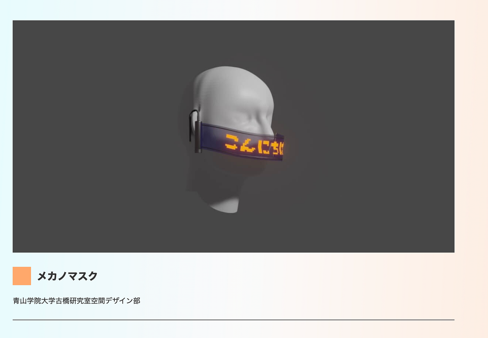
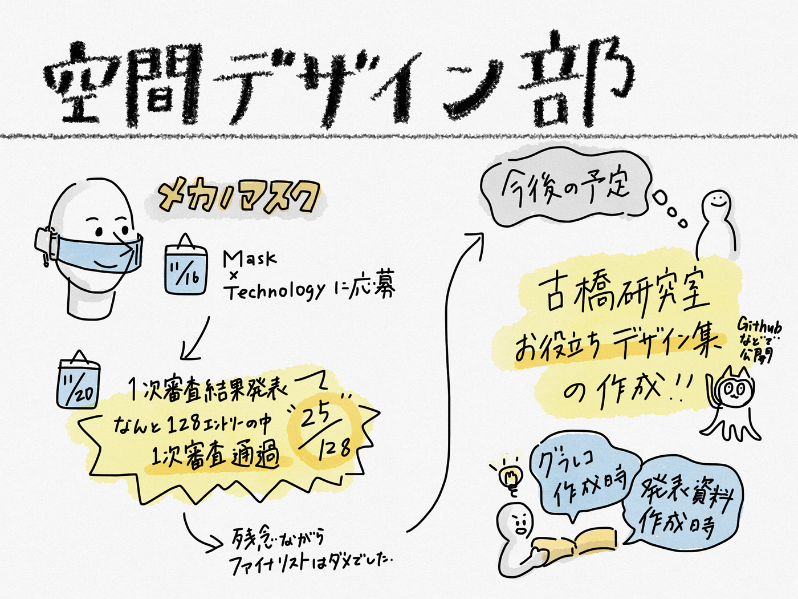

### マスクコンペ一次審査通過！

11月最後の週報になります、空間デザイン部です。

先日応募したマスクコンペ、なんと空間デザイン部が一次審査通過いたしました！！！（大拍手）

[Mask x Technology | 審査通過作品
総計128点のエントリー、誠にありがとうございました。 厳正なる審査を経て選ばれた一次審査通過作品を発表いたします。 審査ポイントは「課題への着眼点」「アイデアの独創性・革新性」「テクノロジーの利活用」。…lodge.yahoo.co.jp](https://lodge.yahoo.co.jp/pr-mask-works/063.html)

初めてのコンペ出場で一次通過できると思っていなかったので、びっくりしたのと同時にとても嬉しかったです！！

二次審査には落ちてしまったため、審査員の方々の前でのプレゼンをする機会を得ることはできなかったのですが、128作品中の25作品に入っただけでも大健闘かなと個人的には思っています！！

二次選考に通らなかった理由としては、いろんな機能を詰め込みすぎたかなと思います。もっとシンプルなものの方がわかりやすく、伝わりやすかったのかなと思いました！

一次、二次選考を通過した作品は日常の癖がわかるマスクや声が変わるマスクなど面白いものがたくさんあったのでぜひリンクから飛んで見てください！！！

▶︎[https://lodge.yahoo.co.jp/pr-mask-works/](https://lodge.yahoo.co.jp/pr-mask-works/)

＜今後の空間デザイン部＞

今後の空間デザイン部としての活動は、デザインお役立ち集を（GitHub上に？）作成していきたいと考えています！！

ゼミ生のみなさんに使っていけるようにわかりやすく、簡単に理解できるよう空間デザイン部らしさがあるようなものを作りたいと考えています！

次回のMTGで実際にどのようなものを作っていくのがいいのかを検討していこうと思います！

＜グラレコ＞

