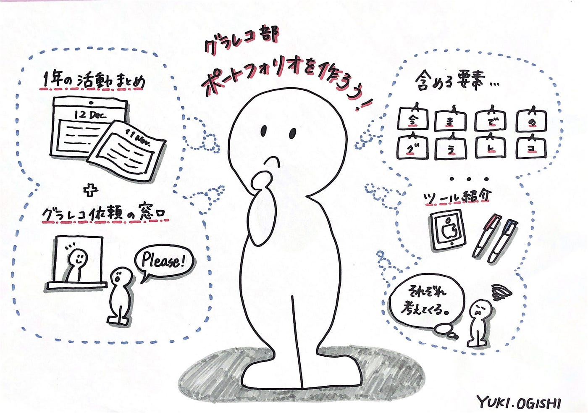

### ポートフォリオレポ

グラレコ部週報です。
今回のミーティングではポートフォリオ作成について話し合いました！

#### ##ミーティング

以前からグラレコ部のポートフォリオを作りたい、という話は出ていたもののなかなか着手できずにいた私たち…。
12月に入ってそろそろ今年度のまとめを始めたいというのもあり、ポートフォリオ作成、始動させたいと思います！

例えば私のグラレコの教科書、「[Graphic Recorder ―議論を可視化するグラフィックレコーディングの教科書](https://www.amazon.co.jp/dp/4802510284/ref=cm_sw_r_tw_dp_U_x_xC38BbR645ABX)」の清水淳子さんのポートフォリオ。

[shimizu junko - 清水淳子 | shimizu junko ポートフォリオサイト
Edit description4mimimizu.net](https://4mimimizu.net/)

要素としては自己紹介や過去作品を始め、noteの投稿など。
なるほど、過去作品はInstagramのように画像が並んでいて見た目にも興味をそそられます。かつシンプルでわかりやすい…！

宿題として、それぞれポートフォリオにどのような要素を入れたいか考えてくることになりました！

#### ##グラレポ

グラフィッカーの方々のポートフォリオを見ていて気になったワード。
お恥ずかしながら「グラレポ」、初めましてでした。

グラレコの大事な要素として”リアルタイム”に可視化していく、というポイントがあると思います。
グラレコの活用法は様々ありますが、”リアルタイム”にこだわらなければ、「内容をグラフィックを使って可視化していく手法」として私たちの活動ももっと可能性があるように感じていました。

例えばちょっと前の古橋先生のつぶやき…

[Facebook Groups
青学古橋研究室 has 117 members. 研究室アプリ https://furuhashilab.glideapp.io メンバーリスト https://bit.ly/3f0S2SX 全員必読！…www.facebook.com](https://www.facebook.com/groups/furuhashilabnow/permalink/996921974121375/?__cft__[0]=AZX8KXfQdwq9q22T0B6xJ0rzBKz9NEe73YSodOFFb5sEO7aB4eCCK8k_4WUJPMXwx268-GEJDXcA-vlvLAXgtukTuX2zRv-jGRMEeRN4G8bFEu1E3B53jxGsvR-_aLxw72-e1GbAmgLAaXNBpmi-Uwl7&__tn__=%2CO%2CP-R)

過去に行われた講演などをグラレコしなおすというのは、”リアルタイムではない”という意味ではグラレコとは言えないかもしれない…
でも「レコーディング」ではなく「レポート」だったらありかも！

以下、グラレポについていくつかの記事載せました。
グラレコとグラレポの違いについてわかりやすいのでぜひ読んでみてほしいです。

[〈グラレポ〉とは何か
グラフィックレポーティングの略称である。…medium.com](https://medium.com/kyuhey-notes/graphic-reporting-on-drawing-skill-of-ba-ca71b7735727)

[今身に付けたいのは"伝える力"。絵と文字で伝える「グラレポ」って？ #リリプリマガジン｜#箕輪編集室 公式
外出自粛により、以前のように友人、家族、職場の仲間たちと直接話すことができなくなって早数ヶ月。 テキストやオンラインでのコミュニケーションが増え、いつも以上に「伝える力」の大切さを痛感している方も多いのではないでしょうか。…minohen.com](https://minohen.com/n/n83cfd6da57e4)

今までグラレコとグラレポを区別していませんでしたが、今後はそれぞれ分けて描いていきたいと思いました！

#### ##グラレコ

青山学院大学 古橋研究室3年

大岸 裕紀
