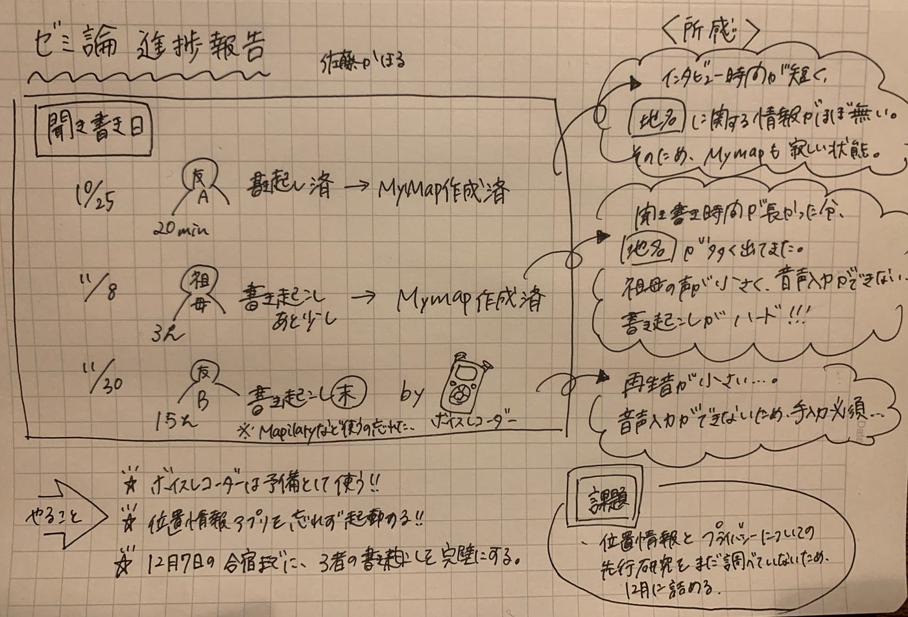

### ３人目の聞き書き

こんにちは！3年の佐藤です。
いつの間にか師走に入っていて驚きです。
2020の最終月だと思うと、１年間が非常に短かった気がします。
去年の今頃は、タイ・バンコクのシーナカリンウィロート大学に通っていました、懐かしい。。。。。。。

ここでは直近進捗報告のみ記すので、より詳しいプロジェクト内容が載っている、[中間報告](https://link.medium.com/fTlYEn4YXbb)もチェックしてみてください。

★[中間報告](https://link.medium.com/fTlYEn4YXbb)

★[GitHubリポジトリ](https://github.com/furuhashilab/2020gsc_KahoruSato)

★[スライド](https://docs.google.com/presentation/d/1HyM2AfAJsyLd6Ewtsqc0fPfXFzvO0df8XrtiacZp9Ik/edit?usp=sharing)

### #進捗

◉これまでに三者に聞き書きを行った。

**[10/25 友人Aの聞き書き]**

☑️書き起こし終了

☑️GoogleMaymap作成終了

《所感》

- 聞き時間が短いため、位置情報は特に得られなかった。その為Mymap上のmapが寂しい状態に。

**[11/8 祖母の聞き書き]**

☑️書き起こしもう少し

☑️GoogleMymap作成終了

《所感》

- 長時間話してもらった為、位置情報が多く話に出てきた。

- 祖母の声が鮮明でない&会話の隙間が多かったため、Google documentの音声入力がうまく作動せず、手入力がハード。

**[11/30 友人Bの聞き書き]**

中学からの友人で、陸上競技を続けている方に聞き書きを行った。今回は練習場に行ったりはせず、練習がオフの日に実行した。

⬜︎書き起こし未完成

⬜︎GoogleMymap未完成

《所感》

- ボイスレコーダーを用いたが、再生音声が小さく、音声入力ができなかった。

- Mapillary等のアプリを起動するのを忘れていた…。

### #決め事

- ボイスレコーダーは予備として使う。

- 音声入力はGoogle documentを使用。

- Mapillary等のアプリを起動することを忘れない。聞き書きを行う前にチェックリストを作る。

### #To do

- 12/7の合宿までに、三者の聞き書きを完成させる(書き起こしが終わっているものもあるが、聞き書きの文章としてまだ成っていないため、終わり次第シェアする)

- 12月末までに、位置情報とプライバシーについての先行研究を学ぶ。

### #音声入力アプリ

これまで3つのアプリ(Google document、[Texter](https://apps.apple.com/jp/app/%E9%8C%B2%E9%9F%B3-%E6%96%87%E5%AD%97%E8%B5%B7%E3%81%93%E3%81%97-%E3%83%86%E3%82%AD%E3%82%B9%E3%83%88%E5%A4%89%E6%8F%9B-texter-%E3%83%86%E3%82%AD%E3%82%B9%E3%82%BF%E3%83%BC/id1482592304)、[Voicenote](https://chrome.google.com/webstore/detail/voicenote-ii-speech-to-te/jimdfkeocobeeldobhpakapbhdeample)ⅱ)を試してみた。結果、Google documentが最も適していた。

そもそもGoogle documentにて書き起こしをしてたのもあるが、他の二つのアプリは音声認識能力が低かった。

以上が進捗報告になります！

ありがとうございました( ^ω^ )
