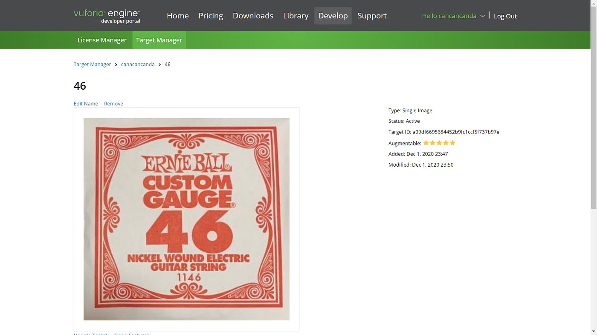
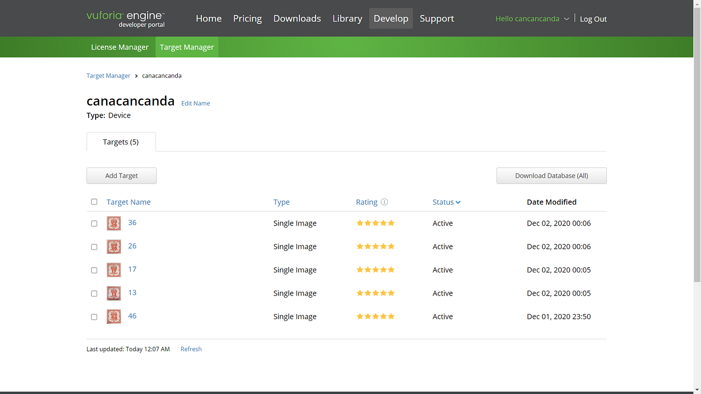
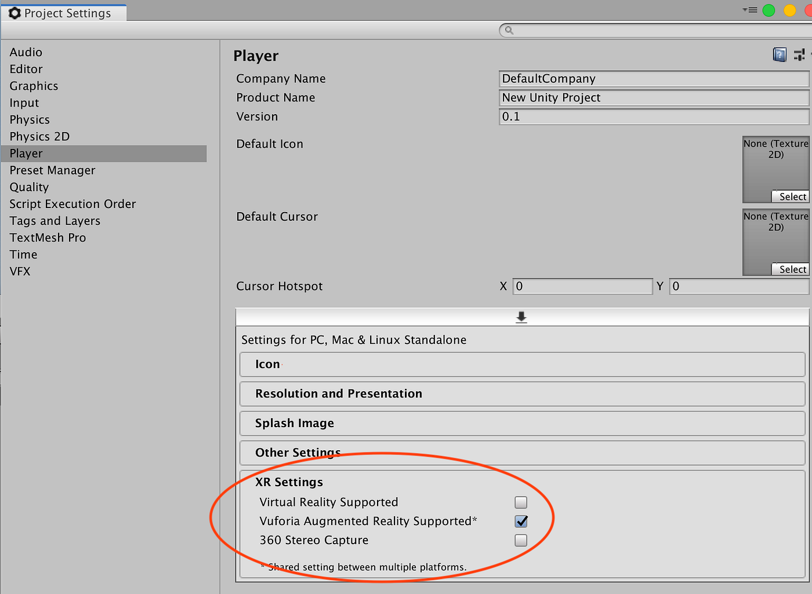
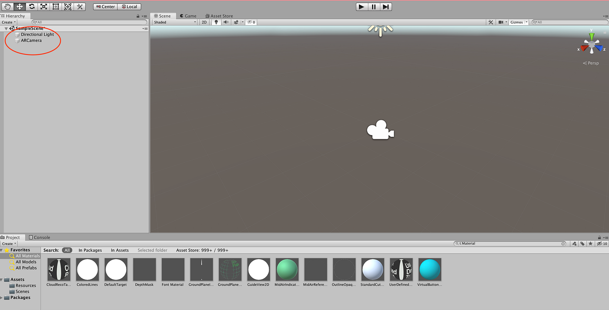
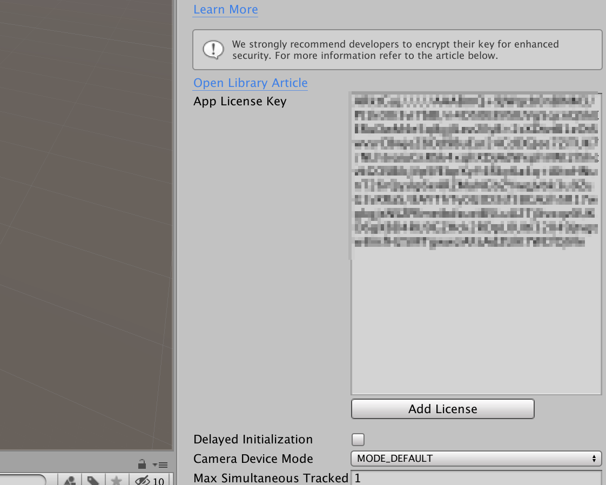
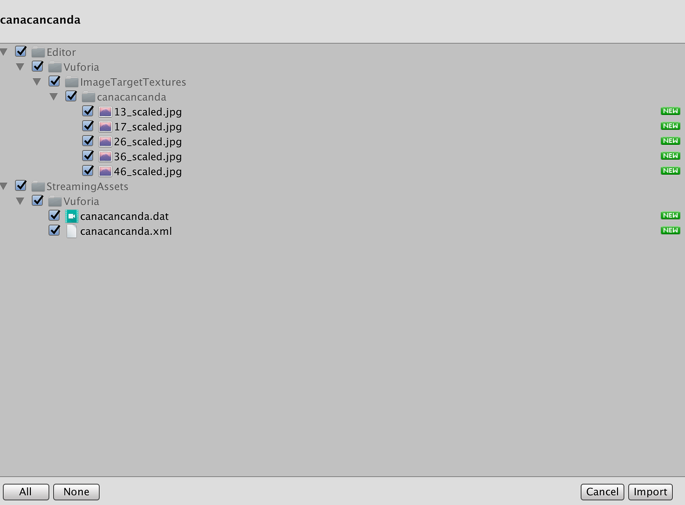
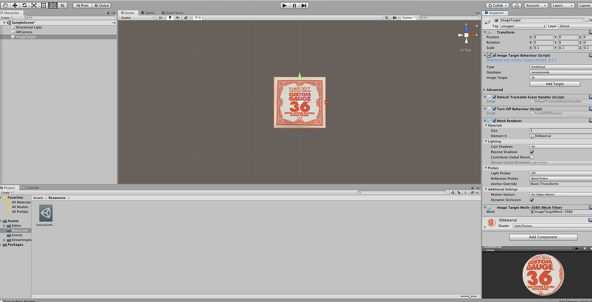
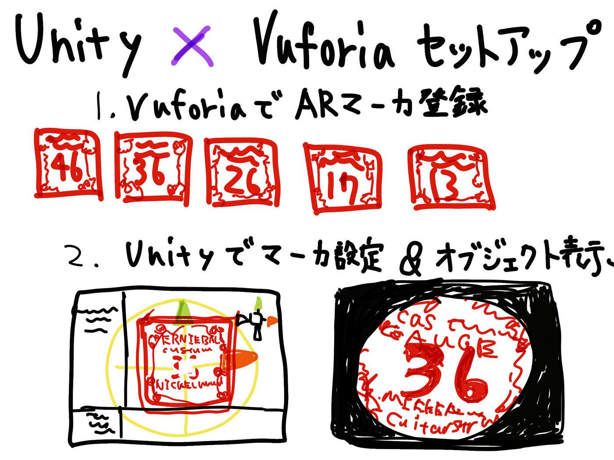

### それなりARへの道のり②

こんにちは！ものづくり部の神田です。今回は主にAR生成のためのUnityとVuforiaのセッティングを行いました。なかなか地味な作業をドキュメンテーション調で書いているので退屈だと思いますがどうぞお付き合いください笑

### ARのマーカーにする画像を登録し画像ファイルのデータベース作成

まず**Vuforia**にてライセンスキーを取得し、ARマーカーにしたい画像の登録をします。おそらく画像ファイルであればなんでもマーカーにできるので今回は家にあったギター弦が入っている紙袋を5枚登録しました。

### ARマーカーにする画像を登録したデータベースをダウンロード

上記の作成したデータベースをUnity Editor用にパケッジとしてダウンロードします。

### Unityの設定でVuforiaを扱えるようにする

次に[Unity Hub](https://unity3d.com/jp/get-unity/download)から特定のバージョンのUnityをインストールします。今回使用したUnityのバージョンは 2019 .2.17f1です。※始めは最新のバージョンで試しましたがVuforiaの設定項目がわかりにくかったです

Project Setting＞XR settingsで Vuforia ARを使えるようにします。

作業画面に行きHierarchyにVuforia Engineの項目が追加されていることが確認できればOKです！ 標準のカメラを削除してVuforia用にARカメラを追加します。

今度はWindow > Vuforia Configurationを選択して一番最初にVuforiaで取得したライセンスキーをApp License Key の欄にペーストします。

そしてUnity用にダウンロードしていたパッケージをインポートします。

### セットアップ完了！のはず.. エラーが起きないことを祈る…

一応これでUnityでVuforiaが扱えるようになったかと思います。あまり面白くないと思うので今週はここまでにしておきます笑 今回はプログラムなど一切使ってないですがこちらでもなんらかのエラーが起きないか怖いです。エラー恐怖症w

次回からは画像マーカーの設定を中心にやっていきます！！

### グラレコ

