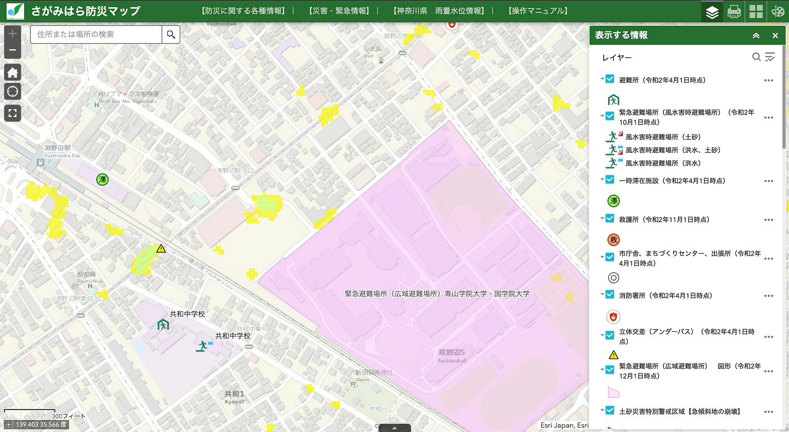
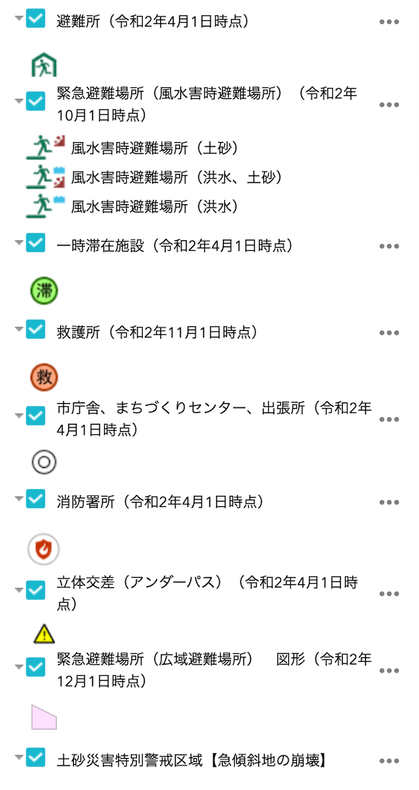
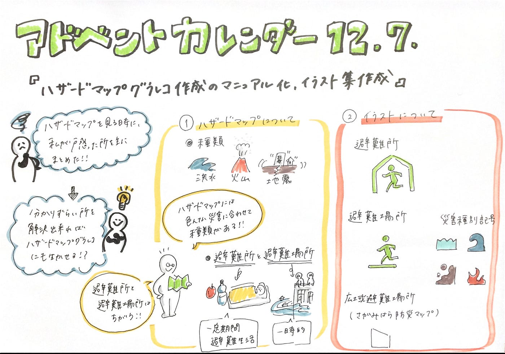

### アドベントカレンダー12/7

12/7（月）担当の古橋研究室3年川嶋彩香です！今回はゼミ論の進歩報告をしていきたいと思います。

私のゼミ論テーマは『**ハザードマップグラレコ作成のマニュアル化、イラスト集作成』**となっています。

前回の中間発表はこちら↓

[ゼミ論中間発表：ハザードマップとグラレコ
「ハザードマップグラレコ作成のマニュアル化、イラスト集作成」medium.com](https://medium.com/furuhashilab/%E3%82%BC%E3%83%9F%E8%AB%96%E4%B8%AD%E9%96%93%E7%99%BA%E8%A1%A8-%E3%83%8F%E3%82%B6%E3%83%BC%E3%83%89%E3%83%9E%E3%83%83%E3%83%97%E3%81%A8%E3%82%B0%E3%83%A9%E3%83%AC%E3%82%B3-bdf11e090f6f)

今回の進歩報告では

**①ハザードマップについて**

**②ハザードマップで使用されているイラストについて**

書いていきたいと思います。

### _**①ハザードマップについて_**

前回の中間発表でも紹介した通り「_ハザードマップ」とは、一般的に「**自然災害による被害の軽減や防災対策に使用する目的で、被災想定区域や避難場所・避難経路などの防災関係施設の位置などを表示した地図**」とされています。_（国土地理院）

しかし、実際にハザードマップをみてみようと思ったら、、、**よくわからない！**個人的に思うハザードマップをみる際に困りそうなところをまとめていこうと思います。

#### **■ハザードマップの種類**

まず最初に、**ハザードマップの種類**です。ハザードマップといっても

> _・洪水ハザードマップ_

> _・内水ハザードマップ_

> _・ため池ハザードマップ_

> _・高潮ハザードマップ_

> _・津波ハザードマップ_

> _・土砂災害ハザードマップ_

> _・火山ハザードマップ …_

などなど様々な種類の災害に合わせたハザードマップ が存在するのです。まずここから私はどれをみたらいいのか…とつまづきました。笑

相模原市では以下の５つが公開されていました。

- [さがみはら防災マップ](https://sagami-kikikanri.maps.arcgis.com/apps/webappviewer/index.html?id=e0f12e9ebfaa46b79f8c61e962fea2d0)

- [土砂災害ハザードマップ](https://www.city.sagamihara.kanagawa.jp/kurashi/bousai/1008688/1013027/index.html)

- [洪水ハザードマップ](https://www.city.sagamihara.kanagawa.jp/kurashi/bousai/1008688/1008692.html)

- [浸水（内水）ハザードマップ](https://www.city.sagamihara.kanagawa.jp/kurashi/bousai/1008688/1008690.html)

- [揺れやすさマップ](https://www.city.sagamihara.kanagawa.jp/kurashi/bousai/1008688/1008693.html)

#### ■避難所と避難場所

いざ災害が起きたときどこに逃げればいいのでしょうか？

災害対策基本法では、「**指定緊急避難場所**」と「**指定避難所**」の2つが明記されています。

> _**避難場所_**

> _避難場所は、地震などによる火災が発生し、地域全体が危険になったときに避難する場所で、火災がおさまるまで一時的に待つ場所です。ここでは、基本的には食料や水の備えはありません。具体的には、大規模な公園や緑地、大学などが指定されています。_

> _**避難所_**

> _避難所は、地震などにより家屋の倒壊や焼失などで被害を受けた方、または現に被害を受ける恐れがある方が、一定の期間避難生活をする場所です。ここでは、飲料水やトイレなどを備えています。具体的には、小中学校や公民館などの公共施設が指定されています。_

> _**その他_**

> _区市町村によっては近隣の人が一時的に集合する場所である一時（いっとき）集合場所や、自宅や避難所での生活が困難で、介護などを必要とする方を一時的に受け入れる二次避難所などもあります。_

参考文献

[東京消防庁＜広報とうきょう消防（第３号）＞
空から救助活動にあたる航空隊 被災地へ向かう緊急消防援助隊 千葉県市原市タンク火災 消防艇・無人走行放車による消火活動 宮城県気仙沼市 市街地の消火活動 宮城県気仙沼市 がれきを除去しながらの人命検索活動 福島第一原発…www.tfd.metro.tokyo.lg.jp](https://www.tfd.metro.tokyo.lg.jp/hp-kouhouka/kts/kts_03/kts04.html)

### ②ハザードマップで使用されているイラストについて

お次は**ハザードマップで使われているイラスト**です。今回は「避難所」と「避難場所」に使われているイラストをまとめたいと思います。

実際にハザードマップ（今回はさがみはら防災マップ）をみてみます。

避難所は屋内に逃げ込む人間のイラスト、避難場所は、風水害時避難場所（土砂）、風水害時避難場所（洪水、土砂）、風水害時避難場所（洪水）の３つに分かれ、地面を走る人の横にそれぞれの災害のアイコンが書いてあります。緊急避難場所に関しては、ピンク色のエリアで示されていました。

この記号は国土交通省が出している**避難所等の地図記号**に詳しく書いてありました。

グラレコする際には、**人間部分をもう少し簡単**にしてもいいのではないかと思いました。

### これからの予定

まずは、

> _**どの災害を想定してハザードマップを作成するのか_**

> _**ハザードマップを表現するときに必要なイラストの提案_**

を行っていきたいと思います。

これからも引き続き頑張っていきたいと思います！！

青山学院大学 古橋研究室 3年

川嶋彩香

**##グラレコ**

