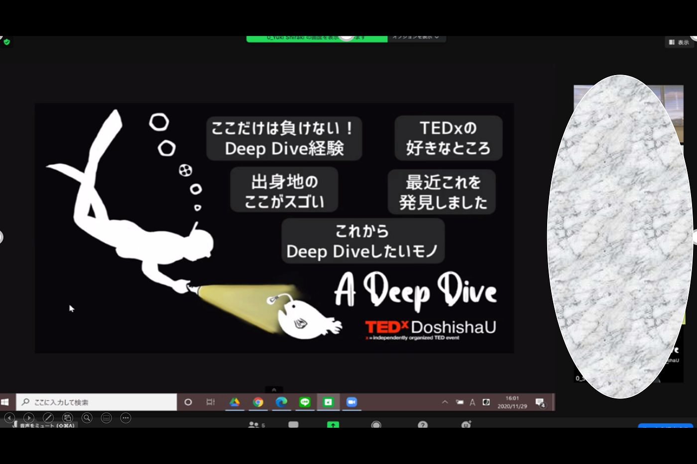
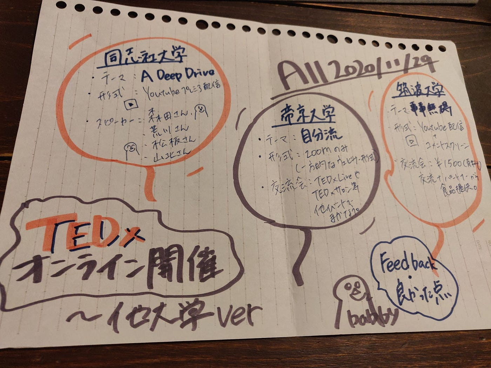

### 他大学のTEDxお邪魔しました

早いもので師走を迎えましたが、コロナは終息どころか勢いが増してきてできる限り外出を控えております。皆さんはいかがお過ごしでしょうか！

今週TEDxAoyamaGakuinUでは、他大学のTEDxオンライン開催にお邪魔してまいりました。今回参加した大学はこちら！

> ・同志社大学

> ・帝京大学

> ・筑波大学

どの大学もうちとは違った工夫やアイデアがみられ各大学ごとに全く新しいTEDxが生まれているように思います。

以下では各大学の特徴、形式などをまとめていきます！

#### 〇同志社大学

・全体テーマ：A Deep Dive

・スピーカー人数：４名 （トーク＋交流会 スピーカーの 4 人中 2 人が校内生）

・時間：13時〜

・メンバー：4年生や院生が多い。

・形式： YouTube プレミア配信を使用

・参加者との交流：最後の交流会で、一人への質問タイムをみんなで聞いて共有する。

👍ブレイクアウトで困らないようにスタッフ側でお客さんに見える形でネタを提供して くれて交流しやすかった

👍 1つ1つのエフェクトのクオリティが高い。

→同じエフェクトを使っていてもレベルの高いものを使っているから全体的なクオリティが高く見えるし、演出に飽きない

#### 〇帝京大学

・全体テーマ：自分流

・スピーカー人数：7名

・時間：13時〜16時くらい

・メンバー＝医学部生＋教授 ZOOM のみを使用

・形式：ZOOMのみを使用 (事前メールにZOOMのリンクを掲載)一方的なウェビナー形式

👍参加者との交流：TEDx live、TEDxサロン等の他のイベントが行われる

#### 〇筑波大学

全体テーマ：事事無碍

スピーカー人数：４名

時間：13時〜 （交流会を除 いて２時間）

4回目の開催

形式：YouTube配信を使用 (生配信での司会＋前撮りした動画＋生でインタビュー相手は zoomで繋がっている) 動画の後にすぐインタビュー。＆ コメントスクリーンを後ろに流す（ニコ動みたい）

参加者との交流会：(有料 1500円)有料コンテンツでスピーカーと交流できる＋パートナーからの食品を送られてくる。

👍動画の後にすぐインタビューされると説得力があるし、話を覚えているので聞いてて 理解できる。

👍一番最後にあるエンディング動画

メンバーの馬場がより詳しい情報や、よかった点、フィードバックをまとめてくれたのでぜひご覧ください！

[Meet Google Drive - One place for all your files
Google Drive is a free way to keep your files backed up and easy to reach from any phone, tablet, or computer. Start…drive.google.com](https://drive.google.com/file/d/1DwlQ4ryv7MP0amA5WNW9lf7okE_PCJ81/view?usp=sharing)

> 次回予告

> 12月12日に開催される立教大学のTEDxにも参加予定です！

