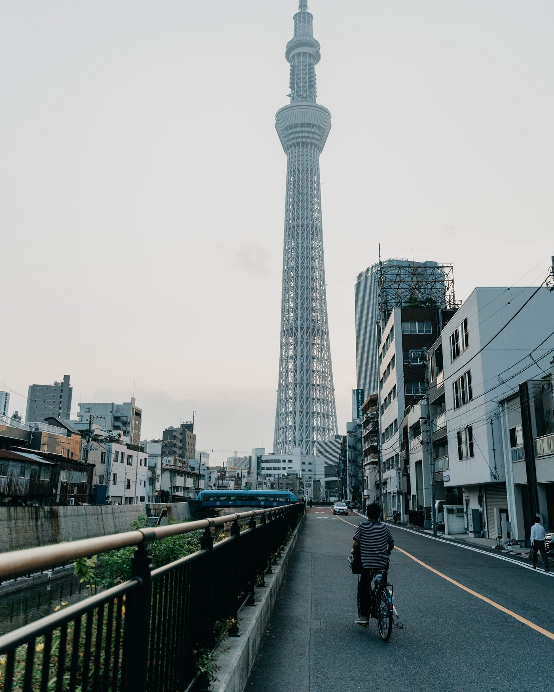

### アドベントカレンダー12／6

やっと師走の季節がやって参りました。コロナの渦にも巻きこまれながらも私は昔から大好きなこの季節を楽しんでおります。みなさんはいかがおすごしでしょうか。

さて12月6日、今日のアドベントカレンダー担当水谷陽です！

私は今回の古橋研究室のゼミ論では自分が一か月の押上でシェアハウス生活を行い、華やかなスカイツリーとは裏腹、一歩街に出ると街の高齢化やシャッター街などが目立つことに気づきました。

そこで地域に住む人々のために何かできる事はないかと思い「押上のまちづくり」についてテーマを設定いたしました。

しかしまちづくりという広域な言葉を用いてしまったがため、現在のゼミ論進行状況は難航中です…

とはいえ、自分なりにまちづくり・押上について調べ考え方向性を定めている所存でございます。そこで今回は私が調べたこと発見したこと等手短にお伝えしたいと思います。

> _1、押上地域の特徴_

> _2、早稲田大学との連携_

> _3、実際に住んでみて_

> _4、今後の方針_

### 1、押上地域の特徴と目指す都市像

・押上地域は東京スカイツリーを契機に年間4000万人の人々が来客する。

**➡国際観光都市としてのまちづくり**

・区内産業の製造業の割合が高く、23区で10パーセントを占めることが分かり、さらに9人以下の小規模事業が八割以上を占めます。

**➡モノづくりとしてのまちづくり**

この二点の特徴が押上地域（墨田区）で顕著となっているようだ。

### 2、早稲田大学との連携

早稲田大学では2002年12月墨田区と「産学官連携に関する協定」を結び、現在、多彩な取り組みが進行中だ。地域の産業振興分野だけでなく、文化の育成・発展、人材育成、まちづくり、学術、環境問題等、幅広い分野での包括的な協定だ。

地域総体の活性化に大学が全面的に連携するこのような協定は、全国的にも珍しい。（早稲田ウィークリーより）

世代、性別、業種の異なる『人と人をつなげる』というコンセプトの下、地域にとけ込む公共物（たとえばシルバーカーなど）を地域の人たちのアイデアと力でつくるプロジェクトが進行中である。（実際のプロジェクト↓）

> ・地域企業の活性支援
 ↳実際の企業に対して経営に関する効率化などを支援

> ・ドッグタグ開発プロジェクト
 ・おばあちゃんと買い物ツアー
 ・墨田商品を市場展開
 ↳「ものではなくストーリーを販売」
 モノづくり人の思いを売る
 ・キラキラ探偵団project
 ↳大学生と小学生の地域交流

> ・マルチマイクロ発電、、、

### 3、実際に住んでみて

実際に押上地域に住んでみて、本当に快適で住みやすい地域であると感じました。いかにその根拠を述べます。

・住宅街が多い
 ・押上の町は観光＜住むことに適してる
 ・スカイツリー近いから買い物楽

・スカイツリーがきれいすぎる
 ・インフラが整っている
 ・鉄道、電車でいろんなところから近い（銀座、清澄白河、上野、東京、渋谷30分圏内）
 ・ランニング、ジョギングのコースが完璧（浅草、墨田川まで走って15分かからない）

➡住みやすさとしては星5つ

しかし、**スカイツリーを除き観光都市としては機能しない**

**➡スカイツリーを契機に住みたい人が増えるのでは？**

### 4、今後の方針

以上のことから私が感じたことは、スカイツリーなどを含め再開発が進められているが、押上の住みやすさ”**下町らしさ**”は残しておきたいという気持ちに駆られました。

観光の街化してしまえば街の雰囲気がガラッと変わってしまう、しかしシャッター街などの問題は解決したい、、、

この二つのジレンマに挟まれながらも、古橋先生とのミーティングで**向島百花園の方との会食の場を設けてもらい現地に住む人々の生の声を聴いてから自分が出来そうなことを探る。**という方針になりました。

会食までにこの街の下調べとして百花園や神社、名物を食べに行き、街の魅力に触れてきました。
