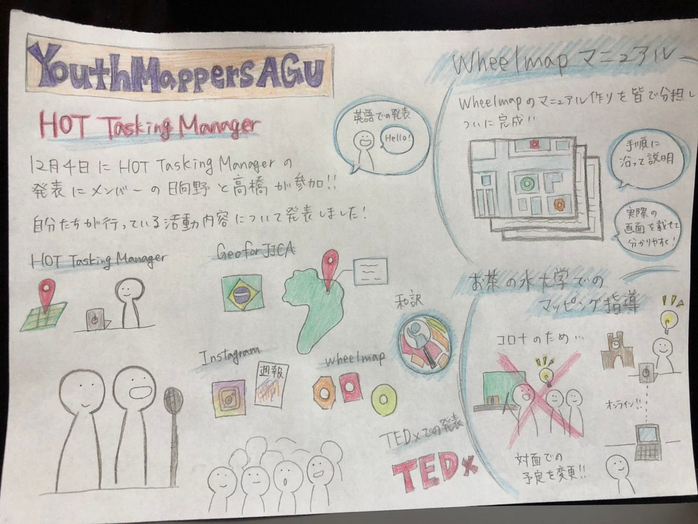

### Wheelmap マニュアル完成

こんにちは、3年の木多です。今年も終わりに近づきやる事が増えてきました。

今週は、

① Wheelmap マニュアル完成

② HUMANITARIAN OPENSTREETMAP SUMMIT 2020の発表

③ お茶の水女子大学でのマッピング指導

④ 各自マッピング活動

についての報告をします。

① Wheelmap マニュアル完成

以前、マイクロン社の方にWheelmapの使い方や、マッピングの方法をレクチャー した際、ミーティングに参加していない社員にも使い方を教えるためのマニュアルを作成して欲しいという依頼があったため、今週の活動で Wheelmap マニュアルを作成しました。

[Wheelmap
Wheelmap.orgは車椅子でアクセス可能な場所を探したり入力したりできるオンラインマップです。公共施設、バー、レストランや映画館、スーパーマーケットについて利用可否をマークしてぜひご参加くださいwheelmap.org](https://wheelmap.org/?locale=ja)

② HUMANITARIAN OPENSTREETMAP SUMMITの発表

12月4日にHUMANITARIAN OPENSTREETMAP SUMMITの発表があり、YouthMappersAGUの日向野と高橋が参加し、自分達が行っている活動内容について英語で発表しました。

③ お茶の水女子大学でのマッピング指導

以前から予定されていたお茶の水女子大学でのマッピング指導についてですが、Covid-19が深刻化しているため、当初の予定であった対面授業ではなくオンライン授業に変更されました。

④ 各自マッピング活動

今週は各メンバーに少し余裕があったため、HOT Tasking Managerでマッピング活動を進めました。自分は10月30日に発生したトルコのイズミール地震に関するプロジェクトに参加し、５タスクを完了させました。

今週のグラレコ

