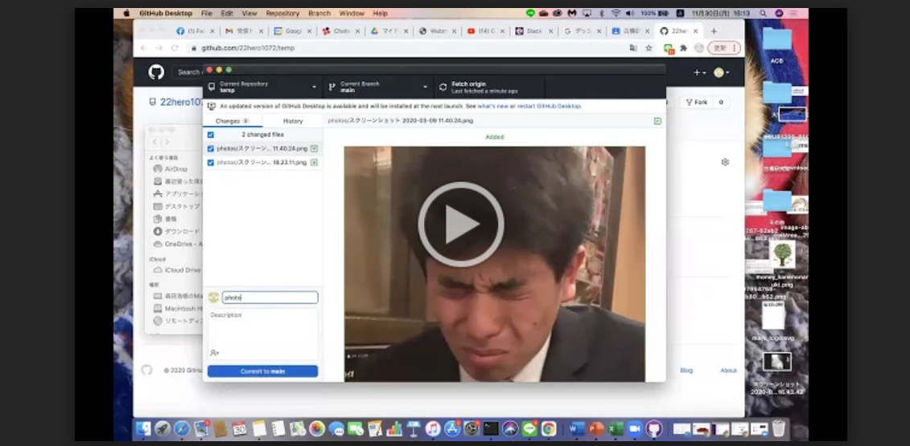
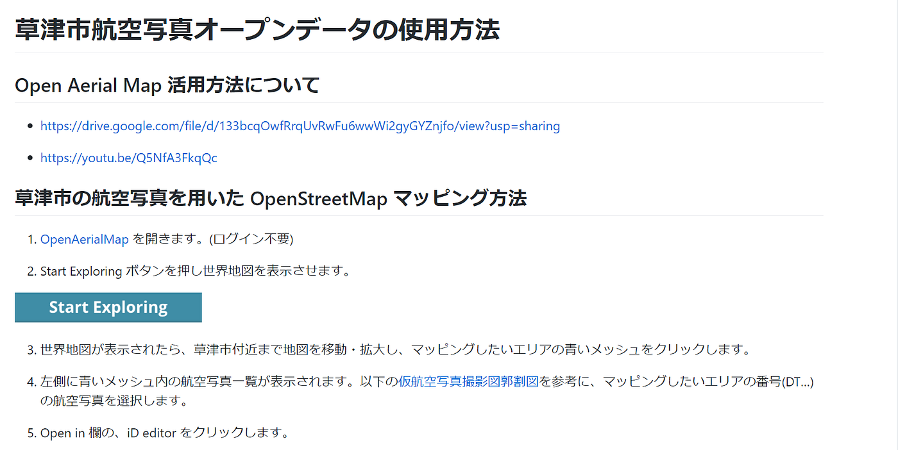
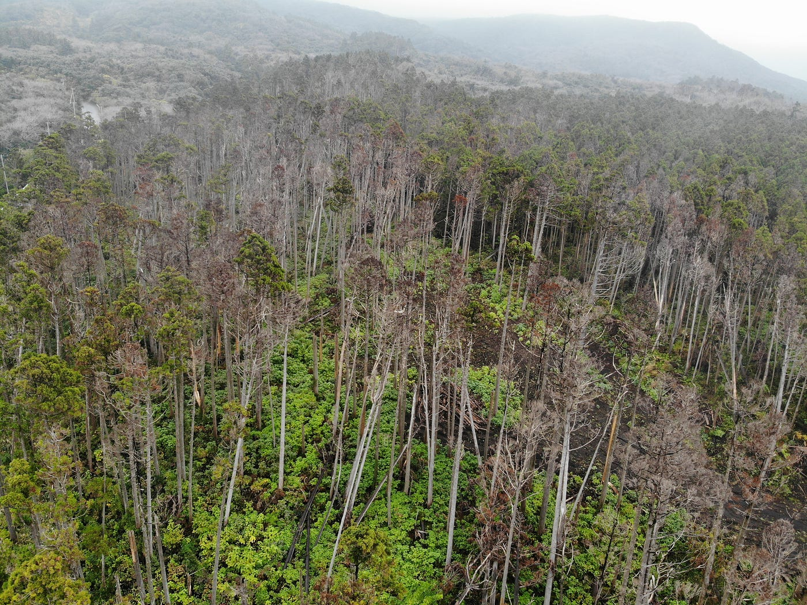
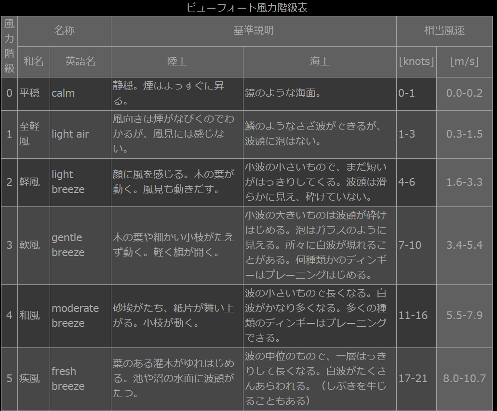
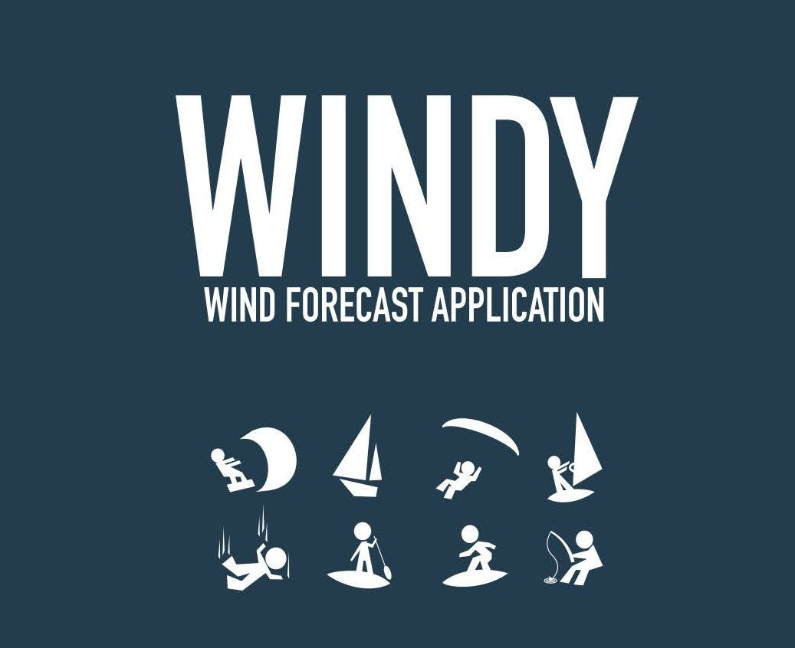
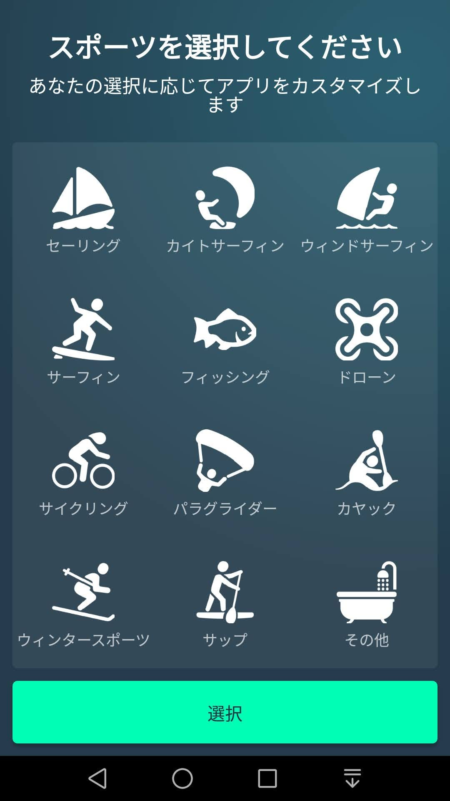
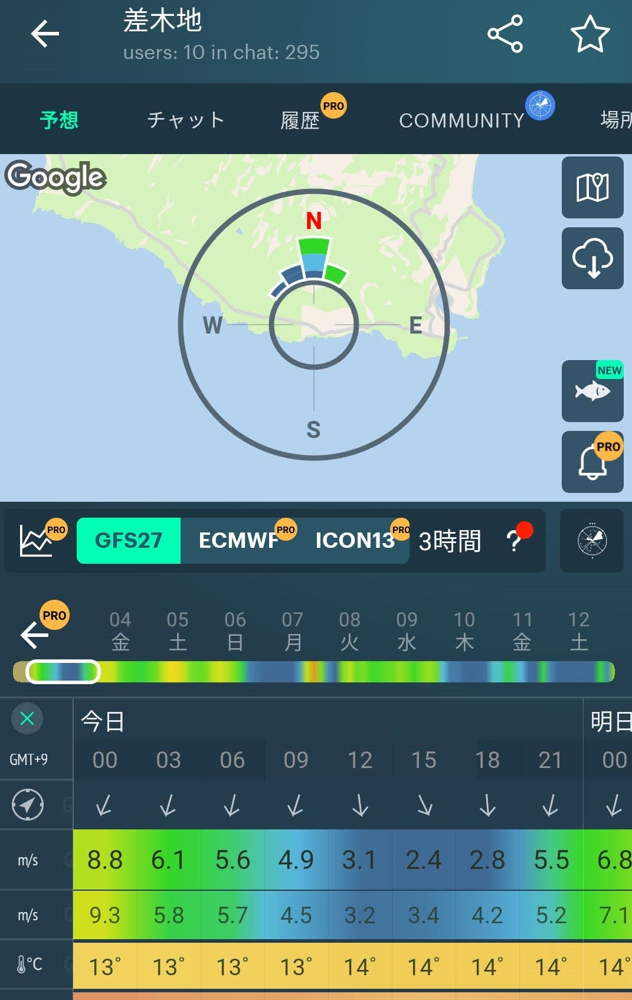

### ドローン部 週報⑳

#### **12/30 ドローン部 ミーティング内容**

> Github Desktop の使い方についてドローン部のメンバーで確認

GitHub Desktop の使い方について森田メンバーがZoomレコーディング機能を使い、説明動画を作成してくれました。

[作成動画](https://drive.google.com/file/d/1OeQR-miZo9rILayu7erTphH99iO5TxvV/view?usp=sharin)

[Meet Google Drive - One place for all your files
Google Drive is a free way to keep your files backed up and easy to reach from any phone, tablet, or computer. Start…drive.google.com](https://drive.google.com/file/d/1OeQR-miZo9rILayu7erTphH99iO5TxvV/view)

メンバーは各自、ドローンバードの事例を参考に、アップロードした写真をGithub Desktopに保存することに。

> ドローンバード訓練参加について

12/8（火）のドローンバード訓練参加者について確認を行った。詳細は、Facebookゼミ内で確認。集合場所・時間等

1/12（火）のドローンバード訓練＆バーベキュー会について、複数のメンバーが参加予定。詳細について確認をする。

> 草津市航空写真オープンデータの使用方法についてのマニュアル作成について

草津市から催促連絡。中西が簡易説明をGithub上に掲載。

今後加筆訂正をしていく。→古橋先生が訂正してくださった。

[furuhashilab/oam4kusatsu
草津市航空写真データの OpenAerialMap 投入 ガチャムクOAM解説動画 ・ガチャピン OAM解説動画 ・発表スライド ・Medium(グラレコ付き) QGIS 3.14 をインストール…github.com](https://github.com/furuhashilab/oam4kusatsu)

[furuhashilab/oam4kusatsu
OpenAerialMap を開きます。(ログイン不要) Start Exploring ボタンを押し世界地図を表示させます。…github.com](https://github.com/furuhashilab/oam4kusatsu/blob/master/HowToUseThisData.md)

> Pix 4D パスワードの確認

Pix4Dのパスワード→先生から情報得た？

#### ドローン×風

先日伊豆大島でドローンを飛ばし、風対策をすることの重要さを改めて確認したいので、今週の週報ではドローンと風について紹介します。

上空を飛行するドローンにとって、風は切っても離せない重要な要素であります。強風の中フライトを強行してしまうと、帰還できずに墜落しドローンを紛失しかねません。

ドローンが耐えれれる風速は、機種によって違い、もちろんのこと重くなればなるほど、強風に耐えることが出来ます。

_**→ドローン規制 １００g以下になるの？ （朝日新聞 朝刊情報）_**

### ドローンを飛ばせる風速の目安は5m/s

風速5m/sってどんな風？

（参考）[ビューフォート風力階級表](http://weather-gpv.info/gw.php)

３.４~５.４m/s
 木の葉や細かい小枝がたえず動く。軽く旗が開く。

**→このような風が吹けば、リスク回避で一時的に運転を見合わせたほうが良い。**

**(参考)ドローン最大飛行可能風速**

Tello１~２m/sで挙動が不安定になる
phantom１０m/s
Mavic pro１０m/s
**Mavic Air１０m/s**
INSPIRE１０m/s
Matrice６００pro８m/s

### “Windy”というアプリで風対策ができる！

風速計等を使って飛ばせるかどうか判断することが一番確実ですが、ドローンに特化した風の情報を提供してくれるアプリケーションがあります。

それが、“Windy” です。

ドローンを飛ばす際はこうしたアプリも活用し、風にも気を付けながら安全にフライトをしましょう。

#### 今週のグラレコ

以上

中西駿太 1A117117
