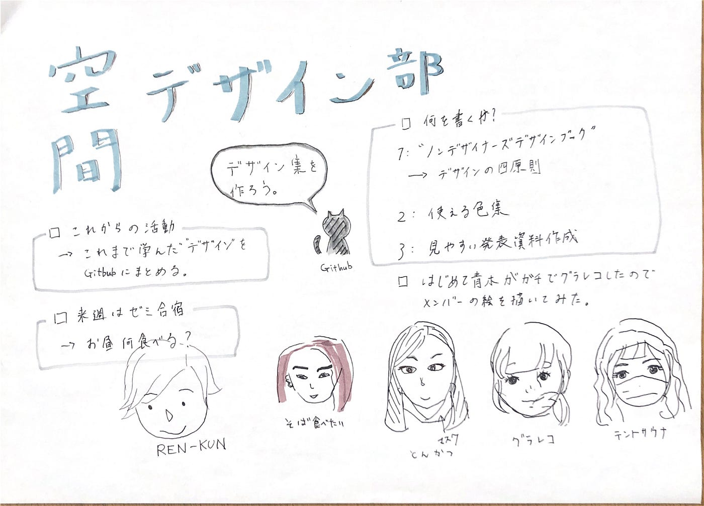

### 空間デザイン部 週報

#### 空間デザイン部、今後何する？

TEDxがおわりメインの活動がなくなった今、空間デザイン部として今後なにをするべきか何をしたいかを話し合い活動内容を決定しました！

### お役立ちデザイン術集をつくる。

・デザインの４原則などデザインの基本情報を簡潔にまとめる
・グラレコ時のカラーチャートを作る

すべてのゼミ生がゼミ内外の制作物の作成時、簡単により情報をみやすく完成度の高いものを作ることができるようなデザイン術マニュアルを作成することが決まりました。

### ノンデザイナーズ・デザインブック

空間デザイン部がデザインを勉強する際に使用している”ノンデザイナーズデザインブック”をメインの参考資料として使用します。

この本でピックアップされているデザインの４原則やカラーの法則などをわかりやすく、また古橋ゼミが多用する発表資料やグラレコなどのプラットホームに合わせた内容に編纂しようと思います。

今年度の活動も残すところあと少し。。！

ちょっとでも自分たちでデザインに触れる機会を作りゼミ内のデザイン性をそこあげできるような活動をしていきます！

グラレコ

