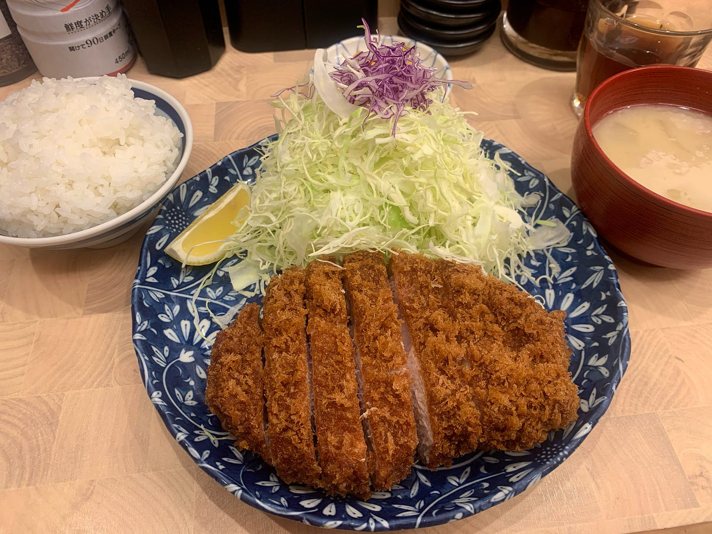
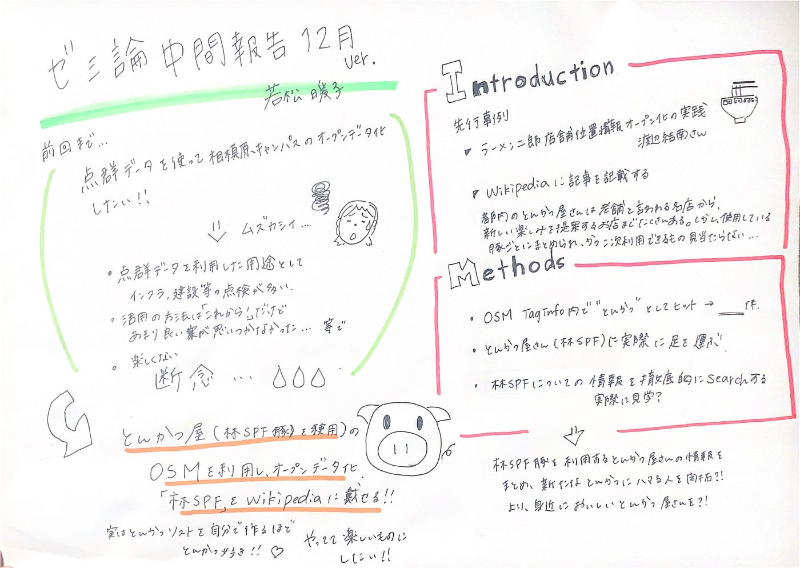

### アドベントカレンダー 12/9

ゼミ論中間報告 若松暖子

少し遅くなってしまいました。
12月9日のアドベントカレンダーを担当します！
よろしくお願いします。

▶︎[GitHubレポジトリ](https://github.com/furuhashilab/sotsuron2020/projects/21)

▶︎[前回の中間報告](https://medium.com/furuhashilab/%E3%83%86%E3%83%B3%E3%82%B0%E3%83%B3%E3%83%87%E3%83%BC%E3%82%BF%E3%81%A3%E3%81%A6%E4%BD%95-c8060be4391)

前回まで、、点群データを利用して実際に相模原キャンパスを計測、オープンデータ化をしたい！と考えてゼミ論を進めていたのですが、点群データについて調べていくほど、難しく自分の頭のキャパを超えていき、「楽しくない」と思い始めてしまいました。前回のゼミのスピーカーであった榎本さんのお話では点群データの現在の主な利用方法としては建築やインフラ関連の大きな建物や設備の点検に利用されており、今年が点群の可能性に気づいた“点群元年”で、これからいろいろな可能性が開かれていくとのことでした！しかし、自分の中で点群を利用してできる面白い案が思い浮かびませんでした。

ゼミ合宿中に古橋先生に相談させていただいたところ、自分がやっていて楽しいことがいい、とのことで今回を期に思い切ってゼミ論内容の変更をすることにしました！！

**「とんかつ屋さんのOSMを利用した店舗情報のオープンソース化」**

を題材にしたいと思います。

**＃INTRODUCTION**

先行研究

**・[日本全国のラーメン二郎店舗位置情報オープン化の実践**](https://furuhashilab.github.io/www4yunawatanabe/)

OGである渡辺結南さんの研究のパクリではないか、といわれると言葉が出ないのですが、とんかつへの愛があると気づかされ、ゼミ論楽しく、美味しいもの食べながらやりたいと考えた結果ここに至りました。

“ とんかつ” をOSMで検索すると130件ほどヒットするのですが、“トンカツ”“豚カツ”など調べても一括化されていないという現状がわかりました。これを全部実際に調べていくのはなかなか難しいため、ここに私らしさ？を加えて林SPF豚を使用したとんかつ店という縛りにして、情報をまとめていきたいと考えます。

なぜ林SPF豚なのかというと私が今まで食べてきたとんかつの中で一番美味しかった（暫定）お店が蒲田にある「とんかつ 臆」（これであおきと読みます）です！そのお店で使われている豚の種類が林SPFという千葉県産のブランド豚なのです！！！脂が上質でくどくなくて最後の一切れまで美味しいのです、、、！！

林SPF豚を検索するとWikipediaには情報が掲載されていませんでした！
この豚肉を使用するとんかつ店の情報をフィールドワークをしながら収集し、さらこの豚の情報をWikipediaに載せることをゼミ論のまとめにしたらいいのではないかと考えました。

**＃METHODS**

・“とんかつ”のOSM上のデータの現状把握
・OSM情報における整理
・林SPF豚を使用しているとんかつ屋さんに足を運ぶ
・林SPF豚について徹底的に調べる
・Wikipediaへの記載方法を調べる

