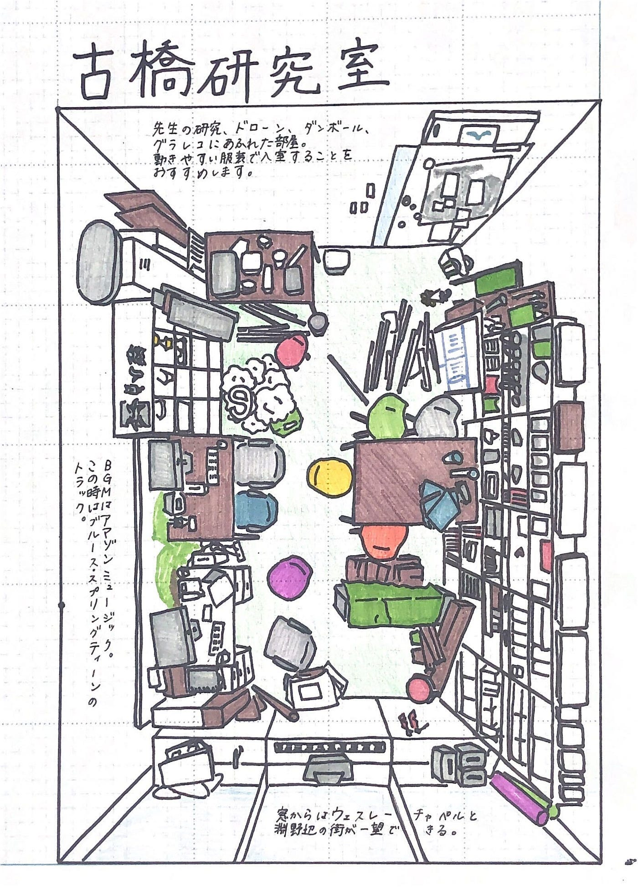
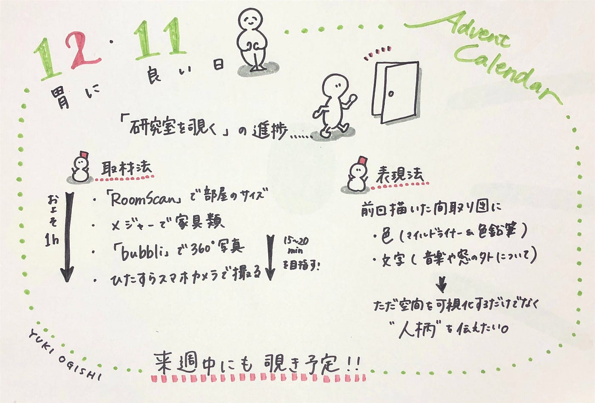

### 12月11日、胃腸の日

12月11日、「1211（胃にいい）日」のアドベントカレンダー担当、大岸です！
今回は私のゼミ論、「地球の教授研究室を覗く」の進捗を書いていこうと思います。

#### ##中間報告までの話

ゼミ論テーマについて詳しい内容や、中間報告までの活動はこちらをどうぞ！

[研究室を覗く
古橋ゼミ3年大岸のゼミ論中間報告です！medium.com](https://medium.com/furuhashilab/%E7%A0%94%E7%A9%B6%E5%AE%A4%E3%82%92%E8%A6%97%E3%81%8F-32d35d5cd1b5)

#### ##アップデート

前回の中間報告では、「仕事場」をテーマにした作品を3点比較し、自分の空間表現法を決めていきました。
そして実際に古橋研究室を書き起こしたものがこちら。

取材法について前回書けていなかったので、ここで少しご紹介します！

まず部屋のサイズの大まかな測定には「[RoomScan](https://apps.apple.com/jp/app/roomscan-lidar/id1504050801)」というアプリを使いました。部屋の壁4面にスマホをあてる事で部屋の面積を測定してくれる優れものです。今回のようにすでに家具などものがあり、床が見えない状態のところではすごく役に立つと思います！
その他の机など大きめの家具はメジャーではかりました。（ホームセンターでのバイトが役に立ちました笑）

部屋の描き起こしのために360度カメラも使いました。今回は「[bubbli](https://apps.apple.com/jp/app/bubbli/id720480745)」というアプリを使用しました。写真を重ねていくのではなく、動画を撮影することで360度の空間を撮影するようなもので、個人的な感覚ではGoogleのストリートビューよりも誤差が少ないように感じました。
その他細かい部分はとにかく写真を撮りまくる！！！笑
後で確認したところ77枚撮っていました笑

大体このような感じで、方眼紙に描きこみながら取材したのですが、トータル1時間ほどかかりました。
他の教授の研究室を取材する際には、1日でなるべく多くの教授の取材をしたいので、描き起こし作業は全て後に回し、とにかく写真を撮って記録し、一人当たり15~20分を目指していきたいと思います。
できるかどうか少し心配ではありますが…笑

さて、前回の間取り図を少しアップデートしました。
「仕事場」の作品として参考にさせていただいた、「菊池亜希子のおじゃまします」では、カラフルな色合いが印象的で、部屋の雰囲気を表現するのに私も取り入れてみたいと感じました。

そこで前回描いたものに、部屋に入ったときの第一印象や古橋研究室のごちゃごちゃ感を表したい！と思い、色を加えてみました。

見えづらいのですが床と窓は色鉛筆で薄めに色を付けています。（肉眼だと見える…。）それ以外の部分はグラレコ部でおなじみ、マイルドライナーで色付けしました。

中間報告時点では色を入れるとごちゃごちゃになって見づらいのでは、と書いていたのですが、あえてそうすることで古橋研究室の雰囲気を表現できたのではないかと思います。

また、部屋に流れていた音楽や窓の外の様子など、間取りの中に描きこめなかったものを文字にして書き込みました。
視覚以外の部分の情報も伝わりやすくなったかなと思います。

描いていて感じたことについて、ただ空間の可視化をするだけではなく、その部屋にいる人の人柄を表現することを大切にしようと思いました。
このテーマを決めるきっかけでも、普段なかなか踏み入れることのない教授の研究室を表現することでその教授の人柄を知ってもらいたい、と書いていました。
例えば、きれい好きなのか物持ちなのか、音楽の趣味や普段どんな人が研究室に足を踏み入れるのかなど、これを見た人が「こんな人だったんだ」と思ってもらえるような研究室表現をしていきたいと思います！

#### ##今後…

いよいよ来週、地球の教授の研究室を覗かせてもらいに行きます！
今後は取材したものを描き起こす作業に追われるものと思われます…。

引き続き頑張っていきます！

#### ##グラレコ

青山学院大学 古橋研究室 3年

大岸 裕紀

_この記事は [青山学院大学 古橋研究室 Advent Calendar 2020](https://qiita.com/advent-calendar/2020/furuhashilab) の12月11日分として作成しました。_
