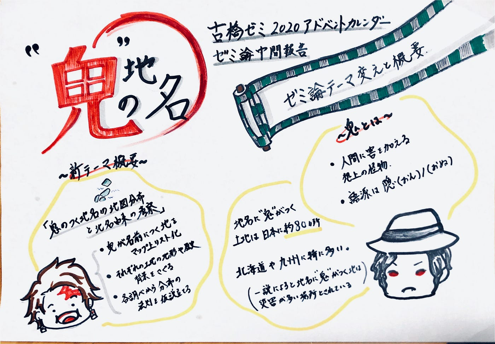

### アドベントカレンダー 12/10

ゼミ論 進捗報告 「地名に鬼を含む土地の地図分布と考察 」by 斎藤 祐花

若干12/11になってしまいましたが、本日のアドベントカレンダーは斎藤が担当します。

今回の記事では先日の中間報告に引き続きゼミ論の進捗報告を行います。が。しかし。
ゼミ論締め切りも直近であるのにもかかわらずこの度ゼミ論のテーマを改めることを決定いたしました。

### 鬼の地名 「地名に”鬼”を含む土地の地図分布と考察 」

鬼…? もしかして…
と思ったそこのあなた正解です。
映画 無限列車編が空前の大ブームを引き起こし爆速で歴代映画興行収入 第2位（2020/12/10現在）にランクインし先週販売された単行本最終巻である23巻が初版395万部発行され社会現象と化しているあの人気漫画・アニメ『鬼滅の刃』に乗っかりました。

明日で４回目の映画視聴を控えている絶賛鬼滅中毒の私ですが、せっかく古橋ゼミでゼミ論を残すのであれば普段あまり熟考する機会の少ない地理やもともと興味のある歴史またなにより異質を兼ね揃えた面白い研究が良いのではと思い古橋先生に相談に乗っていただいたのちに今回のテーマを設定しました。

### そもそも ”鬼”とは何か。

最近では鬼滅人気から、また昔から鬼退治の物語等々で知らぬ間に当たり前となっている”鬼”ですが皆さんはこの正体について考えたことはありますか？また実在するのかどうかも謎ですよね。

世界大百科事典によれば鬼とは人間に危害を与える空想上の怪物。
しかし実は”鬼”の語源は隠（おん・おぬ）であり人から隠れたところに存在するであったり人を蔑む意味合いがあります。
また、興味深いのは鬼とは単に人間とはかけ離れた異質な生物だけを表すものではなく….
人間がもつ弱さや激しい嫉妬や怒り、憎悪、悲しみなどの感情や魂が具現化されたものという説もあります。

そのため日本では古来から伝わる伝説や昔話にたびたび登場し、描かれている姿も絶対的 ”悪者” ポジションから『泣いた赤鬼』のようにやさしい心を持ち人間と交流する姿勢など様々でとても人が育む文化とゆかり多きものなのです。

### 鬼の字を含む地名は日本に 約 ９０箇所

鬼に関する記述のある書物や逸話が台頭したと言われるのは平安時代。長い歳月の中で社会文化の中に根強い影響をもたらした”鬼”ですが
その影響は”地名”にも及んでいます。

現在、日本には約９０箇所（調べられた範囲内では87箇所）地名に”鬼”がつく土地が存在します。

今回進捗報告にあたり自身の Google Map のリスト化機能を使用し、それらの土地のリストを作成しました。

[Yuka Saito's "「鬼」地名" List
Find local businesses, view maps and get driving directions in Google Maps.www.google.com](https://www.google.com/maps/placelists/list/t6L4CTWnR4SC2l1DuIRkhQ)

これをみると、北海道や九州に分布がじゃっかん集中している気がします。また調べた中では名前の類似性が目立ち一点に鬼のつく地名が集中（全集中）しているケースがいくつか存在しました。
（当たり前かもしれませんが）

たとえば…

> **香川県高松市 鬼無町シリーズ
**鬼無町是竹（きなしちょうこれたけ）
鬼無町佐藤（きなしちょうさとう）
鬼無町佐料（きなしちょうさりょう）
鬼無町藤井（きなしちょうふじい）
鬼無町山口（きなしちょうやまぐち）
鬼無町鬼無（きなしちょうきなし）

この鬼無町に関しては先立って由来を調べたところ、どうやら桃太郎の鬼退治が関係している様で、桃太郎が女木島で鬼を討ち讃岐で鬼を滅しそこから”鬼が無し”に由来しているそうです。

### ”鬼” 地名と地形・自然災害の関連性

今回ざっとリスト化し分布を見たところ確かに一点に集中する様子がちらほら見受けられましたがどれも逸話や伝説に由来しているものが多数。

しかし一説によると地名にある”鬼”という言葉はその土地の地盤の弱さや自然災害の威力を示していることも多いそう。

例えば…

> 長野県 鬼無里村 （きなさむら）

> [https://goo.gl/maps/KW1YcScV7kEGsWQz9](https://goo.gl/maps/KW1YcScV7kEGsWQz9)

この地域では平安時代に鬼女紅葉伝説（詳しくは▷[https://ja.wikipedia.org/wiki/%E7%B4%85%E8%91%89%E4%BC%9D%E8%AA%AC](https://ja.wikipedia.org/wiki/%E7%B4%85%E8%91%89%E4%BC%9D%E8%AA%AC)）というものがあるようにやはり鬼にまつわる伝説が名前に由来しているものの1847年に発生した震度７の大地震が地名への高い関連性を有しています。

当時、善光寺という地域を中心に震度７レベルの地震が発生し土砂災害や多発。土砂があちこちからまるで鬼が憤慨するかのように吹き出ている様子から人々が”鬼無”という名前を地名につけたのでないでしょうか。

今回の進捗報告では”ゼミ論テーマの改定” ”イントロダクションとして鬼の基礎知識” ”鬼 地名のリスト化と軽い考察”をピックアップしました。

今後は、ひきつづき各地名の各場所の鬼にまつわる伝説や五輪の歴史的背景と地形や地理的な自然的背景の両側面から鬼の地名分布の考察の仮説立てを行います。

鬼関連ならなんでも楽しくなってきている自分が怖いです。鬼滅パワー偉大ですね。
