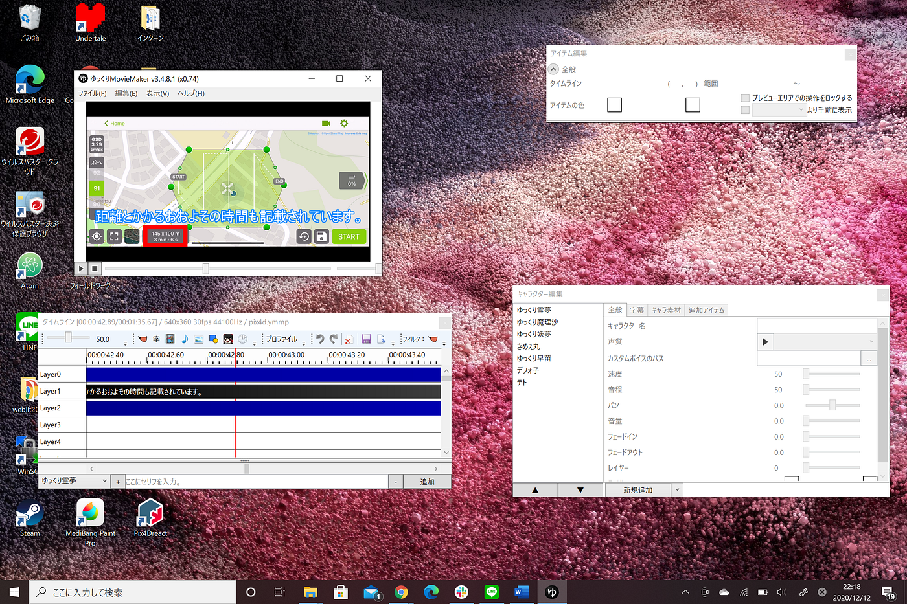
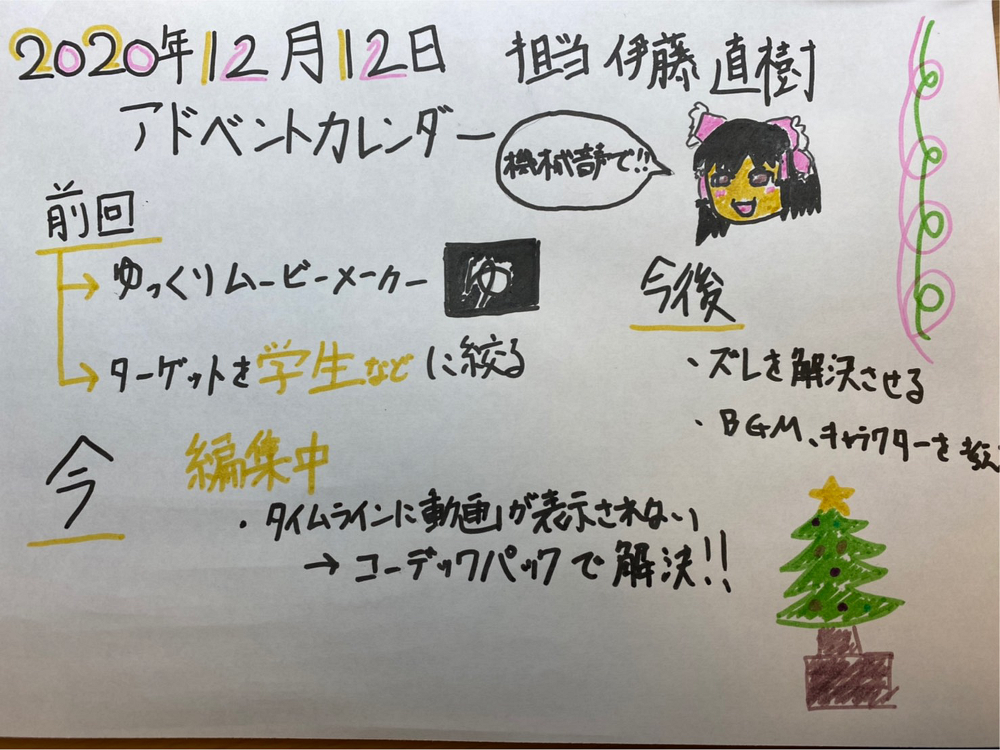

### 12月12日 アドベントカレンダー

本日のアドベントカレンダーを担当する伊藤です。

最近またドラクエウォークにハマり上級職快方に向けて日々精進しております。

私のゼミ論は前回にも説明しましたが、Pix4Dcaptureを用いてOAMに空撮画像をアップロードをするまでの手段のマニュアル作成をしています。

#前回進んだ内容

まず前回の中間発表の状況を説明します。前回の中間発表では動画編集ソフトを選定してソフトのインストールをしていました。またそれに付随して先行事例がどのようにあるか見ていました。

決まったこととして

動画編集ソフト：ゆっくりムービーメーカー

ターゲットを学生といった若い人を対象に日本語のマニュアル作成を作成する。（音声は機械が喋る）

#現在の状況

現在編集を進めています。その際に、動画編集の画面に動画が表示されない問題が生じました。同じ問題が他にないか調べたところ、発見し対処方法も記載されていました。まず1つ目の解決方法の動画のプレビュー形式を変更しても改善されませんでした。そのため2つ目のコーデックパックをインストールすることにしました。最初にインストールをしたコーデックパックはLAV Filtersです。一時的に直りましたが動画を追加したときにまた表示されなくなってしまいました。そのため次のコーデックパックをインストールしました。そのコーデックパックはK-Lite Codec Packです。このコーデックパックはタイムラインを押すと動画も動いてくれるので動画編集がとてもしやすくなりました。

こちらが実際の編集の画面です。

意外にシンプルに編集をすることが出来ます。字幕を入力するだけで音声も自動的に翻訳されるのでやっていて苦ではありません。

#今後の内容

今後も同様に編集をしていきます。試しに出力をしてみたところズレが生じてしまうので完成したら全てのズレが無くなるように再編集をしていきたいと思います。また背景もゆっくりムービーメーカーで編集をしていると黒くなってしまうので何か背景を付けたいと思います。キャラクターを出すか、BGMを付けるかなども今後検討していきます。

グラレコはこちらです。

