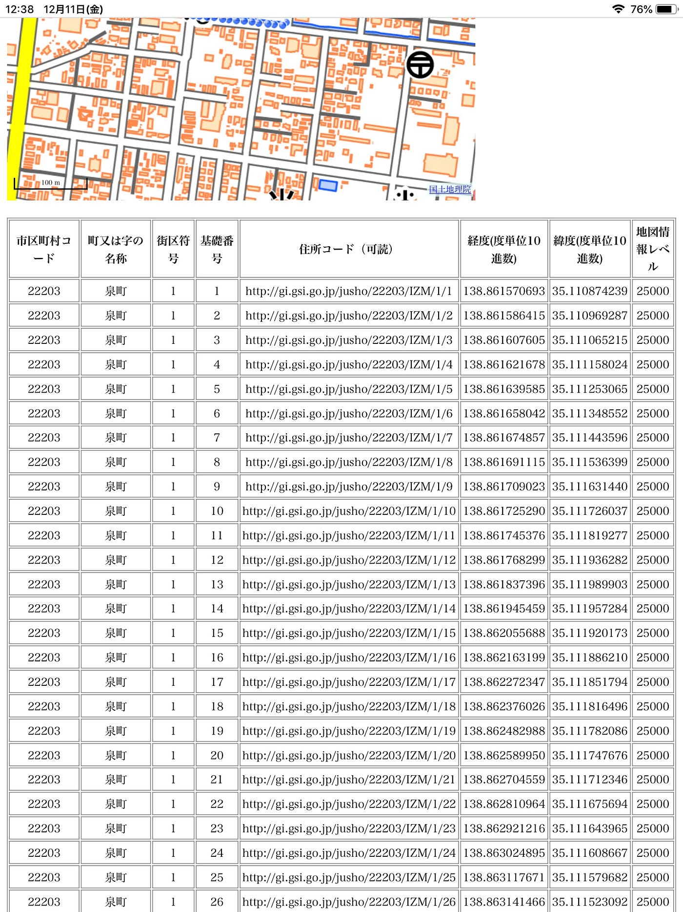
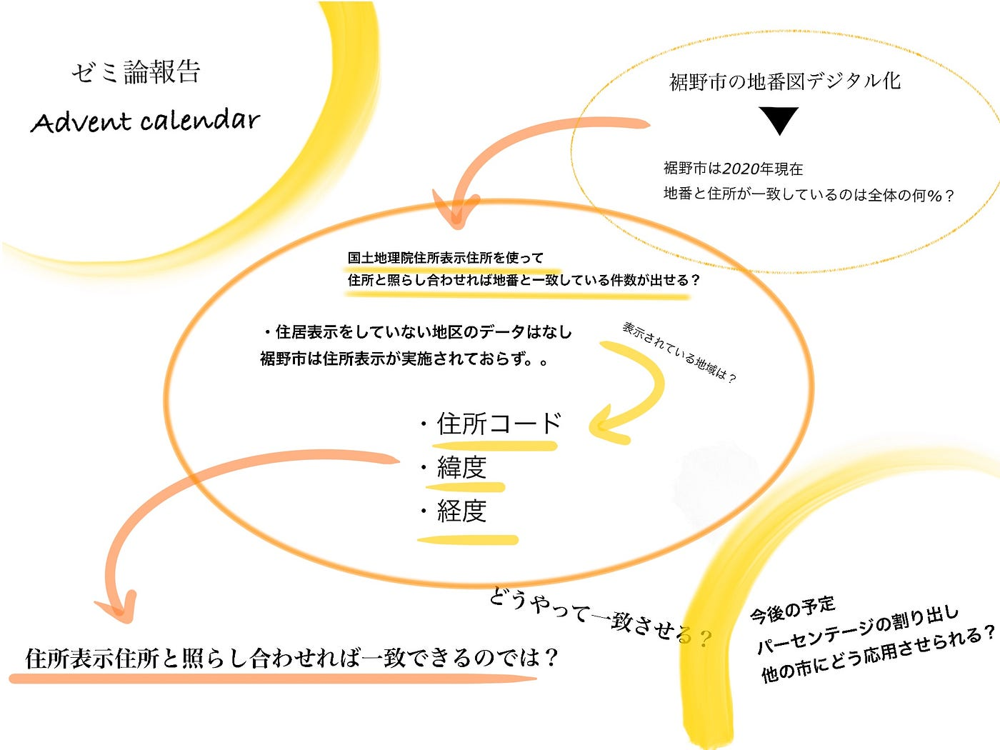

アドベントカレンダー 12/13

本日のアドベントカレンダーを担当します松山蘭です。

裾野市の地番図デジタル化作業に対し、裾野市は2020年現在、地番と住所が一致している場所は全体の何パーセントであるのかをゼミ論のテーマとしました。

また、中間発表では裾野市の地番と住所がどのくらい一致しているのかを予測し、デジタル化することのメリットをリストアップしました。

[裾野市地番図のデジタル化
ゼミ論中間発表 松山蘭 ｜序文 私は古橋先生の現在行っている、裾野市の地番図デジタル化作業に対し、裾野市は2020年現在、地番と住所が一致している場所は全体の何パーセントであるのかをゼミ論のテーマとしました。…link.medium.com](https://link.medium.com/BUHBOUws7bb)

中間発表後、国土地理院住居表示住所を使って、住所と照らし合われれば、地番と住所の一致している件数が出せるのでは、ということで、住居表示住所を探ってみました。

(電子国土基本図(地名情報)「住居表示住所」 ファイル仕様書(20130405))

電子国土基本図(地名情報)「住居表示住所」は，基礎番号のデータであって，以下の注意点がありました。

・電子国土基本図(地名情報)「住居表示住所」には，住居表示を実施していない地区のデータは含まれない。

・電子国土基本図(地名情報)「住居表示住所」は，個別の建築物を識別するものではない。

・基礎番号に対応する住居番号を持つ建築物が必ず存在するとは限らない。

・すべての住居番号に対して対応する基礎番号があるとは限らない。

・住居表示の実施に際しては，基礎番号によらず住居番号を決めることがある。

ということで、実際裾野市を探してみるとなんと住所表示が実施されていませんでした。。。

しかし、もし住所表示されたら、、ということで他の市を試しに見てみました。

こちらは、裾野市の隣にある沼津市の泉町1街区の基礎番号です。

・住所コード・緯度・経度が載っており、このデータと地番図を照らし合わせれば一致できるのではと予測しました。

この後は私の力不足によりこれ以上進めることが出来ないので古橋先生にまずお話を伺うこととします。。

地番図は奥深く調べれば調べるほどわけがわからなくなってしまい絶賛混乱中ですが頑張ります！！

<グラレコ>

